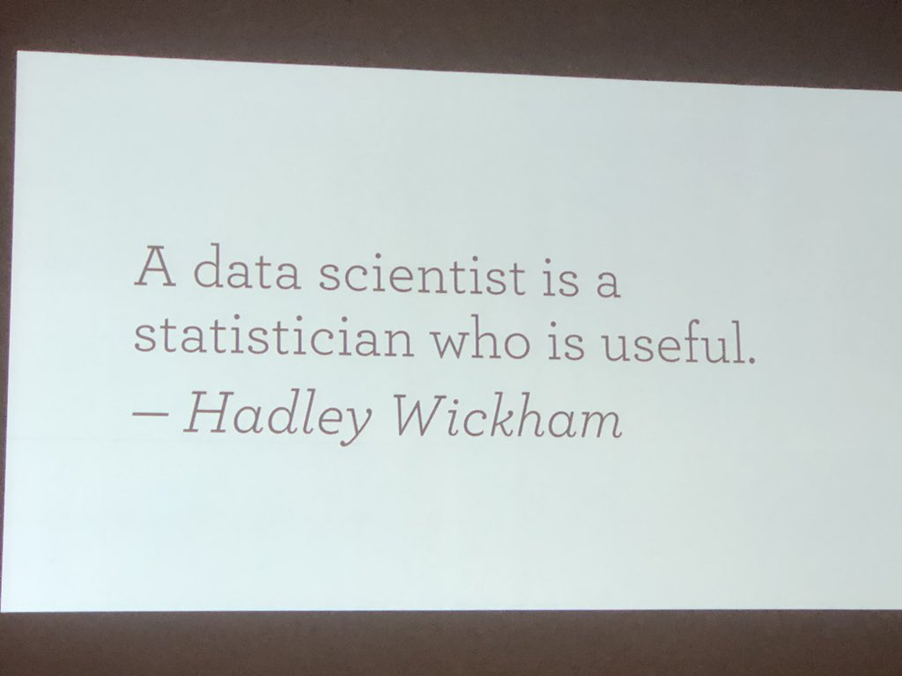
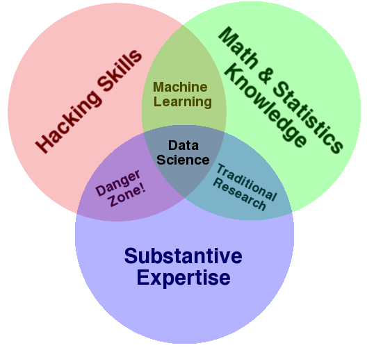
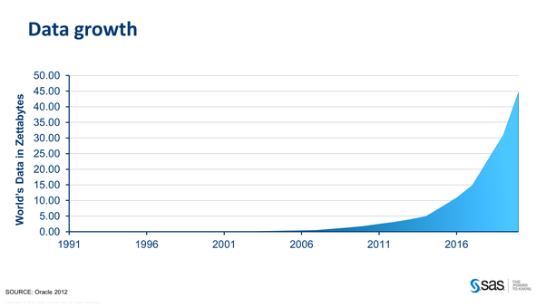
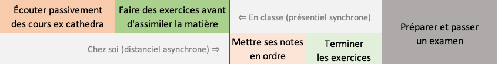
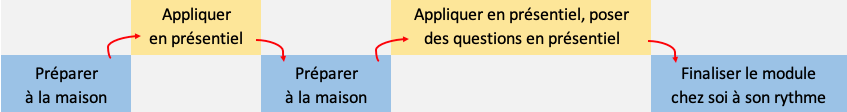
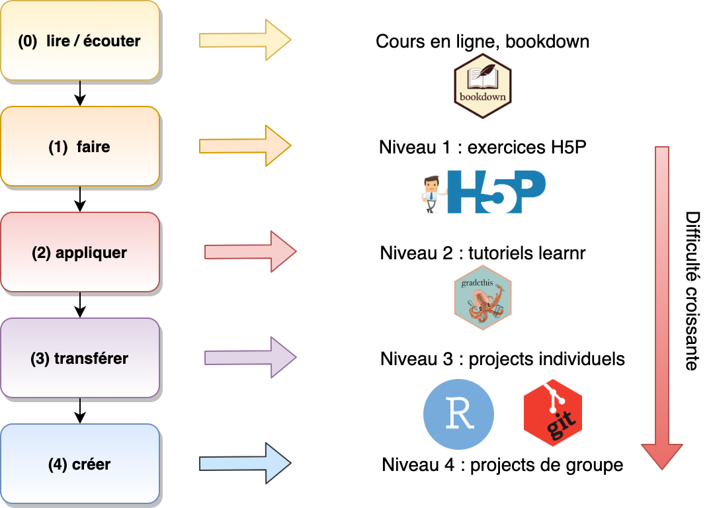

```{r setup, include=FALSE}
knitr::opts_chunk$set(echo = TRUE)
SciViews::R
```

## Organisation de la salle

-   Se placer par quatre par rangée (groupe de travail, même place toute l'année)

-   Allumer son ordinateur ou l'ordinateur de la salle (un par étudiant)

-   Utiliser un câble ethernet à la place du wifi (plus rapide)

-   Se munir d'un post-it jaune pour les questions

-   Remplir les questionnaires sur les tables

## Qui sommes nous ?

### Présentation

Philippe Grosjean, Guyliann Engels, Clément Van Hoeck ([sdd\@sciviews.org](mailto:sdd@sciviews.org){.email})

```{=tex}
\columnsbegin
\columnhalf
\center
```

```{r out.width="50%", echo=FALSE}

```


\columnhalf


\columnsend

## Installation et configuration des logiciels

### Espace Moodle

1.  Accéder au cours sur Moodle **Science des données I : visualisation**
2.  Cliquer sur l'item **Lier et aller à wp.sciviews.org**
3.  Dans le site du cours, cliquer sur "Home"
4.  Lire la page


### Compte GitHub

1.  Choisir un identifiant GitHub (PrenomNom) et le faire valider par un enseignant
2.  Créer son compte GitHub
3.  Cliquer sur "Login GitHub" dans le cours pour s'y identifier

### Compte Saturn Cloud

Cliquer sur le bouton bleu **RStudio** en haut à droite dans le site du cours pour les instructions d'installation (nous le ferons ensemble).

1.  Invitation par mail -> rejoindre l'organisation Econum de Saturn Cloud
2.  Créer sa ressource svbox2024sdd
3.  Invitation par mail -> rejoindre Posit Connect
4.  Générer une API KEY sur Posit Connect
5.  Créer un nouveau secret dans son compte Saturn Cloud pour l'API KEY


## Science des données

### Science des données : une approche pragmatique



### Science des données : à l'interface entre plusieurs disciplines

```{=tex}
\columnsbegin
\columnhalf
```
-   La Science des Données, c'est la discipline qui s'intéresse à l'analyse de données *sous toutes ses formes*

-   Très large et **interdisciplinaire** :

    -   **(Bio)statistiques** et visualisation
    -   Utilisation d'**outils informatiques**
    -   Expertise dans le domaine (**biologie**)

-   \alert{Il faut maîtriser simultanément les trois domaines pour être un scientifique des données.}

\columnhalf



\columnsend

### Pourquoi la science des données ?

-   Besoin issu de la **quantité de données** disponibles (1 zettabyte = 1 milliard de terabytes = 1 000 000 000 000 000 000 000 octets). 


## Comment se déroule un cours ?

### Cours *ex cathedra* + Travaux pratiques



-   Le réel apprentissage se déroule **après** les séances de cours et d'exercices

-   Un examen est nécessaire pour vérifier vos acquis

D'après la science lors d'un cours *ex cathedra*, **vous n'apprenez rien**

-\> Quelle perte de temps :(

### Pédagogie active et classe inversée

**Cours classique *ex cathedra* + séances d'exercices**


**Approche en classe inversée**



-   *Aucune* séance en présentiel sans préparation

-   Chaque heure de travail pleinement consacrée à l'apprentissage

-   Vous êtes actifs **tout le temps** et vous gérez **à votre rythme**

-   **Pas besoin d'un examen à la fin** : travail évalué durant l'année

### C'est quoi la classe inversée ?

 [(lien vers la vidéo)](https://www.youtube.com/watch?v=uLKmLDrGyjw)

### Classe inversée et pédagogie active

Notre approche : **pédagogie active en classe inversée** (vous apprenez *d'abord* à la maison, nous appliquons *ensuite* en présentiel).

\vfill

> I **hear** and I forget.

> I **see** and I remember.

> I **do** and I understand.

> --- Confucius

### C'est quoi la pédagogie active ?

 [(lien vers la vidéo)](https://www.youtube.com/watch?v=ygjSle9Pkg4)

### Et moi, je fais quoi dans tout cela ?

\center

{width="200"}

-   Vous êtes **acteur de votre apprentissage**, les enseignants sont des **facilitateurs** (plus en retrait par rapport à l'approche classique).

-   Plus de séparation entre **cours théorique** et **exercices** ; vos échanges avec le professeur et l'assistant sont similaires.

-   **Vous posez les questions**, et vos enseignants vous répondent **individuellement**.


### Apprentissage en quatre niveaux

{width="80%"}

### Évaluation continue & planning

-   Le [planning des séances](https://wp.sciviews.org/sdd-umons2/?iframe=wp.sciviews.org/sdd-umons2-2024/planning-des-s%25C3%25A9ances.html) est synthétisé dans le cours en ligne

-   Suivi de votre progression dans [Moodle](https://moodle.umons.ac.be) ou à la fin de chaque module du cours

-   Vous aurez des projets (analyse de données biologiques) en séance

-   Vous aurez quatre interrogations écrites par AA et un challenge

-   Note de l'AA (voir [plan de cours](https://github.com/BioDataScience-Course/BioDataScience-Common/tree/2024-2025/docs/plan_de_cours/sdd2_plan_cours_2024-2025.pdf)) :

    -   6% des points pour les exercices (2% H5P-Shiny et 4% tutoriels learnr)

    -   6% pour les projets individuels

    -   28% pour les projets de groupe

    -   5 x 12% pour les interrogations et le challenge


------------

```{=tex}
\begin{center}
\textbf{Avez-vous des questions ?}
\end{center}
```
\centering

{width="30%"}

\vfill

**Ressources utiles :**

-   Site web du cours : <http://bds.sciviews.org/>
-   Cette présentation : <https://github.com/BioDataScience-Course/sdd_lessons/tree/2024-2025/A00/presentations>
