```{r setup, include=FALSE}
knitr::opts_chunk$set(echo = TRUE)
SciViews::R
```


## Qui sommes nous ?

### Prof. Philippe Grosjean

\putat{190}{-115}{\includegraphics[width=50mm]{figures/urchin-growth.pdf}}

\putat{245}{-115}{\includegraphics[width=40mm]{figures/urchins.png}}

```{r out.width="50%", echo=FALSE}
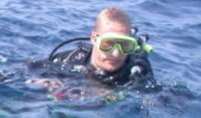
```

- **Bioingénieur** + thèse de doctorat en biologie marine (croissance d'oursins)

- Capacités supplémentaires développées en **science des données** durant des post-docs et via de la consultance pendant 4 ans partout en Europe

- **Laboratoire EcoNum** créé en 2004 à l'Université de Mons

- Intéressé par des travaux **interdisciplinaires** : biologie, chimie, \
modélisation, statistiques, informatique

- **Écrit des logiciels** pour l'écologie en R, Python, ...


### Guyliann Engels

\columnsbegin
\columnlarge

- **Master** en Biologie des Organismes et Écologie à l'UMONS.

- **Mémoire** effectué dans le laboratoire d'Écologie numérique des Milieux aquatiques sur l'écophysiologie et l'écotoxicologie de la posidonie (*Posidonia oceanica*, une plante marine) en Méditerranée.

- **Thèse de doctorat** en cours sur le plancton dans le même laboratoire.

- **Assistant** en biologie à l'UMONS depuis septembre 2017.

\columnsmall


\columnsend

### Identification automatisée du plancton

Le plancton (constitué des organismes aquatiques qui dérivent en pleine eau) forme des communautés très diversifiées. Un litre d'eau de mer contient typiquement des milliers d'espèces de plancton.

*Au laboratoire EcoNum, nous développons des outils pour énumérer automatiquement plancton via l'analyse d'image combinée à la classification supervisée (une technique statistique que nous étudierons en Master 1).*

```{r out.width="80%", echo=FALSE}
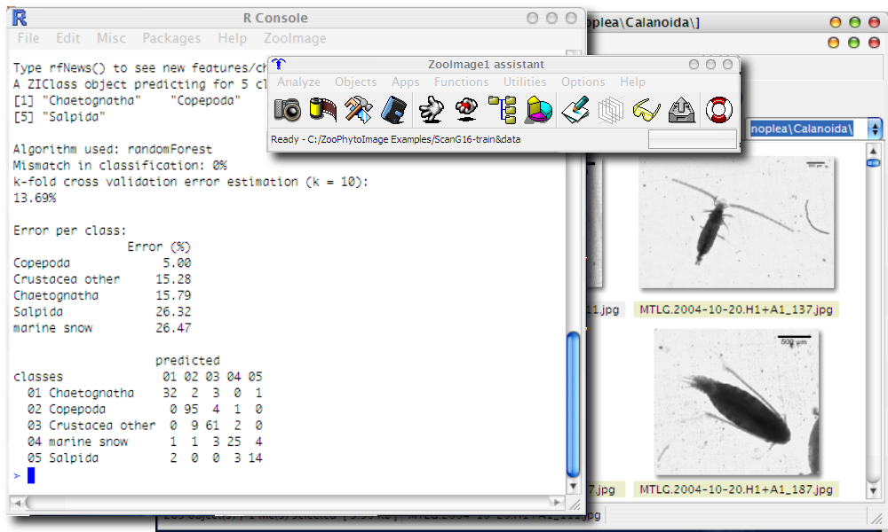
```

\putat{260}{120}{\includegraphics[width=30mm]{figures/copepod.jpg}}

## Science des données

### Science des données : une approche pragmatique

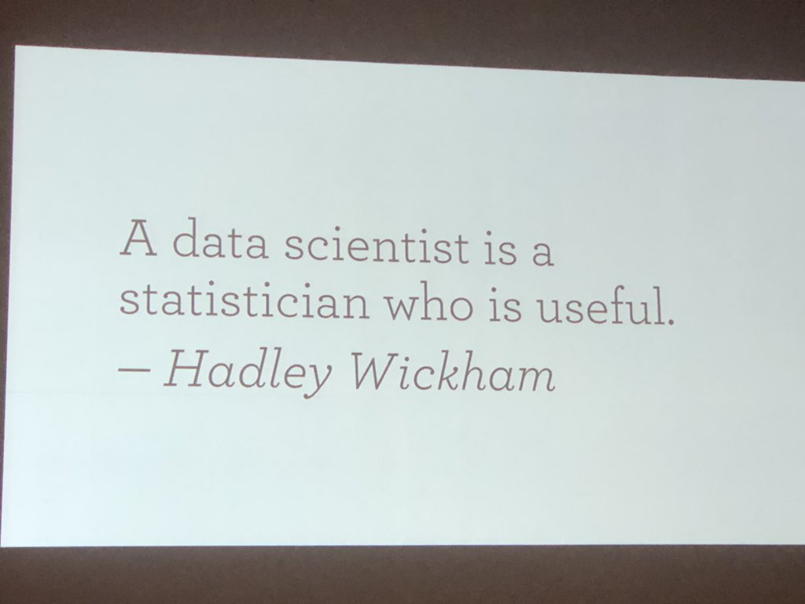

### Science des données : à l'interface entre plusieurs disciplines

\columnsbegin
\columnhalf

- La Science des Données, c'est la discipline qui s'intéresse à l'analyse de données _sous toutes ses formes_

- Très large et **interdisciplinaire** :
    + **(Bio)statistiques** et visualisation
    + Utilisation d'**outils informatiques**
    + Expertise dans le domaine (**biologie**)

- \alert{Il faut maîtriser simultanément les 3 domaines pour être un scientifique des données.}


\columnhalf

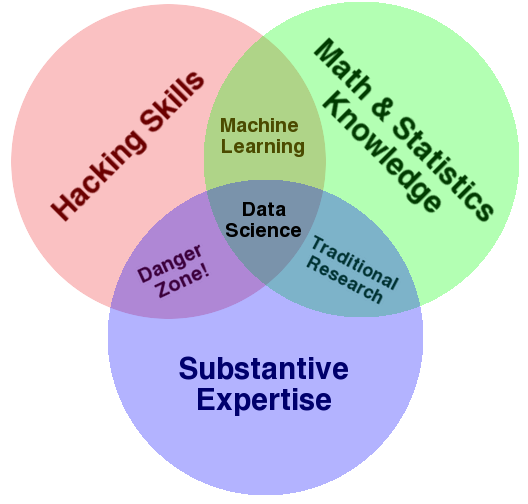

\columnsend


### Pourquoi la science des données ?

- Discipline à la fois ancienne et **récente**
    + Evolution des statistiques, avec ses prémices dans les années 1960 (John Tukey).
    + Emerge comme science à part : 2001 William S. Cleveland, _"Data Science : An Action Plan for Expanding the Technical Area of field of Statistics"_.
    + Le terme **Data Scientist** n'est d'usage courant que depuis 2008.
- Besoin issu de la **quantité de données** disponibles (1 zettabyte = 1 milliard de terabytes = 1 000 000 000 000 000 000 000 octets).
    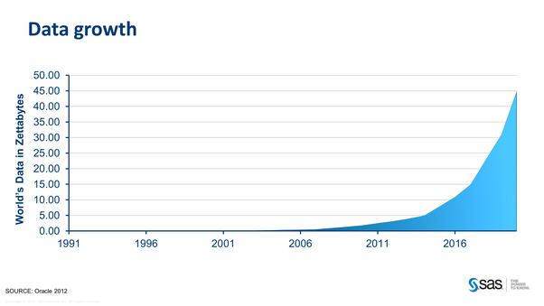

### La science de données biologiques

\columnsbegin
\columnhalf

La biologie n'échappe pas au besoin d'analyser des (gros) jeux de données :

- **Génétique**, bases immenses
- **Biodiversité** animale et végétale
- **Etudes écologiques** avec images satellites, capteurs haute vitesse
- **Littérature** scientifique
- etc.

\alert{Un biologiste analyse des données pratiquement quotidiennement sous une forme ou l'autre !}

\columnhalf

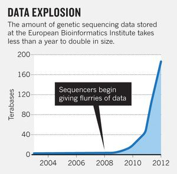

\columnsend

### Objectifs

Nos objectifs principaux durant votre formation en `science des données biologiques` est de vous former afin d'être capanle de :

- réaliser des analyses biologiques usuelles,

- présenter clairement ces résultats de manière reproductible avec des outils informatiques et statistiques professionnels

- développer votre esprit critique

**Vous pouvez retrouver via la fiche du cours le détails de tous les objectifs <http://applications.umons.ac.be/web/fr/pde/2021-2022/ue/US-B2-SCBIOL-006-M.htm>**

## Approche pédagogique

### Apprentissage en continu

L'apprentissage est réparti sur 4 années pour un total de 16 crédits (200h en présentiel). 

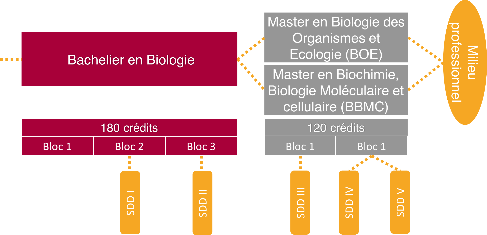

### C'est quoi la classe inversée ?

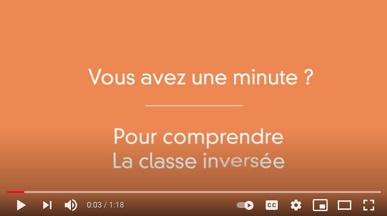
[(lien vers la vidéo)](https://www.youtube.com/watch?v=uLKmLDrGyjw)

### Classe inversée et pédagogie active

Notre approche\ : **pédagogie active en classe inversée** (vous apprenez *d'abord* à la maison, nous appliquons *ensuite* en présentiel -quand on n'est pas confinés-).

\vfill

> I **hear** and I forget.

> I **see** and I remember.

> I **do** and I understand.

> — Confucius

### C'est quoi la pédagogie active ?


[(lien vers la vidéo)](https://www.youtube.com/watch?v=ygjSle9Pkg4)

### Et moi, je fais quoi dans tout cela ?

*Lisez ceci... et réagissez (question Wooclap juste après)\ !*

\center

{width=200}

- Vous êtes **acteur de votre apprentissage**, les enseignants sont des **facilitateurs** (plus en retrait par rapport à l'approche classique).

- Plus de séparation entre **cours théorique** et **exercices**\ ; vos échanges avec le professeur et le ou les assistants sont similaires.

- Les **élèves-assistants** sont coachés tout autant que vous pour vous faciliter l'apprentissage de manière active.

- **Vous posez les questions**, et vos enseignants vous répondent **individuellement**.

## Organisation du cours

### ECTS

**European Credits Transfer System**, créé en 1988 de manière standardisée par la Commission Européenne comme correspondant à une **charge de travail totale** pour l'étudiant de **25 à 30 heures**.

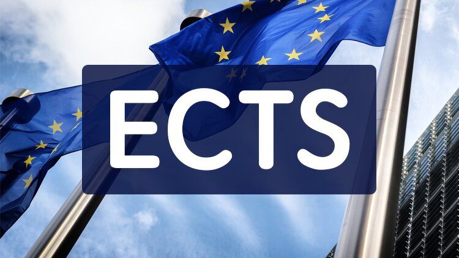

### Optimisation du temps de travail

\center

**Comment voulez-vous passer vos 25-30h/ECTS\ ?**

\vfill

Note\ : 12 modules pour 6 ECTS dans notre cours, donc 1/2 ECTS par module.

### Optimisation du temps de travail à l'Université

**Cours classique *ex cathedra* + séances d'exercices**


- Le réel apprentissage se déroule **après** les séances de cours et d'exercices

- Un examen est nécessaire pour vérifier vos acquis

### Optimisation du temps de travail... comparé à la classe inversée

**Cours classique *ex cathedra* + séances d'exercices**


**Approche en classe inversée**


- *Aucune* séance en présentiel sans préparation

- Chaque heure de travail pleinement consacrée à l'apprentissage

- Vous êtes actifs **tout le temps** et vous gérez **à votre rythme**

- **Pas besoin d'un examen à la fin**\ : travail évalué dans sa globalité

### Le professeur est un coach et un facilitateur

*Mais que font les enseignants alors\ ? Lisez et réagissez (question Wooclap après).*

\center

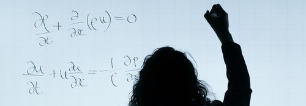{width=200}

- Le professeur (et l'assistant) ne mettent **pas** leur savoir en avant. C'est vous qui construisez votre *propre* savoir.

- Ils **ne répondent pas _directement_ à vos questions**\ : ils vous mettent sur une piste et vous font réfléchir pour trouver la réponse *par vous-même*.

- Ils se mettent en retrait, mais sont **disponibles pour vous aider** (Discord, mail, etc.)

**C'est déroutant car le professeur n'apparaît plus comme l'omniscient qui transmet de manière unilatérale son savoir aux étudiants\ !**

## Apprentissage en 4 niveaux

### Niveaux d'exercice = Apprendre, niveaux 1 à 4

{width='80%'}

### Quatre niveaux d'exercices

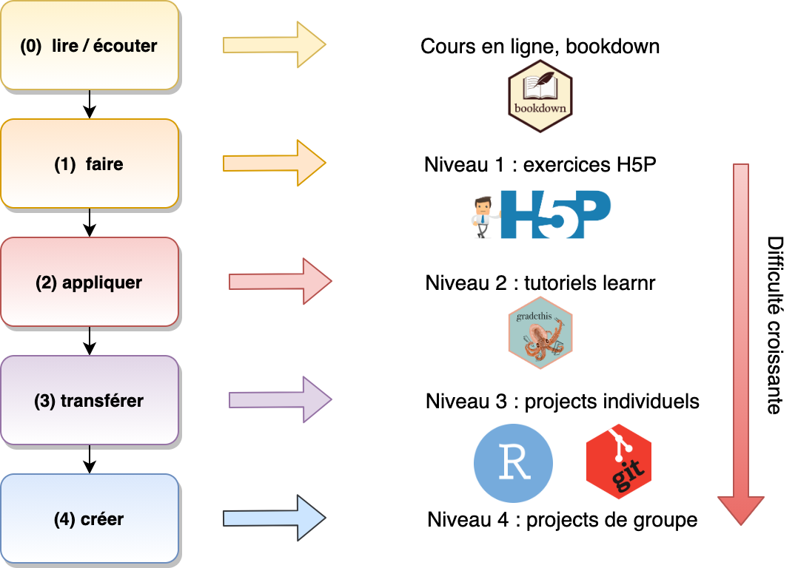{width='80%'}

### Construction de la note

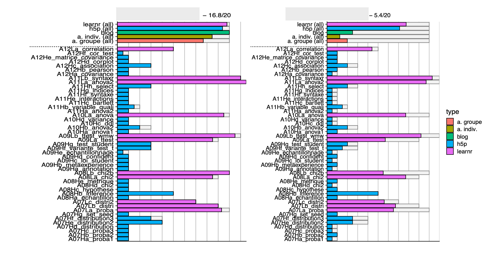{height='80%'}

- Vous pouvez suivre votre progression sur moodle ou en fin du module de cours

## Amélioration continue du cours

### Analyse de l'apprentissage

\begin{center}
\emph{Learning Analytics (LA) : can be defined as the measurement, collection, analysis, and reporting of data about learners and their contexts, for purposes of understanding and optimizing learning and the environments in which it occurs (Lang, Siemens, Wise, \& Gasevic, 2017)}
\end{center}

\vfill

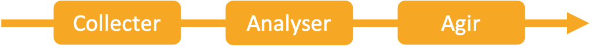

### Exemple 1 : suppression des examens


### Exemple 2 : analyse de la charge de travail

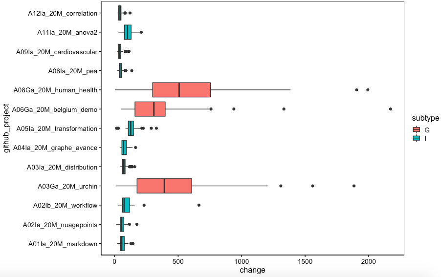

### Etre acteur de l'amélioration

Tout au long de ce cours, nous vous demanderons votre avis ou votre ressenti sur une exercice, sur un chapitre ou encore sur une presentation

**Soyez honnête et constructif**

### Perception générale (roue des émotions de Genève)


### Perception générale - résultats

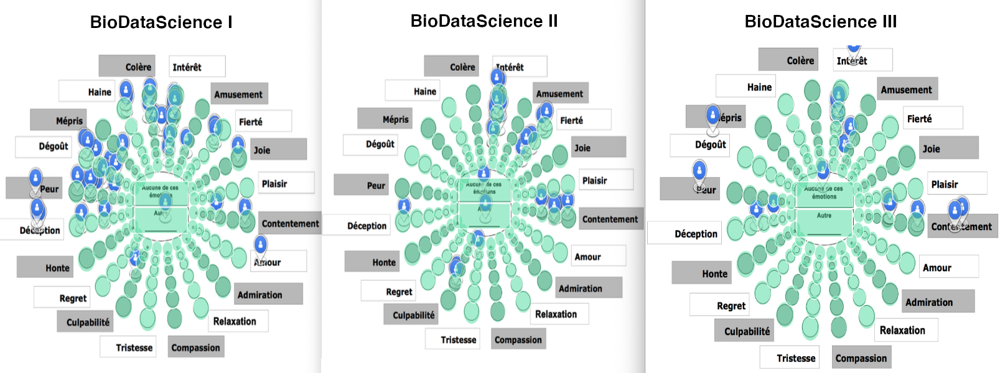

___

\begin{center}
\textbf{Avez-vous des questions ?}
\end{center}

\centering

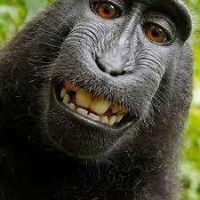{width='30%'}

\vfill

**Ressources utiles**

- Site web du cours \: <https://wp.sciviews.org/>
- Cette présentation\ : <https://github.com/BioDataScience-Course/sdd_lessons/tree/2021-2022/A01/presentations>
