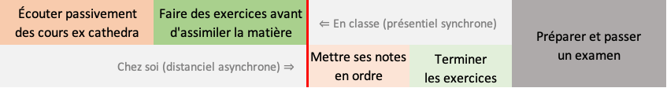

```{r setup, include=FALSE}
knitr::opts_chunk$set(echo = TRUE)
SciViews::R
```


### Science des données : une approche pragmatique


### Science des données : à l'interface entre plusieurs disciplines

\columnsbegin
\columnhalf

- La Science des Données, c'est la discipline qui s'intéresse à l'analyse de données _sous toutes ses formes_

- Très large et **interdisciplinaire** :
    + **(Bio)statistiques** et visualisation
    + Utilisation d'**outils informatiques**
    + Expertise dans le domaine (**biologie**)

- \alert{Il faut maîtriser simultanément les 3 domaines pour être un scientifique des données.}

*C'est notre objectif durant votre formation "science des données biologiques" qui s'étalera sur 4 année.*

\columnhalf


\columnsend


### Pourquoi la science des données ?

- Discipline à la fois ancienne et **récente**
    + Evolution des statistiques, avec ses prémices dans les années 1960 (John Tukey).
    + Emerge comme science à part : 2001 William S. Cleveland, _"Data Science : An Action Plan for Expanding the Technical Area of field of Statistics"_.
    + Le terme **Data Scientist** n'est d'usage courant que depuis 2008.
- Besoin issu de la **quantité de données** disponibles (1 zettabyte = 1 milliard de terabytes = 1 000 000 000 000 000 000 000 octets).
    

### La science de données biologiques

\columnsbegin
\columnhalf

La biologie n'échappe pas au besoin d'analyser des (gros) jeux de données :

- **Génétique**, bases immenses
- **Biodiversité** animale et végétale
- **Etudes écologiques** avec images satellites, capteurs haute vitesse
- **Littérature** scientifique
- etc.

\alert{Un biologiste analyse des données pratiquement quotidiennement sous une forme ou l'autre !}

\columnhalf


\columnsend

### C'est quoi la classe inversée ?


[(lien vers la vidéo)](https://www.youtube.com/watch?v=uLKmLDrGyjw)

### Classe inversée et pédagogie active

Notre approche\ : **pédagogie active en classe inversée** (vous apprenez *d'abord* à la maison, nous appliquons *ensuite* en présentiel -quand on n'est pas confinés-).

\vfill

> I **hear** and I forget.

> I **see** and I remember.

> I **do** and I understand.

> — Confucius

### C'est quoi la pédagogie active ?


[(lien vers la vidéo)](https://www.youtube.com/watch?v=ygjSle9Pkg4)

### Et moi, je fais quoi dans tout cela ?

*Lisez ceci... et réagissez (question Wooclap juste après)\ !*

\center

{width=200}

- Vous êtes **acteur de votre apprentissage**, les enseignants sont des **facilitateurs** (plus en retrait par rapport à l'approche classique).

- Plus de séparation entre **cours théorique** et **exercices**\ ; vos échanges avec le professeur et le ou les assistants sont similaires.

- Les **élèves-assistants** sont coachés tout autant que vous pour vous faciliter l'apprentissage de manière active.

- **Vous posez les questions**, et vos enseignants vous répondent **individuellement**.

### ECTS

**European Credits Transfer System**, créé en 1988 de manière standardisée par la Commission Européenne comme correspondant à une **charge de travail totale** pour l'étudiant de **25 à 30 heures**.


### Optimisation du temps de travail

\center

**Comment voulez-vous passer vos 25-30h/ECTS\ ?**

\vfill

Note\ : 12 modules pour 6 ECTS dans notre cours, donc 1/2 ECTS par module.

### Optimisation du temps de travail à l'Université

**Cours classique *ex cathedra* + séances d'exercices**



- Le réel apprentissage se déroule **après** les séances de cours et d'exercices

- Un examen est nécessaire pour vérifier vos acquis

### Optimisation du temps de travail... comparé à la classe inversée

**Cours classique *ex cathedra* + séances d'exercices**


**Approche en classe inversée**


- *Aucune* séance en présentiel sans préparation

- Chaque heure de travail pleinement consacrée à l'apprentissage

- Vous êtes actifs **tout le temps** et vous gérez **à votre rythme**

- **Pas besoin d'un examen à la fin**\ : travail évalué dans sa globalité

### Le professeur est un coach et un facilitateur

*Mais que font les enseignants alors\ ? Lisez et réagissez (question Wooclap après).*

\center

{width=200}

- Le professeur (et l'assistant) ne mettent **pas** leur savoir en avant. C'est vous qui construisez votre *propre* savoir.

- Ils **ne répondent pas _directement_ à vos questions**\ : ils vous mettent sur une piste et vous font réfléchir pour trouver la réponse *par vous-même*.

- Ils se mettent en retrait, mais sont **disponibles pour vous aider** (Discord, mail, etc.)

**C'est déroutant car le professeur n'apparaît plus comme l'omniscient qui transmet de manière unilatérale son savoir aux étudiants\ !**


### Niveaux d'exercice = Apprendre, niveaux 1 à 4

{width='80%'}


### Quatre niveaux d'exercices

{width='80%'}
