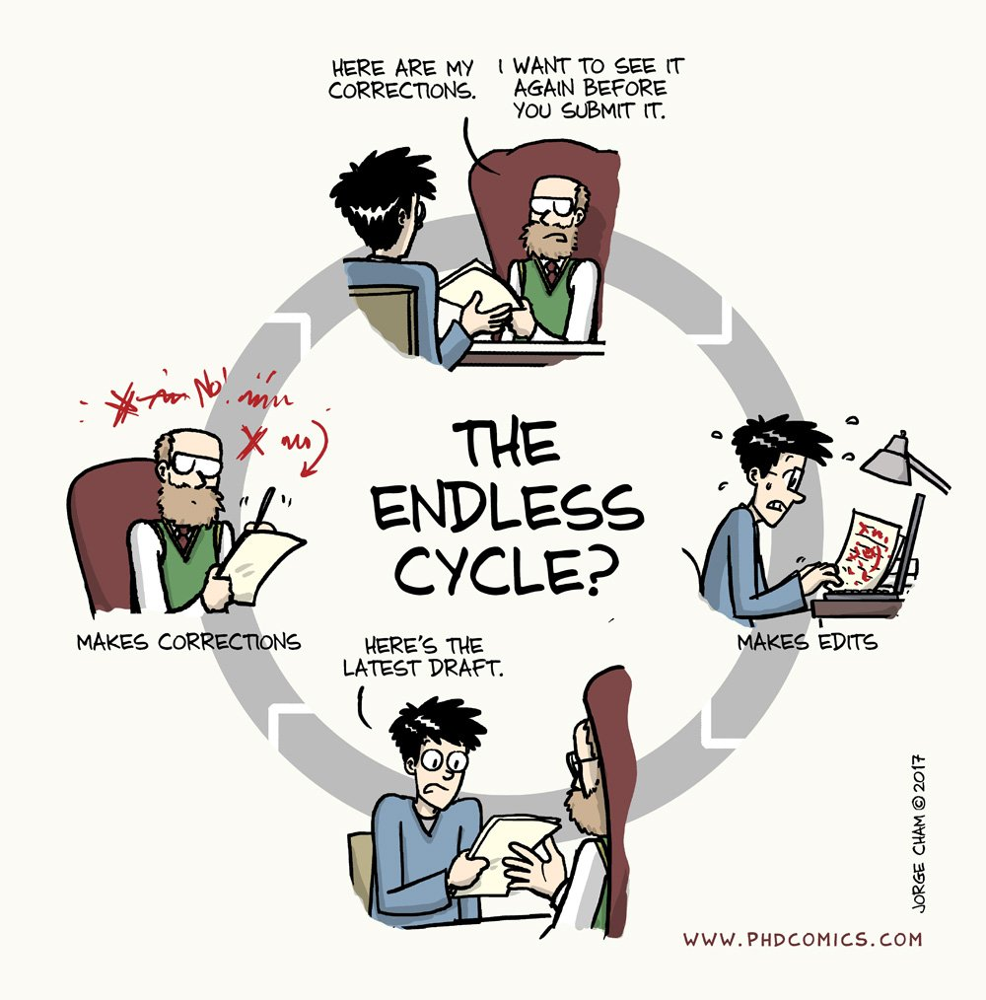
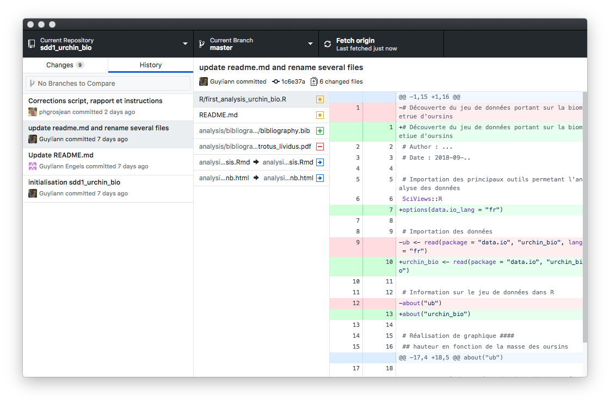
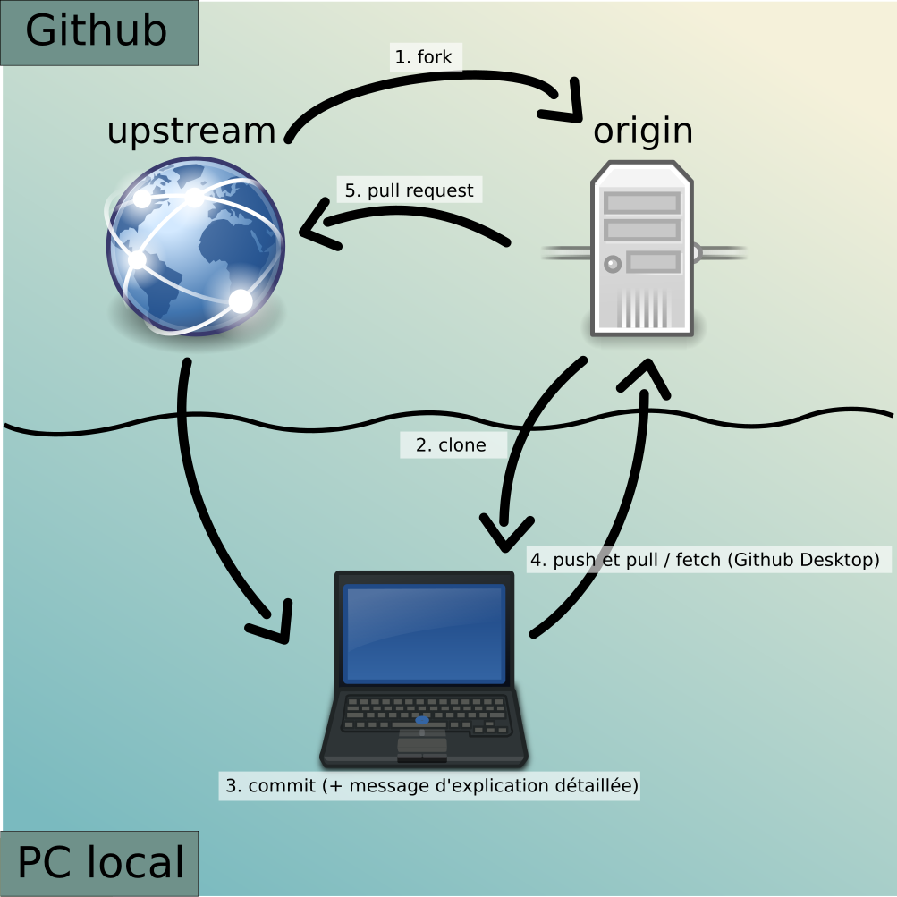

```{r setup, include=FALSE}
knitr::opts_chunk$set(echo = TRUE)
SciViews::R
```

# Git et Github

## Qu'est-ce que Git ?

### Pourquoi gérer des versions ?




### Pourquoi gérer des versions ?


### Qu'est-ce que Git ?

**Git est un système de gestion de versions**

- A un moment donné, on ne voit qu'une seule version

- Mais _toutes_ les versions sont sauvegardées

- On, peut revenir à n'importe quelle de ces versions à tout moment

- On peut naviguer dans l'historique et voir les différences d'une version à l'autre

- Enregistrer une version se dit **faire un commit** dans le langage de Git


### Gestion de l'historique dans RStudio (ou GitHub Desktop)



## Qu'est-ce que GitHub ?

### Sauvegarder sur le Net et partager ses projets

\columnsbegin
\columnsmall

- Le "cloud" a beaucoup de succès. De nombreuses solutions existent : Google Drive/Docs, One Drive, iCloud, Dropbox, ...

- GitHub, Gitlab, ou Bitbucket (entre autres) proposent de combiner le partage en ligne avec la gestion de version Git

\columnlarge


\columnsend

### "Cloner" un projet GitHub sur son PC



### Comment faire dans RStudio ?

- S'identifier dans GitHub\ : créer son "Personal Access Token"

- Créer un projet dans GitHub (éventuellement via ClassRoom)

- Cloner ce **projet** dans **RStudio**

- Éditer un ou plusieurs fichiers

- Sélectionner les fichiers modifiés à committer

- Effectuer un **commit** à chaque fois qu'on veut enregistrer un état, et indiquer un message explicite

**Démonstration "en live" + projet suivi de vaccination COVID-19**
