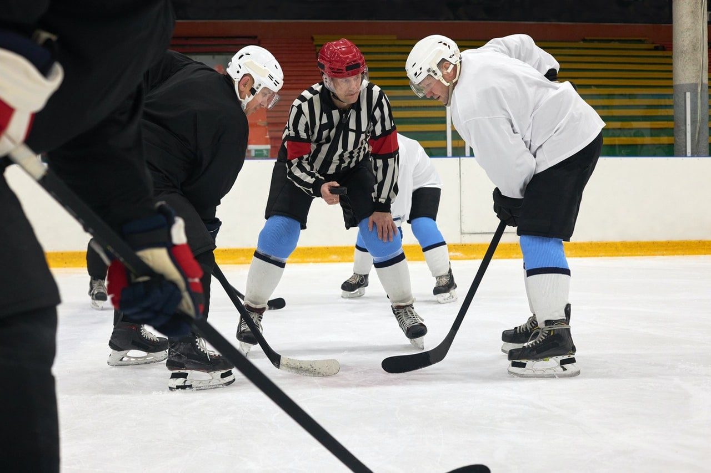

```{r setup, include=FALSE}
knitr::opts_chunk$set(echo = TRUE)
SciViews::R
```

### Reprise...

C'est la reprise... pas encore tout-à-fait ! Durant ces deux heures, nous allons essentiellement nous **préparer** au cours de SDD II.

\center

{width="60%"}

-   Mises-à-jour du logiciel

-   Modifications dans la façon de travailler

-   Travail pour le prochain cours

### Installation logiciel

Cette année-ci, nous utiliserons la **SciViews Box 2022**.

### Rappels et nouveautés

\center

{width="40%"}

-   **Séances assimilées à des TP**. Obligatoires. Si conflit avec un autre TP **obligatoire**, choix à votre jugement. Dans ce cas, *obligatoirement prévenir et rattraper la matière !*

-   **Les présences sont enregistrées**. Les absences doivent être justifiées (certificat médical). Trop d'absences injustifiées ? Vous n'obtiendrez pas de note pour votre travail.

-   **Pas d'examen en session** et **pas d'examen en seconde session** Mais il faut respecter le rythme du cours *(étudier d'avance la matière et faire les exercices H5P, Shiny et Learnr)*.

-   Plus d'utilisation de Discord, remplacé par les **Issues dans GitHub**

### Préparation pour le prochain cours

\center

{width="40%"}

-   Revoir ce qui n'était pas compris

-   Se mettre à jour pour ceux qui ne le sont pas
