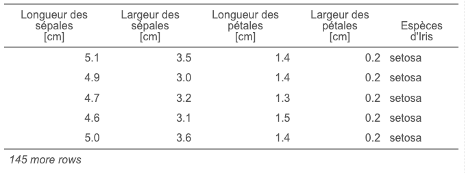

```{r setup, include=FALSE}
knitr::opts_chunk$set(echo = TRUE)
SciViews::R
```

### Reprise...

C'est la reprise... pas encore tout-à-fait ! Durant ces deux heures, nous allons essentiellement nous **préparer** au cours de SDD II.

\center

{width="60%"}

-   Installation du logiciel et nouveautés

-   Modifications dans la façon de travailler

-   Travail pour le prochain cours

### Installation du logiciel

\center

{width="40%"}

Cette année-ci, nous utiliserons la **SciViews Box 2023**, toujours dans le Cloud avec **Saturn Cloud**. Mais il y a deux changements notables :

1.  Nous utiliserons une ressource dans l'organisation **EcoNum** pour le cours (frais pris en charge par le labo)

2.  Votre forfait gratuit passe de 30h à 150h/mois.

Cliquez sur le bouton bleu **RStudio** en haut à droite pour les instructions d'installation (nous allons le faire ensemble).

### Nouveauté : `tabularise()`

-   Avec `SciViews::R` et `chart()` vous obteniez déjà de beaux graphiques

-   Maintenant `tabularise()` vous permet aussi d'obtenir de belles tables (démo...) !



### Changements dans la gestion des séances

\center

{width="40%"}

-   **Séances assimilées à des TP**. Obligatoires. Cela ne change pas.
-   **Planning du travail** dans le cours (voir section [planning des séances](https://wp.sciviews.org/sdd-umons2/?iframe=wp.sciviews.org/sdd-umons2-2023/planning-des-s%25C3%25A9ances.html)). *Plus de message de rappel sur la matière à étudier, etc.*
-   **Deux interrogations et un challenge** par AA (quadrimestre). Répartition des points (voir [plan de cours](https://github.com/BioDataScience-Course/BioDataScience-Common/tree/2023-2024/docs/plan_de_cours/sdd2_plan_cours_2023-2024.pdf)) :
    -   25% des points pour les exercices (5% H5P-Shiny-Learnr, 20% challenge)
    -   25% des points pour les projets (5% individuels, 20% de groupe)
    -   25% première interrogation
    -   25% seconde interrogation

### Préparation pour le prochain cours

\center

{width="40%"}

-   Revoir ce qui n'était pas compris

-   Se mettre à jour pour ceux qui ne le sont pas

-   Préparer **tout** le module 1

**Ressources utiles :**

-   Site web du cours : <http://bds.sciviews.org/>
-   Cette présentation : <https://github.com/BioDataScience-Course/sdd_lessons/tree/2023-2024/B00/presentations>
