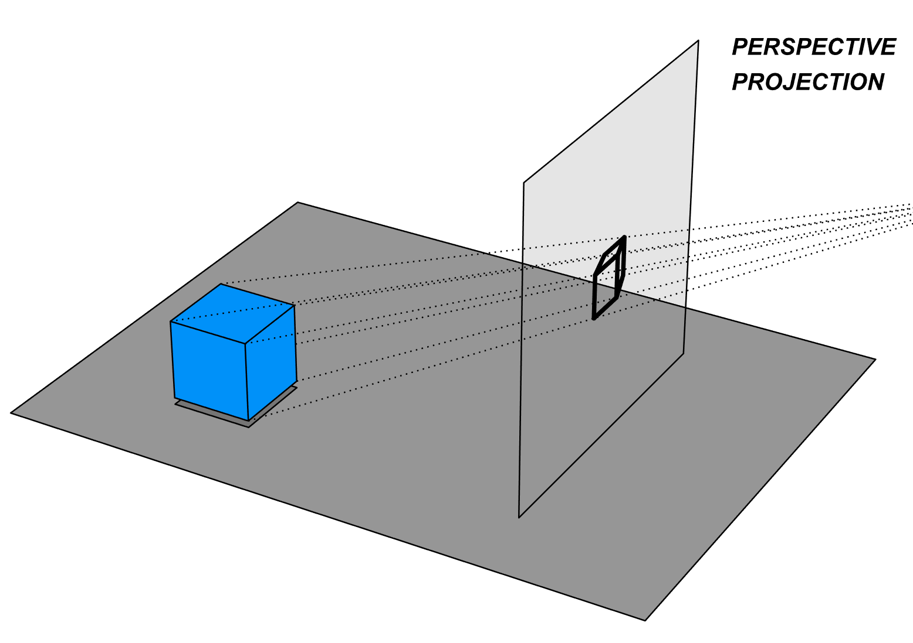
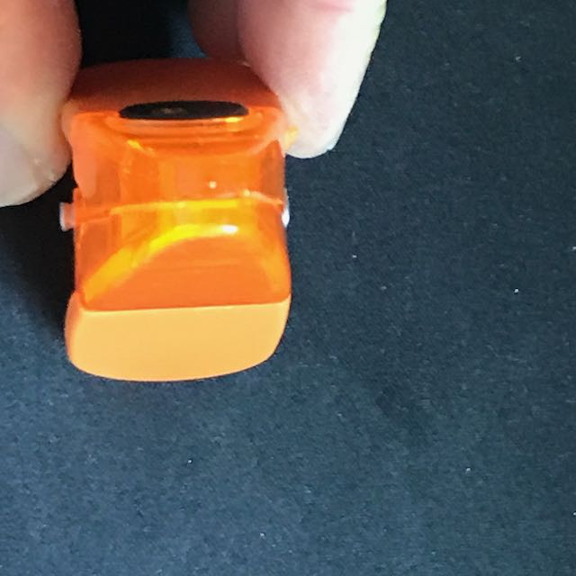
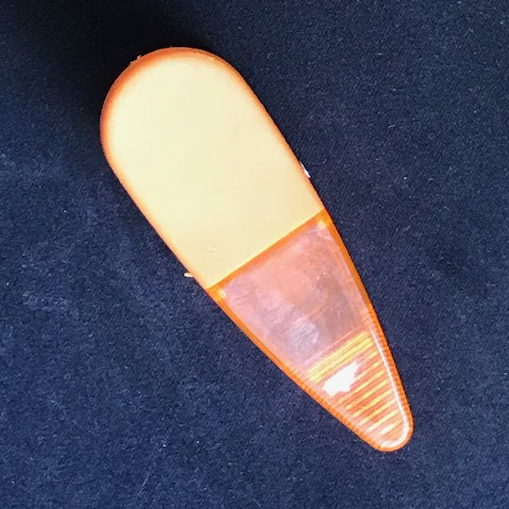
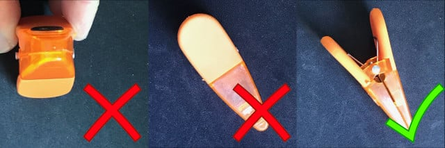

```{r setup, include=FALSE}
knitr::opts_chunk$set(echo = TRUE)
SciViews::R
```

### Comprendre l'ACP

- Nous n'allons pas (ré)expliquer le mécanisme, ni les calculs mathématiques derrière l'ACP. C'est dans le cours

- Nous allons expliciter ensemble l'**idée générale** qui est à l'origine de cette technique

- Objectif\ : **réduire le nombre de dimensions**, tout en conservant un maximum de l'information utile initiale => **Comment déterminer l'information utile\ ?**


### Photo d'un objet tridimensionnel

Une photo (vue en 2D) d'une scène tridimensionnelle est une réduction de dimension. L'**angle** de prise de vue de l'objet est important.



### Qu'est-ce que c'est ?



### Qu'est-ce que c'est ?



### Qu'est-ce que c'est ?


### Qu'est-ce que c'est ?



L'**angle sous lequel la projection de 3D en 2D se fait est important**. Certains angles portent plus d'information que d'autres.

### Qu'est-ce que c'est ?


### Qu'est-ce que c'est ?


### Qu'est-ce que c'est ?


En général, la projection qui correspond à l'**étalement le plus grand** de l'objet est aussi celle qui porte le plus d'information.

### Qu'est-ce que c'est ?


En général, la projection qui correspond à l'**étalement le plus grand** de l'objet est aussi celle qui porte le plus d'information.


### Application à l'ACP

- En général, la projection qui correspond à l'**étalement le plus grand** de l'objet est aussi celle qui porte le plus d'information.

- En statistique, l'étalement se mesure via la variance (ou la covariance si plus d'une variable).

- L'ACP détermine la projection en un nombre de dimensions réduites visant à **étaler le plus possible** le nuage de points au sens de la variance - covariance (ou de la corrélation si les données sont centrées et réduites).

- Note\ : les présentations sont disponibles sur https://github.com/BioDataScience-Course/sdd_lessons

### Bilan

- Le travail en distanciel n'est pas facile, nous en sommes conscients

- Une équipe de 4 personne est disponible pendant les heures (Philippe, Guyliann, Antoine & Maxime), mais trop peu sollicitée, alors qu'il y a beaucoup d'étudiants qui travaillent -et posent leurs questions- à d'autres moments

- **Un tiers de la classe** n'est pas en train de travailler dans le module 7 et est en retard à très en retard

### Vous avez la parole !

\center

{width=250}

- Répondez aux questions (page Wooclap suivante), levez la main pour prendre la parole.
