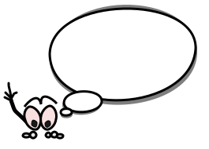

```{r setup, include=FALSE}
knitr::opts_chunk$set(echo = TRUE)
SciViews::R
```

### Bilan

\center 

{width='50%'}

- Nous arrivons à la fin de cette AA consacrée à l'analyse multivariée

- Pour ceux qui ont tenu bon jusqu'au bout\ : **bravo\ !** La matière n'est pas facile et le travail en distanciel total n'a évidemment pas facilité les choses

- Progression générale\ : l'ensemble de votre travail est à finir pour le **30 avril**. La cotation sera similaire au Q1. Note final = moyenne Q1 + Q2.

- Attention\ : nous ne pourrons pas répondre à vos questions durant les 2 semaines de Pâques

\vfill

- Besoin d'une séance en présentiel avant la fin (si possible)\ ?


### À vous la parole !

\center 

{width='30%'}

Nous continuons notre processus participatif des étudiants pour améliorer *votre* cours de Science des Données. Vous allez maintenant pouvoir vous exprimer concernant\ :

\vfill

- Une question relevant de *vos émotions*

- Un formulaire relatif à *votre perception* de l'ensemble R + RStudio + R Markdown.


### Tutoriels Learnrs

\center 

{width='50%'}

Les tutoriels learnrs proposent des exercices auto-évaluatifs dans le contexte d'une analyse de données réelles. **Ils sont conçus pour vous permettre une transition en douceur entre théorie et pratique.**

- Vous avez maintenant la possibilité de noter *votre perception de cet outil* dans ce contexte.

