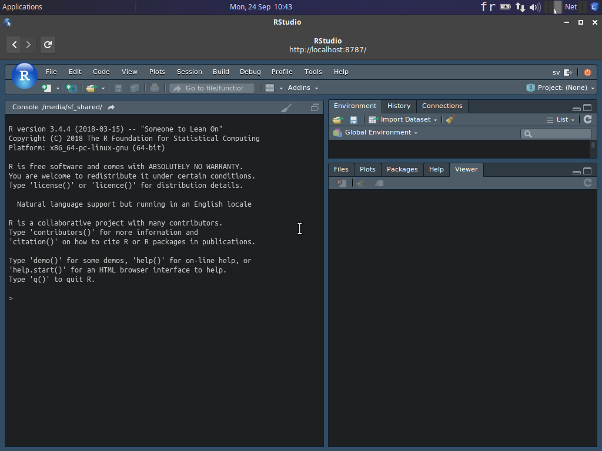
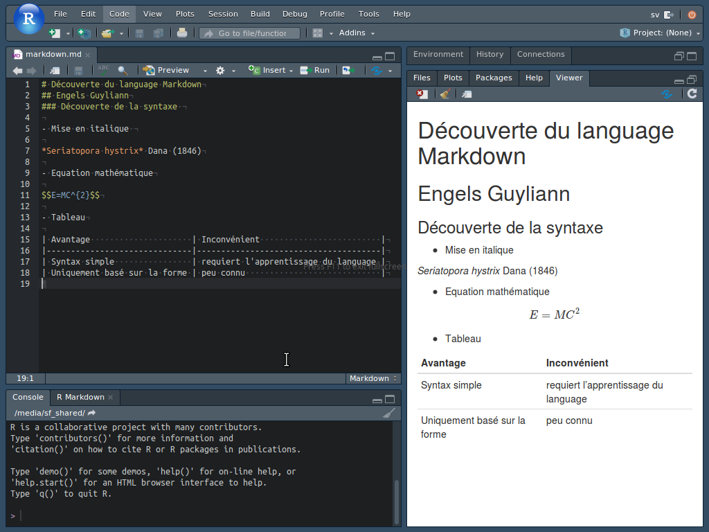

Exercice du cours de [Science des Données Biologiques I de l'Université de Mons, module 01](http://biodatascience-course.sciviews.org/sdd-umons/decouverte-des-outils.html#markdown).

Objectifs
---------

-   Apprendre à écrire un document Markdown.

Procédure
---------

Une fois votre machine virtuelle configurée, vous vous trouvez face à cet écran après avoir lancé RStudio.

Créez un nouveau document Markdown (menu `File` -&gt; `New File` -&gt; `Text File`). Enregistrez ce document dans `/shared/projects` sous le nom `markdown.md`. **L'extension `.md` est importante !** Elle identifie un ficher de type Markdown. Vous pouvez lire le type de fichier reconnu en bas à droite de la fenêtre d'édition de RStudio.

Familiarisez-vous avec la syntaxe Markdown en remplissant ce document. Les balises à utiliser dans un texte Markdown sont résumées dans l'aide-mémoire Markdown qui vous a été distribué. Les éléments princiaux de sa syntaxe sont également accessibles directement depuis RStudio (menu `Help` -&gt; `Markdown Quick Reference`).

-   Ajoutez le titre principal[1]
-   Ajoutez le titre secondaire secondaire[2]
-   Ajoutez maintenant une liste contenant 3 items : 'mise en italique', 'équation mathématique' et 'tableau'[3].
-   Sous le premier élément de liste, ajouter le nom scientifique de l'espèce de corail suivante : *Seriatopora hystrix* Dana (1846). Le nom scientifique d'une espèce doit s'écrire en italique[4]
-   Sous le second item de la liste, ajoutez l'équation ci-dessous dans votre document[5]

    *E* = *M**C*2

-   Enfin, sous le troisième élément de liste, créez un tableau qui reprend les principaux avantages et inconvénients du balisage Markdown[6].

------------------------------------------------------------------------

Une fois votre document édité, cliquez sur le bouton `Preview` dans la barre d'outil de l'éditeur RStudio, vous voyez le résultat : un document final formatté conformément à vos directives Markdown qui apparait soit dans l'onglet `Viewer` en bas à droite, soit dans une fenêtre séparée selon le réglage dans RStudio.

Bilan
-----

**A travers ces exercices, vous avez appris à :**

-   Créer et éditer un document Markdown dans RStudio,

-   Utiliser le balisage spécifique à Markdown pour formatter les divers éléments de votre document (utilisez l'aide-mémoire dorénavant pour approfondir votre apprentissage du balisage Markdown),

-   Créer une version formattée de votre document Markdown via la fonction de "`Preview`" de RStudio.

[1] Utilisez un dièse `#` comme premier caractère à la ligne suivi d'un espace et d'un titre de niveau 1.

[2] Utilisez deux dièses `##` en début de ligne, suivis d'un espace devant un titre de niveau 2.

[3] Un élément de liste commence par un signe moins `-` en début de ligne suivi d'un espace.

[4] Utilisez un astérisque `*` devant et un autre derrière la partie de phrase à placer en italique.

[5] Utilisez le symbole dollar `$` devant et derrière l'équation pour une équation incluse dans le texte. Doublez les dollars pour une équation individualisée sur sa propre ligne. L'équation s'écrit en LaTeX.

[6] Inspirez-vous de l'aide-mémoire pour déterminer comment présenter un tableau dans Markdown. Vous pouvez aussi vous aider de l'application `Table Editor` dans la section `Internet` (menu `Applications` tout en haut à gauche) pour créer plus facilement votre tableau. N'oubliez pas de sélectionner l'onglet `Markdown` en dessous du tableau. Au fur et à mesure que vous remplissez la grille dans la partie supérieure, vous voyez comment écrire le balisage correspondant dans le bas. Une fois terminé, copiez la partie balisée Markdown du bas et collez-là dans votre document dans RStudio.
