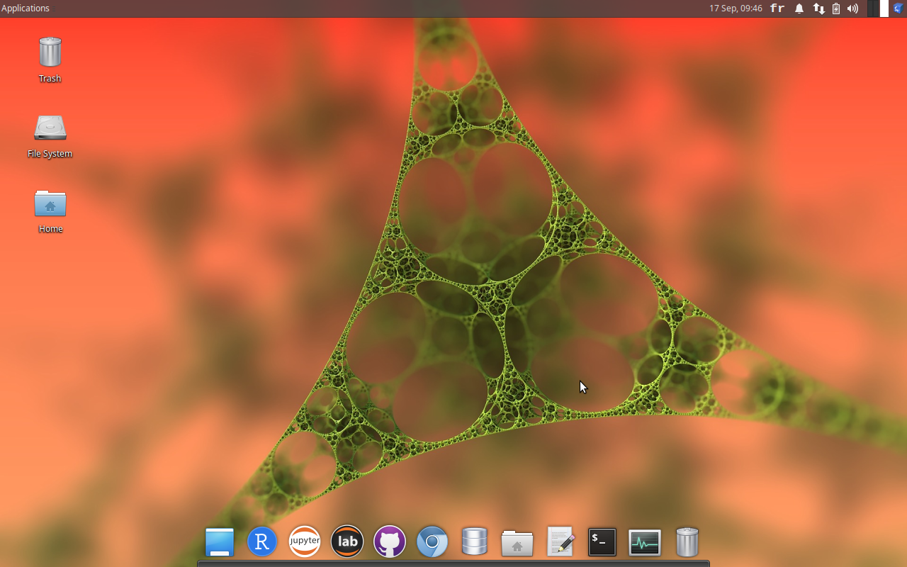

Exercice du cours de [Science des Données Biologiques I de l’Université
de Mons, module
01](http://biodatascience-course.sciviews.org/sdd-umons/decouverte-des-outils.html#machine-virtuelle).

Ce document propose une correction et un complément d’information à
l’activité liée à la découverte de la SciViews Box 2019.

Une fois votre machine virtuelle configurée, vous vous trouvez face à
cet écran lorsque vous la démarrez.

Vous avez en haut à gauche de votre machine virtuelle, le menu déroulant
qui se nomme : `Applications` . Vous trouvez dans ce menu déroulant une
multitude d’applications.

Exercice 1
----------

-   Trouvez une application permettant d’écrire des équations
    mathématiques.

Vous pouvez trouver dans la machine virtuelle l’application **Latex
Equation Editor** qui se trouve dans le menu système `Applications` puis
dans la section `Office` ou encore `Chromium Apps`.

Vous pouvez ensuite facilement écrire votre équation mathématique dans
la fenêtre de gauche et le résultat dans la fenêtre de droite.

-   Trouvez une application permettant de visualiser et récupérer des
    caractères spéciaux.

Vous pouvez trouver dans la machine virtuelle l’application
**Characters** ou **Character Map** qui sont dans le menu système
`Applications` puis dans la section `Accessoires`.

-   Trouvez une application permettant de faire facilement des
    sauvegarde de vos données

Il est très important de réaliser des sauvegardes de vos fichiers. Vous
n’êtes pas à l’abris d’un problème avec votre ordinateur (panne,
perte,…). Vous pouvez trouver dans la machine virtuelle l’application
**Grsync** qui se trouve dans le menu système `Applications` puis dans
la section `System`.

-   Trouvez une application permettant de visualiser l’occupation de
    l’espace sur le disque.
    -   Quel dossier occupe le plus de place sur le disque `box2019` ?

Vous pouvez trouver dans la machine virtuelle l’application **Disk Usage
Analyzer** qui se trouve dans le menu système `Applications` puis dans
la section `System`.

Le disque occupe 16,4Gb, et le dossier le plus volumineux est `/usr`
avec 12,1Gb. Ce dossier contient une série de librairies, dont les
nombreux packages R préinstallés. Ceci justifie sa taille.

La SciViews box 2019 comprend encore une multitude d’applications.
N’hésitez pas à prendre un peu de temps pour les explorer.

Exercice 2
----------

Lancez l’application `Mousepad` (un éditeur de texte simple). Vous
pouvez y accéder depuis le menu système `Applications`, à partir des
favoris, ou de la section `Accessories`. Vous pouvez également y accéder
depuis le **dock** qui se trouve en bas de la fenêtre de la SciViews
Box[1]. Une fois `Mousepad` ouvert, écrivez-y la phrase suivante :

> **Je découvre une partie des applications présentes dans la SciViews
> Box 2019.**

-   Sauvegardez votre fichier dans le dossier `~/Documents` sous le nom
    `test.txt`.

-   Recherchez votre fichier `test.txt` dans votre ordinateur hôte
    (Windows, MacOS, …) et notez la position du fichier.

Lorsque vous vous trouvez sur votre machine hôte, il n’est pas possible
de trouver votre fichier `test.txt`. En effet, le dossier `Documents` de
votre machine virtuelle n’est pas accessible depuis votre machine hôte.
Vous avez lu dans la section [Accès aux
fichiers](http://biodatascience-course.sciviews.org/sdd-umons/configuration.html#acces-aux-fichiers)
de l’[annexe
A](http://biodatascience-course.sciviews.org/sdd-umons/svbox.html)
portant sur l’installation de la SciViews Box. La SciViews Box 2019 est
configurée afin d’avoir le dossier `shared` synchronisé en temps réel
entre les deux systèmes

-   Déplacez le fichier `test.txt` sur le bureau de la machine
    virtuelle.

Lorsque vous déplacez le fichier sur le bureau, votre fichier est
déplacé et ne se trouve plus dans la dossier `Documents`.

-   Déplacez à nouveau ce fichier, cette fois-ci dans le sous-dossier
    `projects` du dossier `shared`. Qu’observez vous ?

Lorsque vous déplacez le fichier dans le dossier `shared`, votre fichier
est copié. Il se trouve dans le dossier `shared` et sur le bureau de la
machine virtuelle.

-   Recherchez à nouveau votre fichier `test.txt` à partir de votre
    ordinateur hôte et notez la position du fichier.

Vous retrouvez votre fichier `test.txt` cette fois depuis votre machine
hôte dans le dossier `shared` local. Vous pouvez accéder facilement à ce
dossier `shared` local à partir du lanceur rappide de la SciViews Box,
bouton `Go to shared folder`.

Conclusion
----------

**Bravo ! Via ces quelques petits exercices ludiques, vous venez de
comprendre le fonctionnement général de la SciViews Box.** Ce n’est pas
très différent de Windows ou MacOS. Vous savez maintenant :

-   Accéder à vos applications depuis la barre système ou depuis le
    Dock,

-   Enregistrer vos documents au bon endroit si vous voulez pouvoir y
    accéder à la fois depuis la SciViews Box et depuis l’ordinateur hôte
    (dans le dossier partagé `shared` ou un de ses sous-dossiers, avec
    le sous-dossier `projects` à privilégier).

[1] Vous noterez que le dock se replie automatiquement lorsqu’une
fenêtre le recouvre, mais il réapparait lorsque vous placer le curseur
de la souris en bas de la fenêtre. Notez aussi que les applications que
vous lancez y apparaissent et leurs fenêtres sont représentée par un
point coloré en dessous de l’icône pour chaque fenêtre ouverte.
