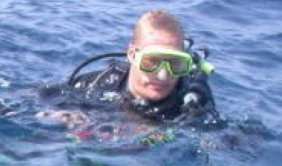
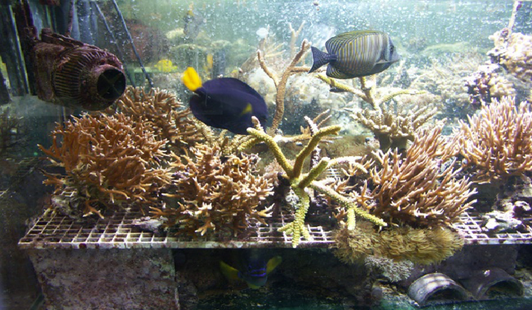
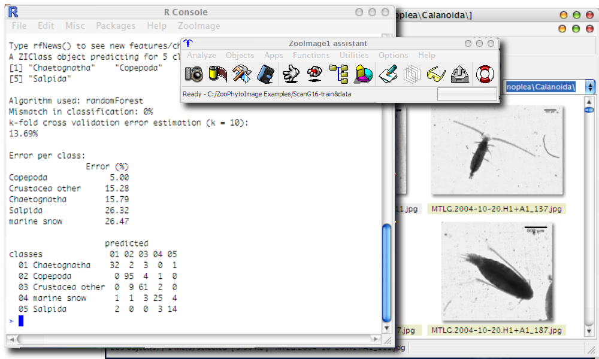
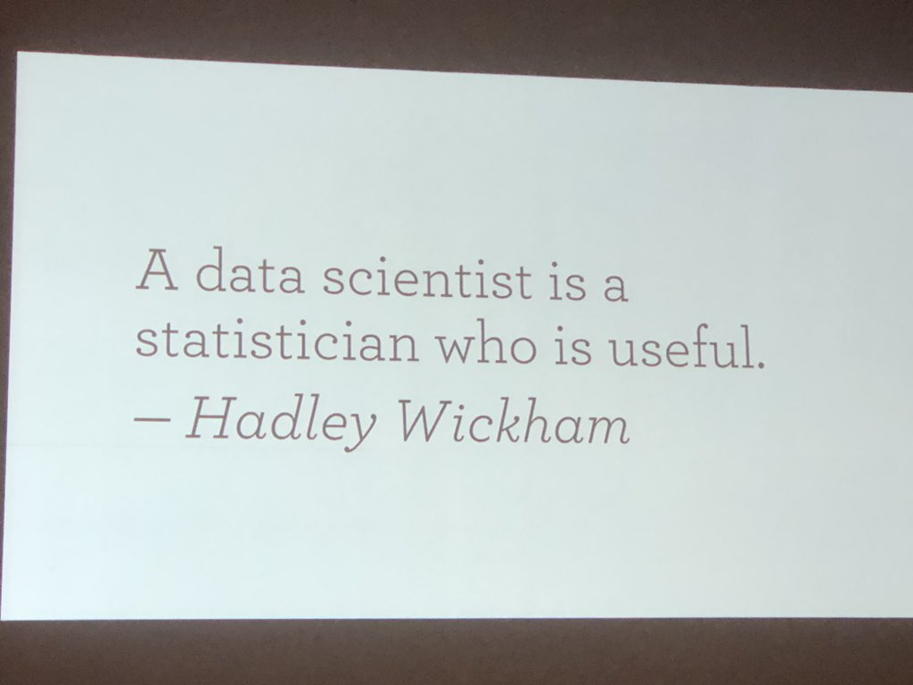
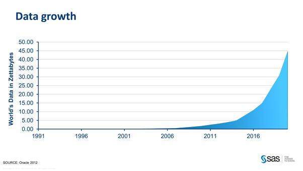
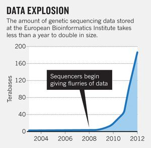
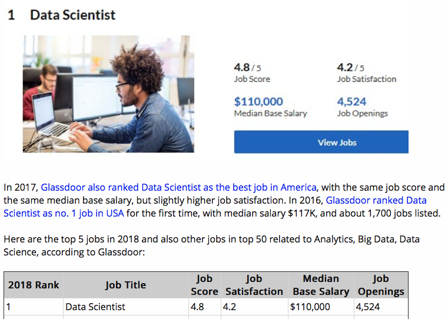
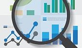

```{r setup, include=FALSE}
knitr::opts_chunk$set(echo = TRUE)
SciViews::R
```


# Présentation

## Qui sommes-nous ?

### Prof. Philippe Grosjean

\putat{190}{-115}{\includegraphics[width=50mm]{../images/urchin-growth.pdf}}

\putat{245}{-115}{\includegraphics[width=40mm]{../images/urchins.png}}

```{r out.width="50%", echo=FALSE}

```

- **Bioingénieur** + thèse de doctorat en biologie marine (croissance d'oursins)

- Capacités supplémentaires développées en **science des données** durant des post-docs et via de la consultance pendant 4 ans partout en Europe

- **Laboratoire EcoNum** créé en 2004 à l'Université de Mons

- Intéressé par des travaux **interdisciplinaires** : biologie, chimie, \
modélisation, statistiques, informatique

- **Écrit des logiciels** pour l'écologie en R, Python, ...


### Guyliann Engels

\columnsbegin
\columnlarge

- **Master** en Biologie des Organismes et Écologie à l'UMONS.

- **Mémoire** effectué dans le laboratoire d'Écologie numérique des Milieux aquatiques sur l'écophysiologie et l'écotoxicologie de la posidonie (*Posidonia oceanica*, une plante marine) en Méditerranée.

- **Thèse de doctorat** en cours sur le plancton dans le même laboratoire.

- **Assistant** en biologie à l'UMONS depuis septembre 2017.

\columnsmall


\columnsend


### Ecophysiologie des coraux en mésocosmes

Les récifs de coraux tropicaux forment des écosystèmes riches et diversifiés, mais ils sont en danger face aux changement climatiques globaux, la surpêche et la pollution.

*Au laboratoire EcoNum, nous étudions comment l'environnement affecte la croissance, la reproduction et la santé des coraux tropicaux en mésocosmes récifaux artificiels.*




### Identification automatisée du plancton

Le plancton (constitué des organismes aquatiques qui dérivent en pleine eau) forme des communautés très diversifiées. Un litre d'eau de mer contient typiquement des milliers d'espèces de plancton.

*Au laboratoire EcoNum, nous développons des outils pour énumérer automatiquement plancton via l'analyse d'image combinée à la classification supervisée (une technique statistique que nous étudierons en Master 1).*

```{r out.width="80%", echo=FALSE}

```

\putat{260}{120}{\includegraphics[width=30mm]{../images/copepod.jpg}}


# Généralités

## Qu'est-ce que la science des données ?

### Science des données : une approche pragmatique



### Science des données : à l'interface entre plusieurs disciplines

\columnsbegin
\columnhalf

- La Science des Données, c'est la discipline qui s'intéresse à l'analyse de données _sous toutes ses formes_

- Très large et **interdisciplinaire** :
    + **(Bio)statistiques** et visualisation
    + Utilisation d'**outils informatiques**
    + Expertise dans le domaine (**biologie**)

- \alert{Il faut maîtriser simultanément les 3 domaines pour être un scientifique des données.}

*C'est notre objectif durant votre formation "science des données biologiques" qui s'étalera sur 4 année.*

\columnhalf


\columnsend


### Pourquoi la science des données ?

- Discipline à la fois ancienne et **récente**
    + Evolution des statistiques, avec ses prémices dans les années 1960 (John Tukey).
    + Emerge comme science à part : 2001 William S. Cleveland, _"Data Science : An Action Plan for Expanding the Technical Area of field of Statistics"_.
    + Le terme **Data Scientist** n'est d'usage courant que depuis 2008.
- Besoin issu de la **quantité de données** disponibles (1 zettabyte = 1 milliard de terabytes = 1 000 000 000 000 000 000 000 octets).
    

### La science de données biologiques

\columnsbegin
\columnhalf

La biologie n'échappe pas au besoin d'analyser des (gros) jeux de données :

- **Génétique**, bases immenses
- **Biodiversité** animale et végétale
- **Etudes écologiques** avec images satellites, capteurs haute vitesse
- **Littérature** scientifique
- etc.

\alert{Un biologiste analyse des données pratiquement quotidiennement sous une forme ou l'autre !}

\columnhalf



\columnsend


### Scientifique des données : le meilleur job !

... aux USA, voir https://www.kdnuggets.com/2018/01/glassdoor-data-scientist-best-job-america-3years.html




### Ce que cela signifie pour vous...

- Croissance exponentielle des données = besoin de spécialistes
- Aujourd'hui, un plus, demain une **obligation**
- Tout biologiste a le _même_ diplôme. C'est les _spécialisations_ qui les différencient
- Un spécialiste en science des données \alert{trouve un travail immédiat, intéressant et bien payé !}

**Prévoyez dès maintenant de rajouter cette compétence dans votre C.V. Nous sommes là pour vous y aider.**



# Cours

## Approche des cours de science des données biologiques

### Science des données biologiques à l'UMONS

- Nouveau cours, plus axé sur l'utilisation des outils et moins sur les statistiques de base qu'avant

- Matériel didactique riche et varié :
    + Syllabus en ligne http://biodatascience-course.sciviews.org/sdd-umons/, en évolution permanente,
    + Tutoriels interactifs (dans la machine virtuelle),
    + Capsules vidéos (à venir),
    + Dépôts Github (Classroom) pour les exercices.
    + Matériel complémentaire sur Moodle.
    + Site Web : http://biodatascience-course.sciviews.org

- Travail en **classe inversée** : vous étudiez et préparez chez vous _avant_ les séances
- Compléments et travail supplémentaire en séance

**Apprendre la science des données, c'est comme apprendre une nouvelle langue : sur la durée et en pratiquant souvent.**
