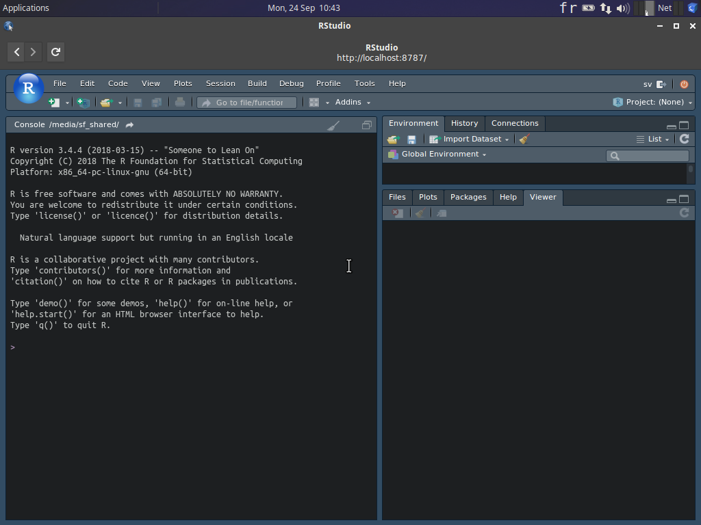

```{r setup, include=FALSE}
knitr::opts_chunk$set(echo = TRUE)
SciViews::R
```

### Découverte de Markdown



___

- Créez un nouveau document `File -> New File -> Text File`

- Enregistrez ce document dans `shared -> projects` 

- Nommez le `markdown.md`

___

- Ajoutez le titre principal 
    +  Ecrivez : Découverte du language Markdown

___

- Ajoutez le titre secondaire secondaire
    +  Ecrivez : Nom et prénom 

___


- Ajoutez un élément de liste intitulé 'mise en italique' 
    +  Ecrivez ensuite : *Seriatopora hystrix* Dana (1846)

Attention, respectez la mise en italique.

___

- Ajoutez un autre élément de liste intitulé 'équation mathématique'. Ensuite, entrez l'équation ci-dessous dans votre document :

$$E = MC^2$$

___

- Ajoutez un troisième élément de liste intitulé 'tableau', puis ajoutez un tableau indiquant les avantages et inconvénients du langage Markdown.

___

#### Astuces

- `EqualX` permet d'écrire facilement des équations complexes qu'il suffit de copier-coller dans le document Markdown.

- `Table Editor` permet d'écrire facilement des tableau dans différents formats, dont Markdown. 
