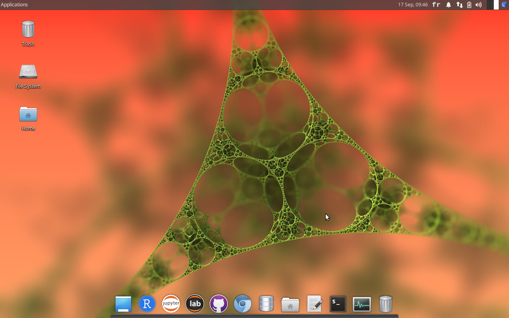
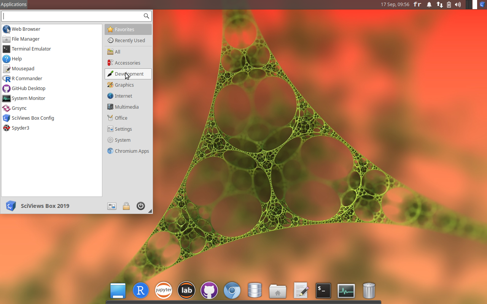

```{r setup, include=FALSE}
knitr::opts_chunk$set(echo = TRUE)
SciViews::R
```


### Découverte de la SciViews Box 2019

Vous vous trouvez sur le bureau (*desktop*) de la machine virtuelle. Explorez la SciViews Box 2019

{width="80%"}

___

La SciViews Box 2019 est un système complet, comme celui installé dans votre ordinateur hôte. Elle comprend une multitude d'applications intéressantes.

{width="80%"}

### Exercice 1

- Trouvez une application permettant d'écrire des équations mathématiques. Ensuite, entrez-y l'équation suivante\ :

$$E=mc^2$$

- Trouvez une application permettant de visualiser et récupérer des caractères spéciaux.

- Trouvez une application permettant de faire facilement des sauvegardes de vos données

- Trouvez une application permettant de visualiser l'occupation de l'espace sur le disque.
    + Quel dossier occupe le plus de place sur le disque `box2019`\ ? 


### Exercice 2

- Employez l'application `Mousepad` pour écrire la phrase suivante\ :

> **Je découvre une partie des applications présentes dans la SciViews Box 2019.**

- Sauvegardez votre fichier dans le dossier `~/Documents` avec le nom suivant `test.txt`

___

- Recherchez votre fichier `test.txt` dans votre ordinateur hôte (Windows, MacOS, ...) et notez la position du fichier.

___

- Déplacez le fichier `test.txt` sur le bureau de la machine virtuelle. Recherchez-le à nouveau dans votre ordinateur hôte.

- Déplacez à nouveau ce fichier, cette fois-ci dans le sous-dossier `projects` du dossier `shared`. Qu'observez vous\ ? 

- Recherchez à nouveau votre fichier `test.txt` à partir de votre ordinateur hôte et notez la position du fichier (note\ : vous pouvez accéder facilement à votre dossier `shared` depuis l'ordinateur hôte via le lanceur rapide, bouton `Go to shared folder`).

