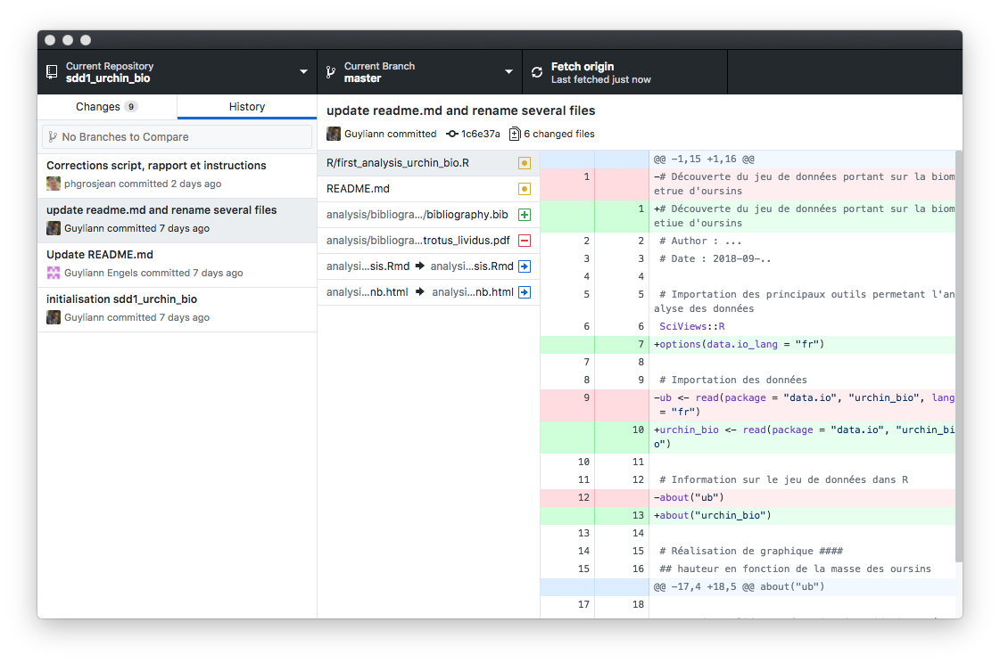
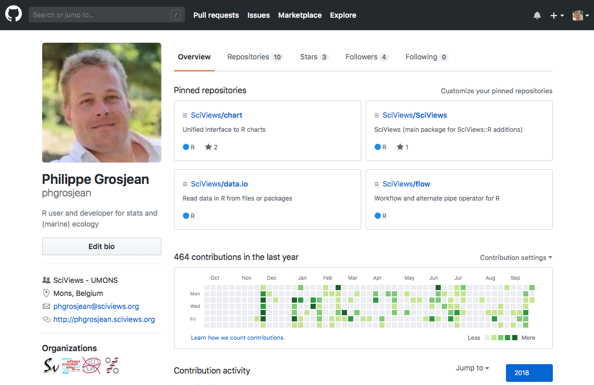

```{r setup, include=FALSE}
knitr::opts_chunk$set(echo = TRUE)
SciViews::R
```


# Git et Github

## Qu'est-ce que Git ?

### Pourquoi gérer des versions ?


### Pourquoi gérer des versions ?


### Qu'est-ce que Git ?

**Git est un système de gestion de versions**

- A un moment donné, on ne voit qu'une seule version

- Mais _toutes_ les versions sont sauvegardées

- On, peut revenir à n'importe quelle de ces versions à tout moment

- On peut naviguer dans l'historique et voir les différences d'une version à l'autre

- Enregistrer une version se dit **faire un commit** dans le langage de Git


### Gestion de l'historique dans Github Desktop




### Comment faire dans RStudio ?

- Créer ou ouvrir un **projet** dans **RStudio** et **activer Git**

- Un onglet **Git apparait**. Tout peut être fait directement à partir de là

- Sélectionner les fichiers modifiés à committer

- Effectuer un **commit** à chaque fois qu'on veut enregistrer un état, et indiquer un message explicite

**Démonstration "en live"**


## Qu'est-ce que Github ?

### Sauvegarder sur le Net et partager ses projets

\columnsbegin
\columnsmall

- Le "cloud" a beaucoup de succès. De nombreuses solutions existent : Google Drive/Docs, One Drive, iCloud, Dropbox, ...

- Github, Gitlab, ou Bitbucket (entre autres) proposent de combiner le partage en ligne avec la gestion de version Git

\columnlarge



\columnsend


### "Forker" un projet Github dans son espace et l'utiliser sur son PC


### A vous de jouer !

Mettez tout cela en application en réalisant votre propre site web à partir d'un fork de `BioDataScience-Course/blogdown.source`
