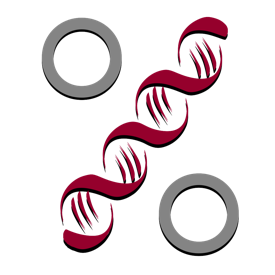

Challenge relatif au cours de [Science des Données Biologiques I de l'Université de Mons, module 05](http://biodatascience-course.sciviews.org/sdd-umons/import.html).



Objectif
--------

-   Vous exercer à la manipulation des données sur le jeu de données `zooplankton`.

Procédure
---------

Reprenez votre projet sur l'étude du zooplancton et complétez votre rapport, ou ouvrez un document R Markdown séparé pour répondre aux challenges suivants. Utilisez la version *complètement* francisée du jeu de données, importé à l'aide de l'instruction :

``` r
(zoo <- read("zooplankton", package = "data.io", lang = "FR"))
```

    ## # A tibble: 1,262 x 20
    ##      ecd  area perimeter feret major minor  mean  mode   min   max std_dev
    ##    <dbl> <dbl>     <dbl> <dbl> <dbl> <dbl> <dbl> <dbl> <dbl> <dbl>   <dbl>
    ##  1 0.770 0.465      4.45 1.32  1.16  0.509 0.363 0.036 0.004 0.908   0.231
    ##  2 0.700 0.385      2.32 0.728 0.713 0.688 0.361 0.492 0.024 0.676   0.183
    ##  3 0.815 0.521      4.15 1.33  1.11  0.598 0.308 0.032 0.008 0.696   0.204
    ##  4 0.785 0.484      4.44 1.78  1.56  0.394 0.332 0.036 0.004 0.728   0.218
    ##  5 0.361 0.103      1.71 0.739 0.694 0.188 0.153 0.016 0.008 0.452   0.110
    ##  6 0.832 0.544      5.27 1.66  1.36  0.511 0.371 0.02  0.004 0.844   0.268
    ##  7 1.23  1.20      15.7  3.92  1.37  1.11  0.217 0.012 0.004 0.784   0.214
    ##  8 0.620 0.302      3.98 1.19  1.04  0.370 0.316 0.012 0.004 0.756   0.246
    ##  9 1.19  1.12      15.3  3.85  1.34  1.06  0.176 0.012 0.004 0.728   0.172
    ## 10 1.04  0.856      7.60 1.89  1.66  0.656 0.404 0.044 0.004 0.88    0.264
    ## # ... with 1,252 more rows, and 9 more variables: range <dbl>, size <dbl>,
    ## #   aspect <dbl>, elongation <dbl>, compactness <dbl>, transparency <dbl>,
    ## #   circularity <dbl>, density <dbl>, class <fct>

A chaque fois, utiliser un chainage des opérations lorsque cela se justifie et prenez soin d'écrire un code **clair**, **lisible**, et qui utilise les fonctions *ad hoc* de manière optimale (recherchez une solution concise et efficace).

-   Calculez le logarithme en base 10 de la taille sur base de la surface occupée par la particule (`area`)

-   Comment se distribuent les tailles (sur base de la variable `area`) en fonction des classes ?

-   Pour combien d'individus le `mode` (niveau de gris le plus fréquent) est-il égal au `max` (le niveau de gris le plus sombre) ?

-   Quelle est la classe qui contient le plus d'individus dont le `mode` est égal au `max` ?

-   Séparez les données en deux sous-tableaux : les organismes opaques et les organismes transparents après avoir montré qu'il existe bel et bien deux catégories bien distinctes. Basez-vous sur le `mode` (niveau de gris le plus fréquent dans la particule).

-   Récupérez un sous-tableau ne contenant que les arthropodes non copépodes dans `zoo_a`.

-   Réduisez le nombre de niveaux à ceux présents dans le tableau `zoo_a` pour la variable `class`.

-   Utilisez les fonctions avancées de `select()` pour récupérer toutes les variables relatives aux niveaux de gris `mean`, `mode`, `min`, `max`, `std_dev` & `range`) + la `class`e dans `zoo_a` et rien d'autre.

-   Faites un tableau général qui résume la moyenne et la médiane pour `mode`, `min` et `max` par classe depuis `zoo_a`. N'oubliez pas d'y ajouter également le nombre d'observations. Présentez ce tableau correctement dans le document R Markdown (formattage et légende du tableau).

-   Depuis le tableau complet `zoo`, quelle est la classe la plus représentée dans les 25% plus gros individus du zooplancton (sur base de l'`ecd`, "equivalent circular diameter" comme bonne mesure de la taille générale) ? Suggestion : utilisez la fonction `quantile()` pour déterminer la valeur du troisième quartile.

-   Calculez le rapport `major` / `minor` et trouver un moyen de comparer cette valeur à la variable `elongation`.
