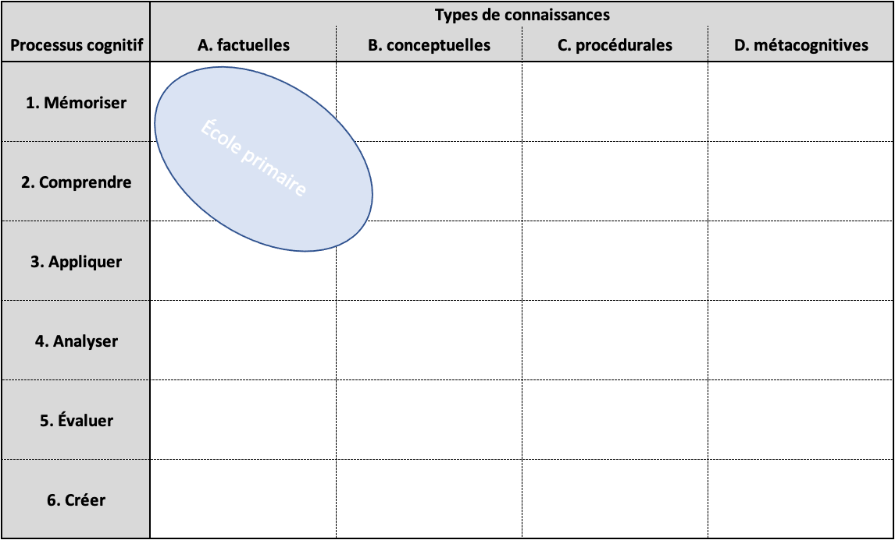

```{r setup, include=FALSE}
knitr::opts_chunk$set(echo = TRUE)
SciViews::R
```

### De quoi allons-nous discuter ?

Analyse des **avis pédagogiques** de l'an dernier => approche en classe inversée pas toujours bien comprise.

\center

{width=270}

- Explication de notre approche pédagogique

- Debriefing de vos résultats Q1

- Retour et propositions de votre part

### C'est quoi la classe inversée ?


[(lien vers la vidéo)](https://www.youtube.com/watch?v=uLKmLDrGyjw)

### Classe inversée et pédagogie active

Notre approche\ : **pédagogie active en classe inversée** (vous apprenez *d'abord* à la maison, nous appliquons *ensuite* en présentiel -quand on n'est pas confinés-).

\vfill

> I **hear** and I forget.

> I **see** and I remember.

> I **do** and I understand.

> — Confucius

### C'est quoi la pédagogie active ?


[(lien vers la vidéo)](https://www.youtube.com/watch?v=ygjSle9Pkg4)

### Et moi, je fais quoi dans tout cela ?

*Lisez ceci... et réagissez\ !*

\center

{width=200}

- Vous êtes **acteur de votre apprentissage**, les enseignants sont des **facilitateurs** (plus en retrait par rapport à l'approche classique).

- Plus de séparation entre **cours théorique** et **exercices**\ ; vos échanges avec le professeur et le ou les assistants sont similaires.

- Les **élèves-assistants** sont coachés tout autant que vous pour vous faciliter l'apprentissage de manière active.

- **Vous** posez les questions, et vos enseignants vous répondent **individuellement**.

### ECTS

**European Credits Transfer System**, créé en 1988 de manière standardisée par la Commission Européenne comme correspondant à une **charge de travail totale** pour l'étudiant de **25 à 30 heures**.


### Optimisation du temps de travail

\center

**Comment voulez-vous passer vos 25-30h/ECTS\ ?**

\vfill

Note\ : 12 modules pour 6 ECTS dans notre cours, donc 1/2 ECTS par module.

### Optimisation du temps de travail à l'Université

**Cours classique *ex cathedra* + séances d'exercices**


- Le réel apprentissage se déroule **après** les séances de cours et d'exercices

- Un examen est nécessaire pour vérifier vos acquis

### Optimisation du temps de travail... comparé à la classe inversée

**Cours classique *ex cathedra* + séances d'exercices**


**Approche en classe inversée**


- *Aucune* séance en présentiel sans préparation

- Chaque heure de travail pleinement consacrée à l'apprentissage

- Vous êtes actifs **tout le temps** et vous gérez **à votre rythme**

- **Pas besoin d'un examen à la fin**\ : votre activité atteste votre progression

### Le professeur est un coach et un facilitateur

*Mais que font les enseignants alors\ ? Lisez et réagissez.*

\center

{width=200}

- Le professeur (et l'assistant) ne mettent **pas** leur savoir en avant. C'est vous qui construisez votre *propre* savoir.

- Ils **ne répondent pas _directement_ à vos questions**\ : ils vous mettent sur une piste et vous font réfléchir pour trouver la réponse *par vous-même*.

- Ils se mettent en retrait, mais sont **disponibles pour vous aider** (Discord, mail, etc.)

**C'est déroutant car le professeur n'apparaît plus comme l'omniscient qui transmet de manière unilatérale son savoir aux étudiants\ !**

### Objectifs pour l'acquisition de compétences


Taxonomie de Bloom modifiée par Krathwohl & Anderson.

### Objectifs pour l'acquisition de compétences


Taxonomie de Bloom modifiée par Krathwohl & Anderson.

### Debriefing des notes du Q1

**Bravo, vous avez bien travaillé\ !**

\center

{width=250}

- 9 étudiants sur 10 ont fait quasiment tous les exercices

- Ceux qui ont fait tous les exercices ont une note bonne à excellente

- Travail important pour y arriver... on en est conscients\ !

### Erreurs récurrentes : entre-aide et citation des sources

Entre-aidez-vous, nous l'encourageons, mais **citez vos sources**.

\center

{width=250}

**Cas 1\ :**

- **Josua** découvre une analyse intéressante.
- Il l'explique à **Roxane**, la même analyse se retrouve dans deux rapports.
- **Roxane** cite ses sources **[Josua, comm. pers.]**.
- Josua a des points pour avoir aidé Roxane.
- Roxane a des points pour avoir correctement cité ses sources.

### Erreurs récurrentes : entre-aide et citation des sources

Entre-aidez-vous, nous l'encourageons, mais **citez vos sources**.

\center

{width=250}

**Cas 2\ :**

- **Peter** partage son code R avec **Déborah**, la même analyse se retrouve dans deux rapports.
- Personne ne cite ses sources.
- Cela apparaît comme du **plagiat** (ne sera plus pardonné au Q2\ !)

### Erreurs récurrentes : répartitions du travail

GitHub propose des outils pour visualiser l'activité d'un dépôt (`Insight` -> `Contributors`).

 ](figures/github_activite.png)

L'activité globale peut être **divisée par collaborateur**. 

___

L'activité de chaque membre est **disponible**.

{width='80%'}

> Vérifiez dans vos projets que votre activité est bien prise en compte.

### Erreurs récurrentes : ne pas vérifier ce qu'on fait

Partant des données suivantes\ :

```{r}
pop2020 <- tibble(
  age = factor(c("Moins de 18 ans", "18 à 64 ans", "65 ans et plus"),
               levels = c("Moins de 18 ans", "18 à 64 ans", "65 ans et plus")),
  population = c(2312040, 6976123, 2204478))
knitr::kable(pop2020, col.names = c("Groupe d'age", "Nombre de personnes"), 
             caption = "Population au premier septembre 2020 en Belgique")
```

___

Quel est le graphique correct\ ? Pourquoi l'autre est-il faux\ ?

```{r, echo=FALSE}
a <- chart(data = pop2020, ~ factor(0) %fill=% age) +
  geom_bar(width = 1) + 
  coord_polar("y", start = 0) +
  theme_void() +
  scale_fill_viridis_d()

b <- chart(data = pop2020, population ~ factor(0) %fill=% age) +
  geom_col(width = 1) + 
  coord_polar("y") +
  theme_void() +
  scale_fill_viridis_d()

combine_charts(list(a,b), common.legend = TRUE)
```


### Erreurs récurrentes : axes des graphiques

```{r, echo=FALSE}
pop <- tibble(
  year = 2010:2020,
  density = c(10839905, 10951266, 11035948, 11099554, 11150516, 
              11209044, 11267910, 11322088, 11376070, 11431406,
              11492641),
  density_error1 = c(1083990.5, 1095126.6, 1103594.8, 11099554, 11150516, 
              11209044, 11267910, 11322088, 11376070, 11431406,
              11492641),
  density_error2 = density*100)

```

```{r, fig.width= 6, fig.height= 2.5}

chart(pop, density ~ year) +
  geom_point() +
  geom_line() +
  labs(y = "Population en Belgique", x= "Année")
```

___

Repérez l'erreur sur le graphique ci-dessous.

```{r, echo=FALSE, fig.width= 6, fig.height= 3}
chart(pop, density_error2 ~ year) +
  geom_point() +
  geom_line() +
  labs(y = "Population en Belgique", x= "Année")
```


### Erreurs récurrentes : graphiques multiples inopportuns

Variation de l'indice de masse corporelle en fonction du genre et du groupe d'âges.

```{r, echo = FALSE, warning=FALSE, message=FALSE, , fig.width= 6, fig.height= 3}
biometry <- read("biometry", package = "BioDataScience", lang = "FR")
biometry %>.%
  mutate(., 
         bmi = weight/(height/100)^2,
         group_age = factor(case_when(
           age < 25 ~ "jeune",
           age >= 25 & age < 60 ~ "adulte",
          age >= 60 ~ "senior"),
          levels = c("jeune", "adulte", "senior"))) -> biometry

biometry <- labelise(biometry, 
  label = list(bmi = "IMC", group_age = "Groupes d'age"),
  units = list(bmi = "", group_age = "")
  )

a <- chart(biometry, bmi ~ gender) +
  geom_boxplot()

filter(biometry, group_age == "jeune") %>.%
  chart(biometry, bmi ~ gender) +
  geom_boxplot() +
  scale_y_continuous(limits = c(0,50)) -> b


filter(biometry, group_age == "adulte") %>.%
  chart(biometry, bmi ~ gender) +
  geom_boxplot() +
  scale_y_continuous(limits = c(13,41)) -> c

filter(biometry, group_age == "seniors") %>.%
  chart(biometry, bmi ~ gender) +
  geom_boxplot() -> d
combine_charts(list(a,b,c,d))
```

> Ce graphique multiple n'est pas interprétable.

___ 

Ce graphique présente la même information que le graphique multiple précédent.

```{r, echo=FALSE, fig.width= 6, fig.height= 3.5}
chart(biometry, bmi ~ gender %fill=% group_age) +
  geom_boxplot()
```

> Un graphique multiple ne doit pas être utilisé sur des données indissociables.

### Erreurs récurrentes : valeurs manquantes

```{r}
drop <- tibble(
  x = runif(10),
  y = runif(10),
  z = c(5, 3, rep(NA, 6), 3, 2)
)
knitr::kable(drop[1:3,])
```

Élimination naïve des données manquantes.

```{r}
drop1 <- drop_na(drop)
```

___

\columnsbegin
\columnhalf

Utilisation du tableau `drop`

```{r}
chart(drop, x ~ y) +
  geom_point()
```
\columnhalf

Utilisation du tableau `drop1`

```{r}
chart(drop1, x ~ y) +
  geom_point()
```

\columnsend

> Soyez très vigilant avec les NA. Les variables `x` et `y` ne contenaient pas de valeurs manquantes au départ ici\ !

### Vous avez la parole !

\center

{width=250}

- Exprimez-vous, suggérez\ : **votre avis compte énormément** ...

- Indiquez **deux points positifs et deux points négatifs** du cours et de la matière dans le formulaire
