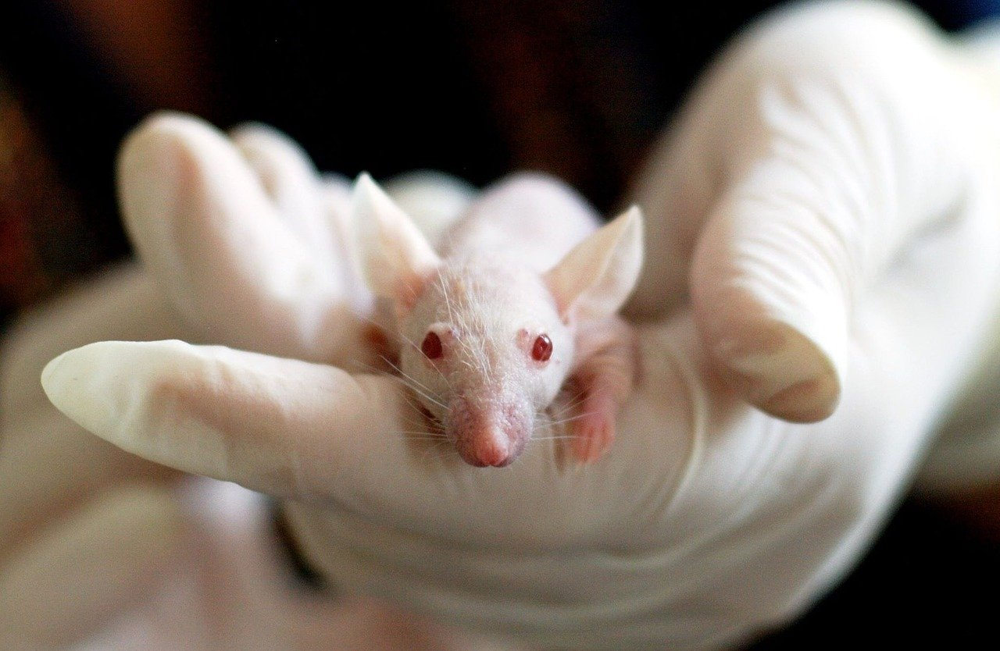

```{r setup, include=FALSE}
knitr::opts_chunk$set(echo = TRUE)
SciViews::R
```

### Le test de chi^2

Cette présentation se divisera en 2 situations 

- Le test chi^2^ univarié : les albinos 
- Le test chi^2^ d'indépendance : Les maladies cardiovasculaires

### Test chi^2^ univarié 

Des souris hétérozygotes pour l'allèle concernant le couleur du pelages sont croisée. Toutes les souris croisées sont donc colorées. Les chercheurs émettent l'hypothèse que ce croisement respectent les lois de Mendel.

D'après les de Mendel, nous devrions obtenir 3/4 de souris colorées et 1/4 de souris albinos.

|   | C  | c  |
|---|----|----|
| C | CC | Cc |
| c | Cc | cc |

___

Les scientifiques dénombrent les jeunes souris et obtiennent 34 souris colorées et 7 souris blanches.

\center 

{height='50%'}

___

Question biologique : Est ce que la coloration de pelage suit la règle de la génétique mendélienne.

Le test de chi^2^ univarié est un bon outil pour comparer des proportions attendues à des proportions observées.

Notre seuil $\alpha$ : $5 \%$

Nos hypothèses sont :

- $H_0: \mathrm{P}(colorés) = \frac{3}{4}\ \mathrm{et}\ \mathrm{P}(albinos) = \frac{1}{4}$

- $H_1: \mathrm{P}(colorés) \neq \frac{3}{4}\ \mathrm{ou}\ \mathrm{P}(albinos) \neq \frac{1}{4}$

___

```{r}
chisq.test(as.table(c(colore = 34, albinos = 7)), 
  p = c(colore = 3/4, albinos = 1/4), rescale.p = FALSE)
```
Faut il rejeter $H_0$ ?

```{r}
pchisq(1.374, df = 1, lower.tail = FALSE)
qchisq(0.2411, df = 1, lower.tail = FALSE)
```


___

Faut il rejeter $H_0$ : Analyse sur bases des quantiles

```{r}
qchisq(0.05, df = 1, lower.tail = FALSE)
```

```{r, fig.height= 2.5, echo = FALSE}
.df <- 1 # Degree of freedom .df
.col <- 1; .add <- FALSE # Plot parameters
.x <- seq(0, qchisq(0.999, df = .df), l = 1000) 
.d <- function(x) dchisq(x, df = .df) 
.q <- function(p) qchisq(p, df = .df)
.label <- bquote(paste(chi^2,(.(.df))))

q_ref <- qchisq(0.05, df = 1, lower.tail = FALSE)
.x2 <- .x
.x2[.x2 < q_ref] <- NA

chart(data = tibble(Quantiles = .x, Prob = .d(.x)), Prob ~ Quantiles) +
  geom_hline(yintercept = 0, col = "gray") +
  geom_ribbon(aes(x = .x, ymin = 0, ymax = .d(.x)), fill = "gray", alpha = 0.2) +
  geom_ribbon(aes(x = .x2, ymin = 0, ymax = .d(.x2)), fill = "red", alpha = 0.2) +
  geom_line() +
  xlab("Quantile") +
  ylab("Densité de probabilité") +
  ylim(0, 0.3) +
  geom_vline(xintercept = 1.374, col = "red")
```

___

Faut il rejeter $H_0$ ? : Analyse sur bases des probabilités

- valeur *P* < seuil $\alpha$, on rejette $H_0$,
- valeur *P* ≥ seuil $\alpha$, on ne rejette pas $H_0$

\vfill

**Interprétation**

Nos observations respectent les lois proposées par Mendel au seuil $\alpha$ de 5% ($\chi^2$ univarié = 1.374, ddl = 1, valeur P = 0.2411). 

### Test Chi^2^ d'indépendance

```{r, echo = FALSE}
cardio <- read("data/cardio.rds")
```

Situation biologique : Des patients ont été suivi afin d'étudier la présence de maladies cardio-vasculaires dans la population. Ces patients ont réalisé plusieurs test médicaux, ont eu un entretient avec un cardiologie et ont du compléter un questionnaire. 

\center 

{height='60%'}

___

```{r, echo = FALSE}
knitr::kable(head(select(cardio, cardio, cholesterol, height, age = age2)))
```

Il s'agit d'un échantillon du jeu de données[ Cardiovascular Disease dataset](https://www.kaggle.com/sulianova/cardiovascular-disease-dataset). Nous allons nous intéresser uniquement aux femmes, ce qui représente `r nrow(cardio)` patientes.

___ 

Question biologique : Y a t'il un lien entre la présence de maladie cardio vasculaire et la présence d'un excès de cholesterol. 


```{r}
(cardio_tab <- table(cardio$cardio, cardio$cholesterol))
```

___

Nous pouvons utiliser un test du chi^2^ d'indépendance pour traiter cette problématique.

Notre seuil $\alpha$ : $5 \%$

Nos hypothèses sont :

- $H_0$ : Indépendance entre la variable cardio et la variable cholesterol

- $H_1$ : Dépendance entre la variable cardio et la variable cholesterol.

___

```{r}
(chi2. <- chisq.test(cardio_tab)); 
cat("Expected frequencies:\n"); chi2.[["expected"]]
```

---

```{r}
cardio_tab
```

```{r}
cat("Expected frequencies:\n"); chi2.[["expected"]]
```

La présence d'un excès de cholestérol a un effet positif significatif au seuil $\alpha$ de 5% sur les maladies cardiovasculaires ($\chi^2$ d’indépendance = 2388.6, ddl = 2, valeur P = < 2.2e^-16^)
