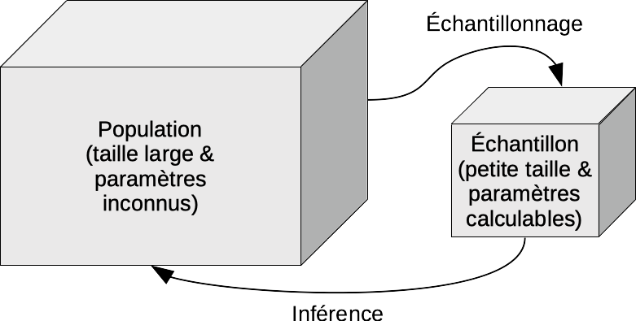

```{r setup, include=FALSE}
knitr::opts_chunk$set(echo = TRUE)
SciViews::R
```

### L'inférence

\center

{width='70%'}

### Le test d'hypothèse

Le test d’hypothèse est l’outil le plus simple pour répondre à une question via l’inférence.

Il faut déterminer\ :

- $H_0$, l'hypothèse nulle =>  l'affirmation à rejeter
- $H_1$, l'hypothèse alternative

### Distribution du Chi^2^

La distribution du Chi^2^ admet un paramètre\ : les degrés de liberté

```{r, echo = FALSE, fig.height= 2.5}
.df <- 3 # Degree of freedom .df
.col <- 1; .add <- FALSE # Plot parameters
.x <- seq(0, qchisq(0.999, df = .df), l = 1000)  # Quantiles
.d <- function(x) dchisq(x, df = .df)           # Distribution function
.q <- function(p) qchisq(p, df = .df)           # Quantile for lower-tail prob
.label <- bquote(paste(chi^2,(.(.df))))          # Curve parameters
#curve(.d(x), xlim = range(.x), xaxs = "i", n = 1000, col = .col,
#  add = .add, xlab = "Quantiles", ylab = "Probability density") # Curve
#abline(h = 0, col = "gray") # Baseline

q_ref <- qchisq(0.05, df = 3, lower.tail = FALSE)
.x2 <- .x
.x2[.x2 < q_ref] <- NA

chart(data = tibble(Quantiles = .x, Prob = .d(.x)), Prob ~ Quantiles) +
  geom_hline(yintercept = 0, col = "gray") +
  geom_ribbon(aes(x = .x, ymin = 0, ymax = .d(.x)), fill = "gray", alpha = 0.2) +
  #geom_ribbon(aes(x = .x2, ymin = 0, ymax = .d(.x2)), fill = "red", alpha = 0.2) +
  geom_line() +
  xlab("Quantile") +
  ylab("Densité de probabilité") +
  ylim(0, 0.3) 
```

### Zone de rejet

Cette zone de rejet est déterminée par une probabilité nommé le seuil $\alpha$ fixée *avant* de réaliser le test d'hypothèse. Nous fixons ici $\alpha$ à 5%. 

```{r}
qchisq(0.05, 3, lower.tail = FALSE)
```

___

```{r, echo = FALSE, , fig.height= 3.5}
.df <- 3 # Degree of freedom .df
.col <- 1; .add <- FALSE # Plot parameters
.x <- seq(0, qchisq(0.999, df = .df), l = 1000)  # Quantiles
.d <- function(x) dchisq(x, df = .df)           # Distribution function
.q <- function(p) qchisq(p, df = .df)           # Quantile for lower-tail prob
.label <- bquote(paste(chi^2,(.(.df))))          # Curve parameters
#curve(.d(x), xlim = range(.x), xaxs = "i", n = 1000, col = .col,
#  add = .add, xlab = "Quantiles", ylab = "Probability density") # Curve
#abline(h = 0, col = "gray") # Baseline

q_ref <- qchisq(0.05, df = 3, lower.tail = FALSE)
.x2 <- .x
.x2[.x2 < q_ref] <- NA

chart(data = tibble(Quantiles = .x, Prob = .d(.x)), Prob ~ Quantiles) +
  geom_hline(yintercept = 0, col = "gray") +
  geom_ribbon(aes(x = .x, ymin = 0, ymax = .d(.x)), fill = "gray", alpha = 0.2) +
  geom_ribbon(aes(x = .x2, ymin = 0, ymax = .d(.x2)), fill = "red", alpha = 0.2) +
  geom_line() +
  xlab("Quantile") +
  ylab("Densité de probabilité") +
  ylim(0, 0.3) +
  #geom_vline(xintercept = 5.61, col = "red") +
  annotate("text", x = 3, y = 0.04, label = "Zone de non rejet", col = "black") +
  annotate("text", x = 11.5, y = 0.05, label = "plain(Zone ~ de ~ rejet) == plain(seuil) ~ alpha", parse = TRUE, col = "red") +
  annotate("segment", x = 8.8, y = 0.045, xend = 8.2, yend = 0.01,
    size = 0.5, col = "red", arrow = arrow(length = unit(0.2, "cm")))  #+
  # annotate("text", x = 6.5, y = 0.25, label = "chi[obs]^2 == 5.61", parse = TRUE,
  #   col = "red", fontface = "bold.italic") +
  # annotate("text", x = 7.4, y = 0.2, label = "(aire à droite = valeur P)",
  #   col = "red", fontface = "bold.italic")
```

### Situation fictive

Notre hypothèse de départ est\ :

$H_0$ : il est équiprobable d'être du groupe A, B, C ou D

Nos observation\ :

```{r}
(tab <- as.table(c(A = 5, B = 10, C = 20, D = 10)))
```

```{r}
chisq.test(tab, p = c(A = 1/4, B = 1/4, C = 1/4, D = 1/4))
```

La **valeur _p_** correspond à l'aire (à droite ici) plus extrême que la valeur du Chi^2^~obs~.

___

```{r, echo = FALSE, , fig.height= 3.5}
.df <- 3 # Degree of freedom .df
.col <- 1; .add <- FALSE # Plot parameters
.x <- seq(0, qchisq(0.999, df = .df), l = 1000)  # Quantiles
.d <- function(x) dchisq(x, df = .df)           # Distribution function
.q <- function(p) qchisq(p, df = .df)           # Quantile for lower-tail prob
.label <- bquote(paste(chi^2,(.(.df))))          # Curve parameters
#curve(.d(x), xlim = range(.x), xaxs = "i", n = 1000, col = .col,
#  add = .add, xlab = "Quantiles", ylab = "Probability density") # Curve
#abline(h = 0, col = "gray") # Baseline

q_ref <- qchisq(0.05, df = 3, lower.tail = FALSE)
.x2 <- .x
.x2[.x2 < q_ref] <- NA

chart(data = tibble(Quantiles = .x, Prob = .d(.x)), Prob ~ Quantiles) +
  geom_hline(yintercept = 0, col = "gray") +
  geom_ribbon(aes(x = .x, ymin = 0, ymax = .d(.x)), fill = "gray", alpha = 0.2) +
  geom_ribbon(aes(x = .x2, ymin = 0, ymax = .d(.x2)), fill = "red", alpha = 0.2) +
  geom_line() +
  xlab("Quantile") +
  ylab("Densité de probabilité") +
  ylim(0, 0.3) +
  geom_vline(xintercept = 10.556, col = "red") +
  annotate("text", x = 3, y = 0.04, label = "Zone de non rejet", col = "black") +
  annotate("text", x = 8.5, y = 0.07, label = "plain(Zone ~ de ~ rejet)", parse = TRUE, col = "red") +
  annotate("segment", x = 8.8, y = 0.045, xend = 8.2, yend = 0.01,
    size = 0.5, col = "red", arrow = arrow(length = unit(0.2, "cm")))  +
   annotate("text", x = 13.5, y = 0.15, label = "chi[obs]^2 == 10.556", parse = TRUE,
     col = "red", fontface = "bold.italic") 
```

### Les conditions d'application

Assurez vous que les conditions d'application soient respectées\ !

- échantillonnage aléatoire et observations indépendantes,
- aucun effectif théorique (ou probabilité) sous $H_0$ nul,
- aucun effectif observé, si possible, inférieur à 5 (ceci n'est **pas** une condition stricte\ ; le test sera "approximativement" bon dans le cas contraire).
