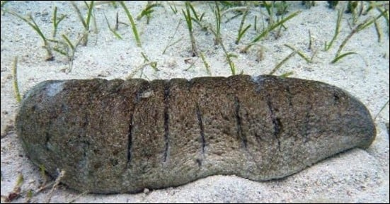

```{r setup, include=FALSE}
knitr::opts_chunk$set(echo = TRUE)
SciViews::R
```

### Le test t de Student

Nous traiterons de deux situations concrètes pour illustrer l'utilisation du test d'hypothèse t de Student en insistant sur trois points\ :

1. **Formulation des hypothèses** à partir de la question biologique posée

2. Interprétation des résultats du test t de Student *versus* valeur *P*.

3. Façon d'**exprimer le résultat** du test en français

### Cas 1 : Canal du sable de *Holothuria scabra*

Loïc Calcagno a présenté son mémoire portant sur l'analyse morpho-fonctionnelle du canal du sable atypique de l’holothurie tropicale *Holothuria scabra* Jaeger, 1833 (Echinodermata, Holothuroidea).

\center 

{width='60%'}

Loïc Calcagno a suivi le cours de `Science des données IV : pratique`.

___

