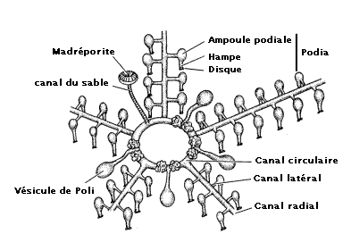
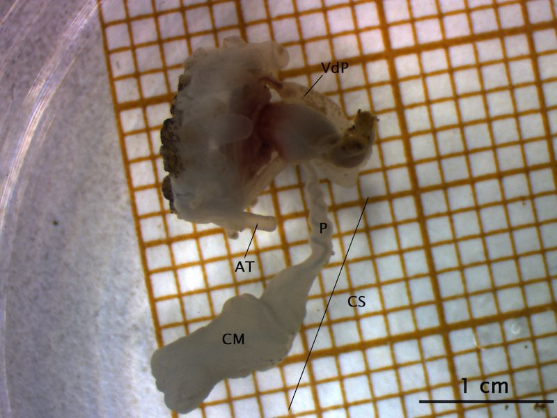

```{r setup, include=FALSE}
knitr::opts_chunk$set(echo = TRUE)
SciViews::R
```

### Le test t de Student

Nous traiterons de deux situations concrètes pour illustrer l'utilisation du test d'hypothèse t de Student en insistant sur trois points\ :

1. **Formulation des hypothèses** à partir de la question biologique posée

2. Choix de la **meilleure variante** du test t de Student en fonction du contexte.

3. Façon d'**exprimer le résultat** du test en français ou en anglais

### Cas 1 : canal du sable de *Holothuria scabra*

Loïc Calcagno a présenté son mémoire portant sur l'analyse morpho-fonctionnelle du canal du sable atypique de l’holothurie tropicale *Holothuria scabra* Jaeger, 1833 (Echinodermata, Holothuroidea).

\center 

{width='55%'}

*H. scabra*, photo de L. Calcagno.

Loïc Calcagno a suivi le cours de `Science des données IV : pratique`.

___

Le système ambulacraire des échinodermes a plusieurs fonctions\ : locomotion des individus, prise de nourriture, échanges gazeux,... (schéma issu de Ruppert & Barnes, 1991)

\center 

{width='75%'}

___

Chez les *Holothuroidea*, la plaque madréporique est interne. La terminologie « canal du sable » désigne le pédoncule suivi du corps madréporaire.

\center 

{width='55%'}

Les différents organes prélevés chez un juvénile d’*Holothuria scabra* avec la vésicule de poli (VdP), les ampoules tentaculaires (AT) et le canal du sable (CS). Légende : CC – Canal circulaire ; CM – Corps madréporaire ; CS – Canal du sable ; P - Pédoncule. Photo: L. Calcagno.

___

**Question biologique :** est-ce que le rapport de taille du corps madréporaire sur le canal du sable reste constant chez *H. scabra* entre le stade juvénile et le stade adulte ("rapport" est une variable calculée et sans unités).

\vfill

**Traduction de la question biologique en hypothèse nulle et hypothèse alternative\:**

$H_0: \overline{rapport_{juvenile}} - \overline{rapport_{adulte}} = 0$

$H_1: \overline{rapport_{juvenile}} - \overline{rapport_{adulte}} \neq 0$

\vfill


**Fixation du seuil alpha à 5%** *avant* l'analyse.

___

Rapport = variation du rapport du corps madréporaire sur le canal du sable en fonction du stade de croissance de *H. scabra*. (sJ = *H. scabra* juvénile (n=6), sA = *H. scabra* adulte (n=6))

```{r, echo = FALSE, , results='hide', message=FALSE, warning=FALSE, fig.height = 3}
stone_canal <- read("data/size_stonecanal.xlsx")

stone_canal %>.%
  filter(., sp != "fA") %>.%
  pivot_wider(., names_from = organe, values_from = longueur) %>.%
  rename(., cs = 'canal du sable', p = `pédoncule`, cm = 'corps madréporaire') %>.%
  mutate(., rapport = cm/cs, sp = factor(sp, levels = c("sJ", "sA")))-> stone_canal_6

chart(data = stone_canal_6, rapport ~ sp) +
  geom_jitter(alpha = 0.4, width = 0.2) +
  stat_summary(geom = "point", fun = "mean") +
  stat_summary(geom = "errorbar", width = 0.1,
     fun.data = "mean_sdl", fun.args = list(mult = 1)) + 
  labs(y = "Rapport", x = "Stade de croissance", col = "Organes")
```

___

Le choix d'un test de t de Student indépendant bilatéral se justifie ici. Les conditions d'application ont été vérifiées au préalable.

```{r}
t.test(data = stone_canal_6, rapport ~ sp,
  alternative = "two.sided", conf.level = 0.95, var.equal = TRUE)
```

**Interprétation biologique :** Le rapport de taille du corps madréporaire sur le canal du sable est significativement plus élevé chez l'adulte au seuil $\alpha$ de 5% (test t indépendant bilatéral, t = -16, ddl = 10, valeur P = 1.8•10^-8^). 

### Cas 2 : régulation acide-base chez *Echinometra mathaei*

Laure Moulin a réalisé sa thèse de doctorat entre l'ULB et l'UMONS sur la résilience d'oursins tropicaux *Echinometra mathaei* à l'acidification des océans.

Dans une de ses publications (Moulin et al,  2014), elle doit déterminer si ses spécimens en expérience ont grandi ou pas. [voir dépôt institutionnel UMONS  : https://di.umons.ac.be/details.aspx?pub=7bf638f3-74e8-49d8-b063-396f378413d7]


<!--
##### Référence

Moulin, L., Ph. Grosjean, J. Leblud, A. Batigny & Ph. Dubois, 2014. Impact of elevated *p*CO~2~ on acid–base regulation of the sea urchin *Echinometra mathaei* and its relation to resistance to ocean acidification: A study in mesocosms. *J. Exp. Mar. Biol. Ecol., **457**:97-104.
-->

---

**Question biologique\ :** durant l'expérience, les oursins ont-ils grandi \ ? Afin de pouvoir préciser les hypothèses, il est noté qu'une croissance *négative* a déjà été observée chez cette espèce dans des conditions défavorables, et ici, les conditions d'acidification sont potentiellement stressantes.

 \vfill
**Choix des mesures\ :**

- Pour plus d'efficacité, un design apparié est choisi. Les oursins sont marqués et mesurés au début et à la fin de l'expérience,

- La masse de squelette est déterminée indirectement (mesure de la masse immergée) comme mesure la plus précise possible.

\vfill

**Hypothèses\ :**

$H_0: \overline{M_{squel1} - M_{squel0}} = 0$

$H_1: \overline{M_{squel1} - M_{squel0}} \neq 0$ (test bilatéral)

---

**Taille de l'échantillon\ :** important pour s'assurer de la *puissance* du test. Utilisation de tous les oursins (*n* = 44, jugé amplement suffisant). [p.s.\ : on peut aussi jouer sur la durée de l'intervalle entre les deux mesures.]

\vfill

**Vérification des conditions d'application\ :** Test de Normalité de d'homoscédasticité réalisés (Q-Q plot et test de Bartlett).

Extrait du matériel & méthodes de la publication Moulin et al, 2014.


\vfill

**Fixation de $\alpha$ à 5%** *avant* de faire le test.

---

**Présentation des résultats\ :**

Extrait du matériel & méthodes de la publication Moulin et al, 2014 qui présente le résultat du test de Student.


___

**Matériel & méthodes\ :**

Section du matériel & méthodes de la publication Moulin et al, 2014 qui introduit le test de Student. [p.s.\: la correction de Welch n'apporte rien en appairé, c'est en fait le même test que le Student classique.]


