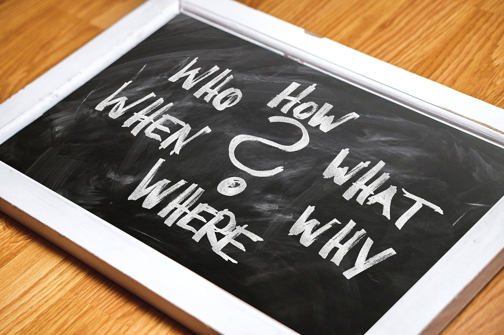

```{r setup, include=FALSE}
knitr::opts_chunk$set(echo = TRUE)
SciViews::R
```

### De quoi allons-nous parler ?

Dans le cadre du cours de *Science des données I: inférence*, vous avez actuellement 2 travaux de groupes à réaliser :

\vfill

- la biométrie des oursins

- la biométrie humaine


### Biométrie des oursins

Lors du cours de *Science des données I: visualisation*, vous avez débuté un projet en binôme sur la biométrie des oursins.

\vfill

Ce travail se poursuit durant le cours de *Science des données I: inférence*

- Tenir compte des remarques du Q1 et améliorer le projet => A03Gb_20M_nomdugroupe_note.csv

- Réaliser des tests d'hypothèse afin de compléter votre projet => README.md


### Biométrie humaine

Il s'agit du projet principal de cours de *Science des données I: inférence*. Ce travail par 4 est décomposé en 3 phases afin de vous aider à vous organiser.

- Phase d'exploration/de découverte

- Phase de test

- Phase de synthèse

### Phase d'exploration

Vous avez à votre disposition un thème *la santé humaine* et un tableau de données.

\vfill

\columnsbegin
\columnhalf



\columnhalf

- state_of_art.Rmd et les articles joints : Devenir un "expert" du domaine.

- measure_protocol.Rmd et les dictionnaires des données associées : Comprendre chacune des variables à votre disposition.

- dataviz.Rmd : Réaliser des graphiques sur base de vos connaissances sur l'état de l'art et les données.

\columnsend

### Phase de test

\columnsbegin
\columnhalf


\columnhalf

- biometry.R : Préparer un tableau de données avec les labels et les unités associés à chaque variable.

- metrics.Rmd : Calculer des indices pertinents sur base de la littérature et de votre connaissance des données.

- hypotheses_testing.Rmd : Vérifier vos hypothèses grâce à des tests d'hypothèse judicieux.

\columnsend

### Phase de synthèse

- biometry_report.Rmd : Réaliser un rapport de synthèse.

- biometry_report.Rmd : Réaliser une présentation de synthèse.

\center 

{width='80%'}   

### Infos pratiques

- Les mini-présentations sont disponibles sur https://github.com/BioDataScience-Course/sdd_lessons et sont enregistrées dans Teams

\vfill

- **A vous la parole maintenant\ !**
