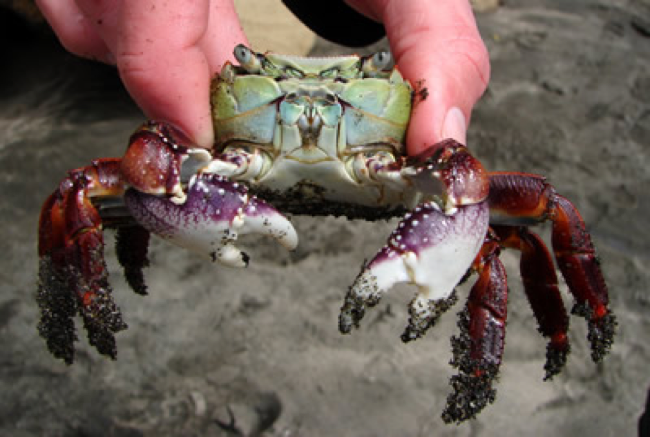
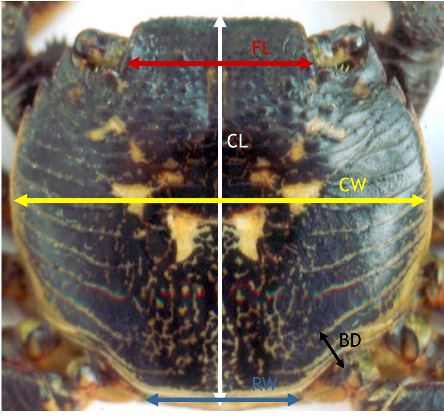

```{r setup, include=FALSE}
knitr::opts_chunk$set(echo = FALSE, message = FALSE)
SciViews::R
```


### Biométrie des crabes

L'étude porte sur deux variétés de crabes *Leptograpsus variegatus*  : la variété bleue et la variété orange. 

Analysez ce jeu de données avec les outils propres à l'ACP.

Le jeu de données se trouve dans le packge **`MASS`** et se nomme **`crabs`**

```{r,fig.align='center', echo=FALSE, out.width= '55%'}

```

### Les mesures réalisées

L'étude porte sur 100 crabes bleus et 100 crabes oranges avec une égalité mâles et femelles.

\columnsbegin
\columnlarge

```{r,fig.align='center', echo=FALSE, out.width= '75%'}

```

\columnsmall

Les mesures sont :

- **CL** Longueur de carapace (length)
- **CW** Largueur de carapace (width)
- **FL** Taille du lobe frontal (front)
- **RW** Largueur à l'arrière (rear) 
- **BD** Epaisseur du corps (depth)

\columnsend

### Marphy 

\columnsbegin
\columnsmall


**Consignes**

\vfill
\vfill

Transect entre Nice et Calvi afin d’étudier sur 68 stations afin de mesurer la température, la salinité, la fluorescence et la densité dans le jeu de données Marphy.

\vfill
\vfill

Analysez ce jeu de données avec les outils propres à l'ACP.

\columnlarge

```{r, echo= FALSE, message=FALSE, out.width='95%', fig.align='center'}
library(tidyverse)
library(cowplot)
fr <- map_data("france")
ggplot(fr, aes(long, lat, group = group)) +
  geom_polygon(fill= "white", color = "black") +
  geom_segment(aes(y = 43.7 , x = 7.25, yend = 42.56, xend= 8.75, color = "red"), size = 1, show.legend = FALSE) +
  theme(axis.line = element_blank(), axis.title = element_blank(),axis.text = element_blank(), axis.ticks = element_blank()) +
  coord_quickmap()
```

\columnsend

### Marbio

\columnsbegin
\columnsmall

**Consignes**

\vfill
\vfill

Le transect a permis de  dénombrer les différents groupes au sein du zooplancton, dans le jeu de données Marbio.

\vfill
\vfill

Analysez ce jeu de données avec les outils propres à l'ACP.

\columnlarge

```{r, echo= FALSE, message=FALSE, out.width='95%', fig.align='center'}
library(tidyverse)
library(cowplot)
fr <- map_data("france")
ggplot(fr, aes(long, lat, group = group)) +
  geom_polygon(fill= "white", color = "black") +
  geom_segment(aes(y = 43.7 , x = 7.25, yend = 42.56, xend= 8.75, color = "red"), size = 1, show.legend = FALSE) +
  theme(axis.line = element_blank(), axis.title = element_blank(),axis.text = element_blank(), axis.ticks = element_blank()) +
  coord_quickmap()
```


\columnsend
