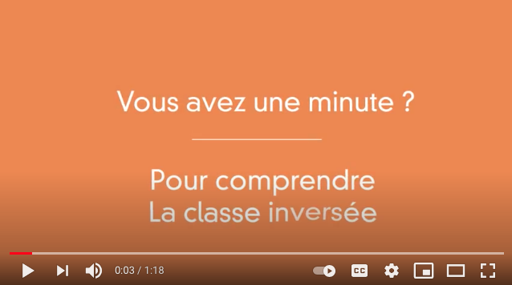

```{r setup, include=FALSE}
knitr::opts_chunk$set(echo = TRUE)
SciViews::R
```

### De quoi allons-nous discuter ?

Analyse des **avis pédagogiques** de l'an dernier => approche en classe inversée pas toujours bien comprise.

\center

{width=270}

- Explication de notre approche pédagogique

- Debriefing de vos résultats Q1

- Retour et propositions de votre part

### C'est quoi la classe inversée ?


[(lien vers la vidéo)](https://www.youtube.com/watch?v=uLKmLDrGyjw)

### Classe inversée et pédagogie active

Notre approche\ : **pédagogie active en classe inversée** (vous apprenez *d'abord* à la maison, nous appliquons *ensuite* en présentiel -quand on n'est pas confinés-).

\vfill

> I **hear** and I forget.

> I **see** and I remember.

> I **do** and I understand.

> — Confucius

### C'est quoi la pédagogie active ?


[(lien vers la vidéo)](https://www.youtube.com/watch?v=ygjSle9Pkg4)

### Et moi, je fais quoi dans tout cela ?

*Lisez ceci... et réagissez (question Wooclap juste après)\ !*

\center

{width=200}

- Vous êtes **acteur de votre apprentissage**, les enseignants sont des **facilitateurs** (plus en retrait par rapport à l'approche classique).

- Plus de séparation entre **cours théorique** et **exercices**\ ; vos échanges avec le professeur et le ou les assistants sont similaires.

- Les **élèves-assistants** sont coachés tout autant que vous pour vous faciliter l'apprentissage de manière active.

- **Vous posez les questions**, et vos enseignants vous répondent **individuellement**.

### ECTS

**European Credits Transfer System**, créé en 1988 de manière standardisée par la Commission Européenne comme correspondant à une **charge de travail totale** pour l'étudiant de **25 à 30 heures**.


### Optimisation du temps de travail

\center

**Comment voulez-vous passer vos 25-30h/ECTS\ ?**

\vfill

Note\ : 8 modules pour 3 ECTS dans notre cours, donc environ 11h par module.

### Optimisation du temps de travail à l'Université

**Cours classique *ex cathedra* + séances d'exercices**


- Le réel apprentissage se déroule **après** les séances de cours et d'exercices

- Un examen est nécessaire pour vérifier vos acquis

### Optimisation du temps de travail... comparé à la classe inversée

**Cours classique *ex cathedra* + séances d'exercices**


**Approche en classe inversée**


- *Aucune* séance en présentiel sans préparation

- Chaque heure de travail pleinement consacrée à l'apprentissage

- Vous êtes actifs **tout le temps** et vous gérez **à votre rythme**

- **Pas besoin d'un examen à la fin**\ : travail évalué dans sa globalité

### Le professeur est un coach et un facilitateur

*Mais que font les enseignants alors\ ? Lisez et réagissez (question Wooclap après).*

\center

{width=200}

- Le professeur (et l'assistant) ne mettent **pas** leur savoir en avant. C'est vous qui construisez votre *propre* savoir.

- Ils **ne répondent pas _directement_ à vos questions**\ : ils vous mettent sur une piste et vous font réfléchir pour trouver la réponse *par vous-même*.

- Ils se mettent en retrait, mais sont **disponibles pour vous aider** (Discord, mail, etc.)

**C'est déroutant car le professeur n'apparaît plus comme l'omniscient qui transmet de manière unilatérale son savoir aux étudiants\ !**

### Objectifs pour l'acquisition de compétences


Taxonomie de Bloom modifiée par Krathwohl & Anderson.

### Objectifs pour l'acquisition de compétences


Taxonomie de Bloom modifiée par Krathwohl & Anderson.

### Objectifs pour l'acquisition de compétences


Taxonomie de Bloom modifiée par Krathwohl & Anderson.

### Objectifs pour l'acquisition de compétences


Taxonomie de Bloom modifiée par Krathwohl & Anderson.

### Objectifs pour l'acquisition de compétences


Taxonomie de Bloom modifiée par Krathwohl & Anderson.

### Objectifs pour l'acquisition de compétences


Taxonomie de Bloom modifiée par Krathwohl & Anderson.

### Objectifs pour l'acquisition de compétences


Taxonomie de Bloom modifiée par Krathwohl & Anderson.

### Vous avez la parole !

\center

{width=250}

- Répondez aux questions (pages Wooclap suivantes), levez la main pour prendre la parole. La discussion est ouverte.

### Debriefing des notes du Q1

**Bravo, vous avez bien travaillé\ !**

\center

{width=250}

- 9 étudiants sur 10 ont fait (quasiment) tous les exercices

- Ceux qui ont fait tous les exercices ont une note bonne à excellente

- Travail important pour y arriver... on en est conscients\ !

### Erreurs récurrentes : entre-aide et citation des sources

Entre-aidez-vous, nous l'encourageons, mais **citez vos sources**.

\center

{width=250}

**Cas 1\ :**

- **Josua** découvre une analyse intéressante.
- Il l'explique à **Roxane**, la même analyse se retrouve dans deux rapports.
- **Roxane** cite ses sources **[Josua, comm. pers.]**.
- Josua a des points pour avoir aidé Roxane.
- Roxane a des points pour avoir correctement cité ses sources.

### Erreurs récurrentes : entre-aide et citation des sources

Entre-aidez-vous, nous l'encourageons, mais **citez vos sources**.

\center

{width=250}

**Cas 2\ :**

- **Peter** partage son code R avec **Déborah**, la même analyse se retrouve dans deux rapports.
- Personne ne cite ses sources.
- Cela apparaît comme du **plagiat** (ne sera plus pardonné au Q2\ !)

### Erreurs récurrentes : répartitions du travail

GitHub propose des outils pour visualiser l'activité d'un dépôt (`Insight` -> `Contributors`).

 ](figures/github_activite.png)

L'activité globale peut être **divisée par collaborateur**. 

___

L'activité de chaque membre est **disponible**.

{width='80%'}

> Vérifiez dans vos projets que votre activité est bien prise en compte.

### Erreurs récurrentes : valeurs manquantes

```{r}
drop <- tibble(
  x = runif(10),
  y = runif(10),
  z = c(5, 3, rep(NA, 6), 3, 2)
)
knitr::kable(drop[1:3,])
```

Élimination naïve des données manquantes.

```{r}
drop1 <- drop_na(drop)
```

___

\columnsbegin
\columnhalf

Utilisation du tableau `drop`

```{r}
chart(drop, x ~ y) +
  geom_point()
```
\columnhalf

Utilisation du tableau `drop1`

```{r}
chart(drop1, x ~ y) +
  geom_point()
```

\columnsend

> Soyez très vigilant avec les NA. Les variables `x` et `y` ne contenaient pas de valeurs manquantes au départ ici\ !


### Erreurs récurrentes : copier-coller

Il ne faut pas reprendre le code du cours sans le comprendre et sans l'adapter.

```{r, echo=FALSE, fig.height= 3}
micmen_data <- tibble(
  conc = seq(0, 10, by = 0.1),
  v = SSmicmen(conc, Vm = 5, K = 2)
)
chart(data = micmen_data, v ~ conc) +
  geom_line() +
  xlab("Concentration [mol/L]") +
  ylab("Vitesse [mol/min]") +
  geom_vline(xintercept = 0, col = "darkgray") +
  geom_hline(yintercept = c(0.5, 1), col = "gray", linetype = "dashed") +
  geom_vline(xintercept = 0.4, col = "gray", linetype = "dashed") +
  annotate("text", label = "Vm", x = -0.4, y = 1) +
  annotate("text", label = "Vm/2", x = -0.5, y = 0.5) +
  annotate("text", label = "K", x = 0.5, y = 0.03)
```

### Erreurs récurrentes : interprétation simpliste

L'interprétation d'un graphique est importante. Elle met en avant votre compréhension de la situation.

```{r, fig.width= 6, fig.height= 2.5, echo=FALSE}
urchins <- read("urchin_bio", package = "data.io", lang = "FR")
chart(urchins, height ~ weight %col=% origin) +
  geom_point()
```

**Description/interprétation simpliste : "les oursins proviennent du milieu naturel et d'élevage."**

### Erreurs récurrentes : loterie des variables

\center
**La loterie de la modélisation VS La modélisation réfléchie**

\vfill

\columnsbegin
\columnhalf

\center

**Sélection aléatoire des variables :**

\vfill

{width='40%'}

\columnhalf

\center

**Logique souhaitée :**

\vfill

- On visualise les données

- On décide des variables à modéliser

- On réalise le premier modèle 

- On optimise le modèle

- On valide le modèle (analyse des résidus,...)

- On paramétrise l'équation du modèle

\columnsend


### Attentes au Q2

- **Posez vos questions** pour vous assurer de bien comprendre la matière

- La **réalisation technique d'une analyse** ne sera plus suffisante. Vous allez maintenant devoir appliquer vos analyses avec votre oeil du biologiste. 

\center

{width='60%'}

### Vous avez la parole !

\center

{width=250}

- Répondez aux questions (page Wooclap suivante), levez la main pour prendre la parole.
