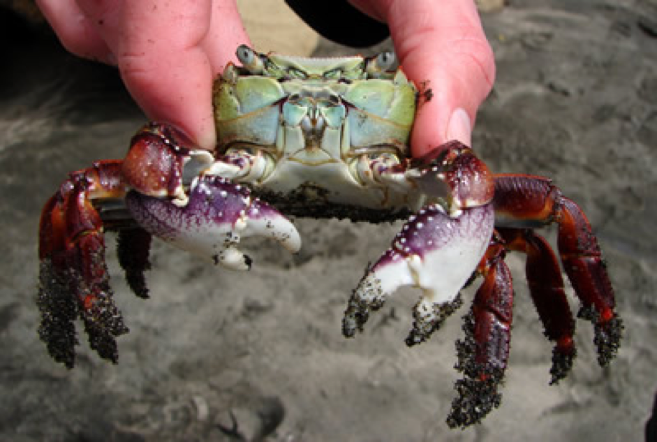
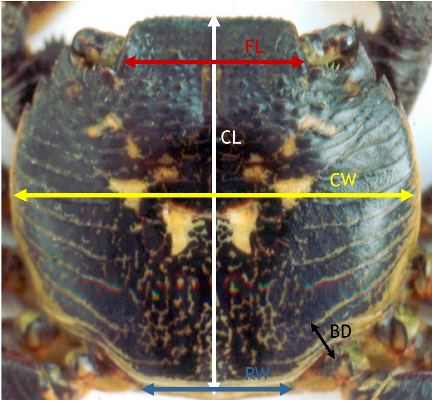

```{r setup, include=FALSE}
knitr::opts_chunk$set(echo = FALSE, message = FALSE)
SciViews::R
```


### Biométrie des crabes

L'étude porte sur deux variétés de crabes *Leptograpsus variegatus*  : la variété bleue et la variété orange. 

Analysez ce jeu de données avec les outils propres à l'ACP.

Le jeu de données se trouve dans le packge **`MASS`** et se nomme **`crabs`**

```{r,fig.align='center', echo=FALSE, out.width= '55%'}

```

### Les mesures réalisées

L'étude porte sur 100 crabes de la variété bleue et 100 crabes de la variété oranges avec une égalité d'effectifs entre mâles et femelles dans les deux sous-populations.

\columnsbegin
\columnlarge

```{r,fig.align='center', echo=FALSE, out.width= '75%'}

```

\columnsmall

Les mesures sont (en mm) :

- **length\ :** Longueur de carapace (CL)
- **width\ :** Largueur de carapace (CW)
- **front\ :** Taille du lobe frontal (FL)
- **rear\ :** Largueur à l'arrière  (RW)
- **depth\ :** Epaisseur du corps (BD)

\columnsend


### Marphy 

\columnsbegin
\columnsmall


**Consignes**

\vfill
\vfill

Transect entre Nice et Calvi à travers une zone frontale (remontée d'eaux froides profondes riches en nutriments). Le transect est composé de 68 stations régulièrement espacées entre Nice (station 1) et Calvi (station 68). La température (°C), la salinité (PSU), la fluorescence (unités de fluorescence) et la densité (g/L) dans le jeu de données `marphy`.

\vfill
\vfill

Analysez ce jeu de données avec les outils propres à l'ACP.

\columnlarge

```{r, echo= FALSE, message=FALSE, out.width='95%', fig.align='center'}
library(tidyverse)
library(cowplot)
fr <- map_data("france")
ggplot(fr, aes(long, lat, group = group)) +
  geom_polygon(fill= "white", color = "black") +
  geom_segment(aes(y = 43.7 , x = 7.25, yend = 42.56, xend= 8.75, color = "red"), size = 1, show.legend = FALSE) +
  theme(axis.line = element_blank(), axis.title = element_blank(),axis.text = element_blank(), axis.ticks = element_blank()) +
  coord_quickmap()
```

\columnsend


### Marbio

\columnsbegin
\columnsmall

**Consignes**

\vfill
\vfill

Le transect a permis de  dénombrer différents groupes au sein du plancton dans les échantillons collectés aux mêmes 68 sdtations que `marphy`. Ces données sont regroupées dans le jeu de données `marbio`.

\vfill
\vfill

Analysez ce jeu de données avec les outils propres à l'ACP.

\columnlarge

```{r, echo= FALSE, message=FALSE, out.width='95%', fig.align='center'}
library(tidyverse)
library(cowplot)
fr <- map_data("france")
ggplot(fr, aes(long, lat, group = group)) +
  geom_polygon(fill= "white", color = "black") +
  geom_segment(aes(y = 43.7 , x = 7.25, yend = 42.56, xend= 8.75, color = "red"), size = 1, show.legend = FALSE) +
  theme(axis.line = element_blank(), axis.title = element_blank(),axis.text = element_blank(), axis.ticks = element_blank()) +
  coord_quickmap()
```


\columnsend
