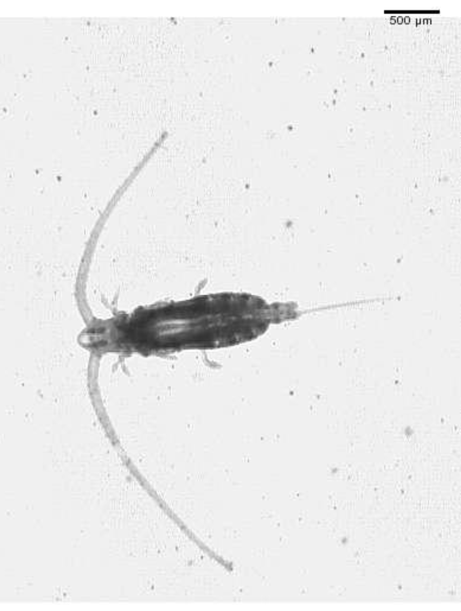

```{r setup, include=FALSE}
knitr::opts_chunk$set(echo = TRUE)
SciViews::R
```

### Matrice de confusion

La matrice de confusion est un outil informant sur la qualité d'un algorithme de classification supervisée. Il s'agit d'un tableau à double entrée comparant les prédictions de l'algorithme par rapport à une classification manuelle.

```{r, echo=FALSE, message=FALSE}
conf <- data.frame( "Orange" = c( 25, 0, 1), "Mandora" = c(0, 16, 9), "Mineola" = c(0,8, 18 ),  row.names = c("Orange", "Mandora", "Mandarine") )

knitr::kable(conf, col.names = c("Orange", "Mandora", "Mandarine"))
```


Sur cette matrice de confusion simplifiée, calculez : **Le nombre de vrai positif, vrai négatif, faux positif,  faux négatif, le taux de reconnaissance global (accuracy), taux de vrai positif (recall), spécificité (specificity), précision et le score F (F-measure)** en vous ciblant sur les Mandora (On retrouve en ligne la classification manuelle)

Les formules sont disponibles dans le document annexe à l'url suivant 

- <https://github.com/BioDataScience-Course/sdd_lesson/blob/2019-2020/sdd3_01/more/confusion_matrix.pdf> 


### Les organismes planctoniques de la mer du Nord

Regroupement des organismes animaux et végétaux dont la capacité de mouvements horizontaux est inférieure à celles des mouvements de l'eau. Ils ne peuvent pas nager à contre courant, par exemple.

```{r,fig.align='center', echo=FALSE, out.width= '25%'}

```

Vous avez une assignation à votre disposition pour cet exercice <https://classroom.github.com/a/yNVbegs7>


### Les organismes planctoniques de la baie de Calvi

Une seconde assignation est mise à votre disposition : <https://classroom.github.com/a/77u4Qotl> 

Il est plus important que le premier et comprend plus de 10000 observations
