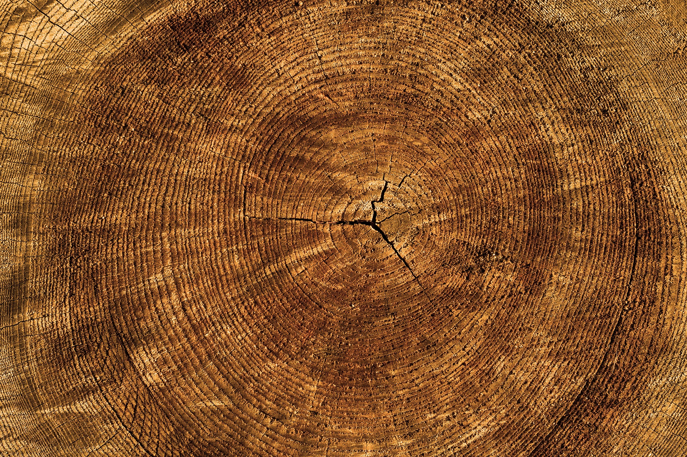
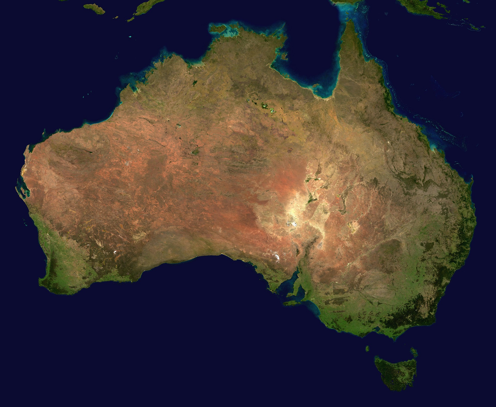

```{r setup, include=FALSE}
knitr::opts_chunk$set(echo = TRUE)
SciViews::R
```


1. Découvertes des outils de base pour analyser les séries temporelles
   + Transformation d'un objet data.frame en ts
   + Autocorrélation 

2. Décomposition de séries

### La Schizophrénie

Un test d'activité cérébrale est réalisé sur un patient quotidiennement durant 120 jours. Au jour 60, les médécins lui prescrivent le médicament. 

Le nouveau médicament a t'il un effet sur l'activité cérébrale du patient étudié ? 

* Jeu de données : schizo.txt

### Les tremblements de terre dans le monde

Les tremblements de terre d'une magnitude supérieur à 7 sont comptabilisé dans le monde entre 1900 et 1998.


```{r,fig.align='center', echo=FALSE, out.width= '55%'}
knitr::include_graphics("../images/earthquake.jpg")
```

 Y a t'il des périodes de fortes activités sismiques ? 

* Jeu de données : earthq.txt


### Les feux de forêts au Canada

On dénombre le nombre d'acres de forêt qui est détruit par le feu.

- 1  acre correspond à 4046 m^2^

```{r,fig.align='center', echo=FALSE, out.width= '55%'}
knitr::include_graphics("../images/feux_forets.jpg")
```


Les feux de forêts sont-ils en augmentation 

* Jeu de données : fire.txt

### La population de lynx


Une étude s'intéresse aux  lynx capturés entre 1821 et 1934 au Canada

```{r,fig.align='center', echo=FALSE, out.width= '55%'}

```

* Jeu de données : lynx présent dans R

### La production de bières

La production mensuelle de bière (mégalitres) est encodée mensuellement depuis 1956. Décomposez cette série avec la méthode des moyennes mobiles

```{r,fig.align='center', echo=FALSE, out.width= '65%'}
knitr::include_graphics("../images/beer.jpg")
```


* Jeu de données : beer.txt

### Croissance d'arbres

Les scientifiques mesurent l'épaisseur de cernes (en cm) sur des arbres abattu en 1973. Décomposez cette série avec la méthode des moyennes mobiles

```{r,fig.align='center', echo=FALSE, out.width= '65%'}

```

* Jeu de données : cernes.txt

### Variation de la température 

Les chercheurs rencensent la température moyenne mensuelle à Melbourne à partir de janvier 1981. Y a t'il une augmentation de la température au cours du temps ? 

```{r,fig.align='center', echo=FALSE, out.width= '65%'}
knitr::include_graphics("../images/temperature.jpg")
```

* Jeu de données : temperature_melbourne_1981

### Transect de Nice à Calvi

Les chercheurs souhaitent visualiser graphiquement la distribution des Copépodes le long du transect (Variable Copepodits1)

```{r, echo= FALSE, message=FALSE, out.width= '50%', fig.align='center'}
library(tidyverse)
library(cowplot)
fr <- map_data("france")
ggplot(fr, aes(long, lat, group = group)) +
  geom_polygon(fill= "white", color = "black") +
  geom_segment(aes(y = 43.7 , x = 7.25, yend = 42.56, xend= 8.75, color = "red"), size = 1, show.legend = FALSE) +
  theme(axis.line = element_blank(), axis.title = element_blank(),axis.text = element_blank(), axis.ticks = element_blank()) +
  coord_quickmap()
```

Jeu de données : Marbio du package (Pastecs)

### Production de lait 

La production mensuelle de lait par vache est monitoré à partir de janvier 1926. Y a t'il une évolution linéaire? Le cycle annuel est modélisable ? ... 

```{r,fig.align='center', echo=FALSE, out.width= '65%'}
knitr::include_graphics("../images/vache.jpg")
```


* Jeu de données : milk_product_1962

### Variation de la population en Australie

Les chercheurs rencensent mensuellement le population Australienne à partir de 1978. Ils souhaitent savoir si la croissance a été linéaire. 

```{r,fig.align='center', echo=FALSE, out.width= '65%'}

```

* jeu de données : demographie.txt
