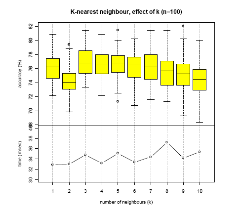

```{r setup, include=FALSE}
knitr::opts_chunk$set(echo = TRUE)
SciViews::R
```


# Classification supervisée (machine learning)

## Algorithmes & optimisation

### Objectifs du cours

\putat{200}{-30}{\includegraphics[width=50mm]{../../template/resources.pdf}}

- Comprendre le partitionnement par arbres
 
- Savoir utiliser des algorithmes de classification supervisée plus sophistiqués: random forest, machine à vecteurs supports et réseaux de neurones


### Partitionnement par arbres

- Le partitionnement par arbres fonctionne selon la même logique que les **clés de détermination**

- Un arbre est constitué d'une série de **noeuds** correspondant à un choix de type `var x >= seuil`. Si la réponse est oui, on part sur la **branche** de droite, sinon sur la branche de gauche.

- les dernières branches débouchent sur les **feuilles** de l'arbre qui prédisent une classe.


### Partitionnement par arbre - exemple

Application sur `iris` :

```{r, echo=FALSE}
library(rpart)
iris_rpart <- rpart(Species ~ ., data = iris)
par(bg = "white")
plot(iris_rpart, margin = 0.2); text(iris_rpart, use.n = TRUE)
```


### Random Forest

- Le problème avec un arbre: il est impossible de revenir sur une division faite plus haut.

- "Random Forest" construit un **grand nombre d'arbres** (`ntree = 500` par défaut) en y introduisant une **variation aléatoire à chaque noeud** (argument `mtry = `, sélection aléatoire d'une fraction des variables, racine carré de leur nombre par défaut)

- Chaque arbre est donc **différent des autres** : toutes les divisions qui ont un sens sont testées

- La classe est définie par un **vote à la majorité simple** par tous les arbres

- Méthode coûteuse en calculs, mais très performante (**l'une des meilleures actuellement**) !

- Il n'est malheureusement plus possible de visualiser les règles de décision car il y en a beaucoup trop.


### Réseaux de neurones artificiels

- Techniques **inspirées du fonctionnement du cerveau humain** : des "neurones" sont connectés les uns aux autres et transmettent le signal vers la couche suivante différemment selon les signaux qu'ils reçoivent en entrée.

 - Potentiellement très efficace (dans sa version extrême, dite **deep learning**), mais très coûteuse en temps de calcul
 
 - Requière un très grand nombre de données dans le set d'apprentissage
 
 - Donne des résultats différents (et performances très variables) d'une fois à l'autre avec les mêmes paramètres


### Organisation des neurones dans un réseau


### Machine à vecteurs supports

- La machine à vecteurs supports ("support vector machine" ou SVM) permet de séparer deux classes le long d'un hyperplan qui sépare l'hyperespace des variables en deux zones

- Le plan est défini par la distance des points les plus proches, qui forment les **vecteurs de support**

- Une **transformation des données initiales** est d'abord appliquée afin de tranformer une frontière non linéaire entre deux classes en une frontière linéaire. Différents "noyaux" (kernels) de transformation sont disponibles. Leur choix dépend de la transformation nécessaire.

- Le problème à plus de deux classes se résoud soit en _un versus tous_ (avec "le meilleur qui prend tout"), ou _un versus un_ (avec vote à la majorité sur l'ensemble des classifieurs binaires).


### Machine à vecteurs supports (2)


### Application sur iris

- Le script de démo montre comment utiliser le partitionnement par arbre, random forest, les réseaux de neurones et la machine à vecteurs supports dans R.

- L'optimisation des classifieurs par le biais des paramètres adaptables manuellement est également démontrée pour les algorithmes les plus complexes.


## Optimisation de classifieurs


### Optimisation de classifieurs

- Illustration sur base de l'élaboration d'un classifieur pour du zooplanton méditerranéen (voir Grosjean _et al_, 2004, voir http://go.sciviews.org/publi_zooimage).

- **Optimisation de 15 algorithmes** différents et choix des meilleurs paramètres pour chacun d'eux

- **Bootstrap** 2/3 apprentissage, 1/3 test réalisé 100 fois pour chaque choix afin de simuler la variabilité des indicateurs d'un jeu de donnée à l'autre

- Comparaison des performances des 15 classifieurs optimisés, à la fois en terme de **taux global de reconnaissance** et et **vitesse de calcul**


### Optimisation de l'arbre de partitionnement


### Optimisation des k plus proches voisins




### Optimisation de l'apprentissage par quantification vectorielle


### Optimisation de "Random Forest" (1)


### Optimisation de "Random Forest" (2)


### Optimisation - choix final


