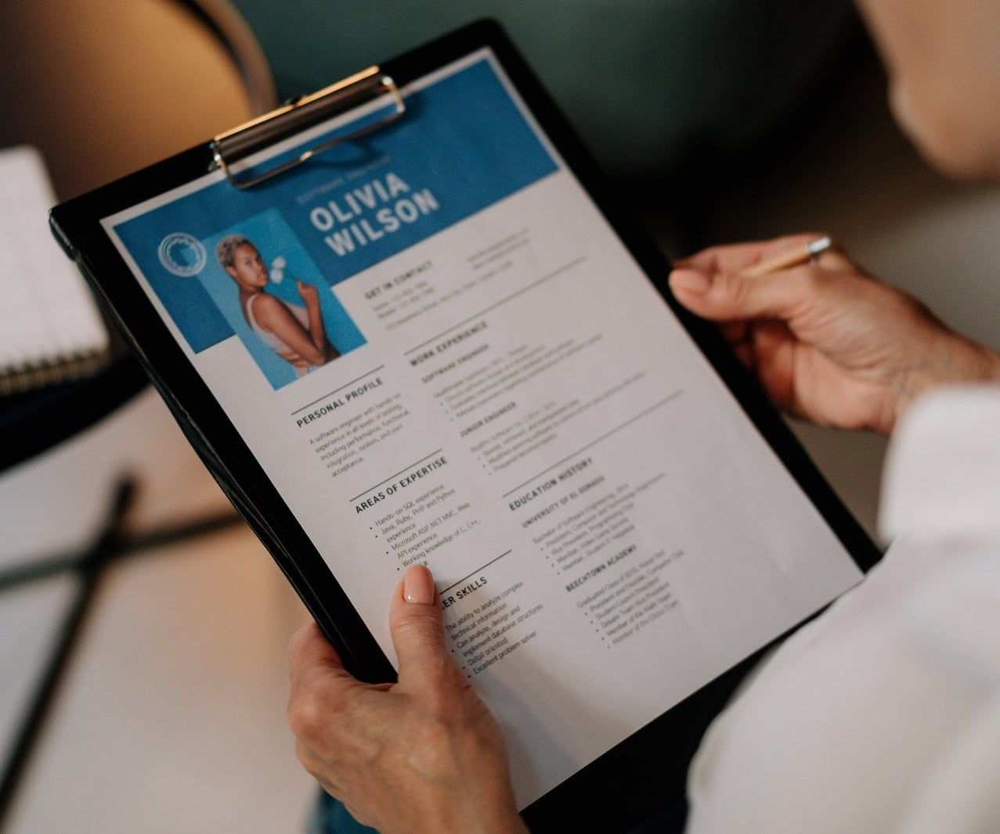
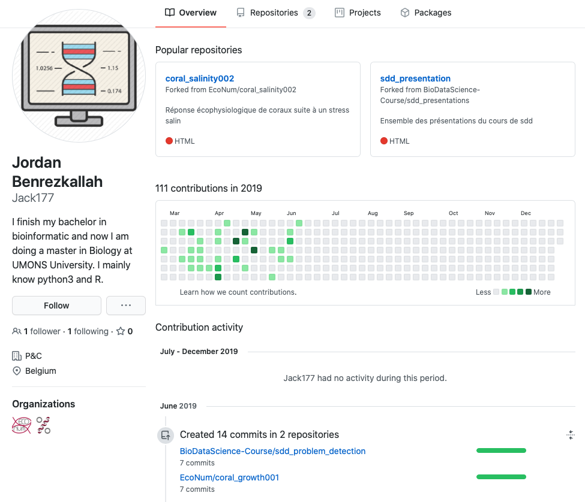

```{r setup, include=FALSE}
knitr::opts_chunk$set(echo = TRUE)
SciViews::R
```

### Bilan

Avec les cours de SDD I + II + III, vous être préparés pour l'analyse de vos données.

- Matière classique en **biostatistiques**

- **Bonus** : techniques plus **avancées** (remainement complexe des données, machine learning, modèles (non)linéaires, séries temporelles, ...)

- **Bonus** : maîtrise des **logiciels** (R, RStudio, Git, R Markdown)

- **Bonus** : bonnes pratiques en **Open Science** et **Open Data** (l'avenir\ !)

- **Bonus** : bonnes bases pour réaliser une **recherche reproductible**

\center

{width=270}

### Que faire ensuite ?

- Utiliser, valoriser (stages, mémoire, carrière, doctorat)

- Être conscient de ses points forts et rédiger son CV en fonction (**mettez en avant vos compétences en science des donnes et biostatistiques**)

\center

{width=270}

### Valoriser ses meilleurs travaux de SDD

- Mettre en évidence des travaux qui peuvent **certifier de vos compétences** au delà de l'habituel en biologie\ : rendre vos meilleurs dépôts GitHub **publics** (et les forker dans son espace personnel) - soigner son **identité sur Internet\ !**

\center

{width=270}

### Face à un problème inconnu

- Vous avez aussi appris à réfléchir par vous-même. Lisez la littérature scientifique, recherchez (Google, Stackoveflow, ...), lisez les pages d'aides et les tutoriels

- Nous n'avons pas vu toutes les techniques stats ... mais vous êtes prêts pour comprendre plus facilement les autres par vous-même ou avec un minimum d'aide !

- **Important**\ : faites-nous signe lorsque ce qu'on vous a enseigné vous est utile\ ! 

### Erreurs récurrentes : carnet de notes

Le carnet de notes est souvent associé au carnet de laboratoire que vous allez découvrir/utilisez très prochainement.

\center

{width='60%'}

**Vous devez tout consigner clairement dans ce carnet**

### Erreurs récurrentes : rapport de synthèse

Un rapport de synthèse s'appuie sur un carnet de notes.

\center

{width='60%'}

Ce rapport doit être  **auto-suffisant**

### Vous avez la parole !

**Votre retour est très important pour améliorer nos cours de Science des Données.**

\center

{width=250}

- Répondez aux questions (page Wooclap suivante), levez la main pour prendre la parole.
