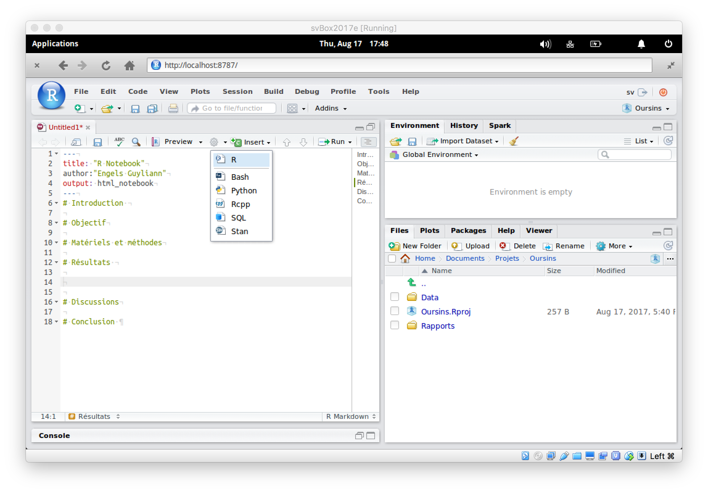

## Objectif

> Se familiariser avec la machine virtuelle SciViews Box, avec le logiciel RStudio et les documents de type R Notebook.


## Prérequis

- Installation de la machine virtuelle : voir tutoriel d'installation de la SciViews Box.


## Procédure

### La SciViews Box

**Étape 1.** Après avoir lancé la SciViews Box, la fenêtre d'accueil s'affiche. A partir de là, deux options permettent d'accéder au logiciel d'analyse de données et de représentation graphique **R** à travail l'interface de **RStudio** :

- Rentrer dans la machine virtuelle pour y réaliser notre travail,
- Ouvrir un page web dans le navigateur de l'ordinateur et y insérer l'adresse suivante : `http://localhost:8718`. En choisissant cette option, poursuivez à l'étape 5.

**Conseil : essayez les deux approches. Selon les ordinateurs, et selon vos habitudes de travail, l'une des deux vous paraîtra rapidement plus facile et fluide que l'autre.**


----

**Étape 2.** Entrez le mot de passe pour accéder à la machine virtuelle : **sv**^[Ce mot de passe est court, et donc peu sécurisé. Ceci n'est pas important car, avec la configuration par défaut, vous n'avez accès à la SciViews Box que localement depuis l'ordinateur hôte. Cela réduit donc quasiment à néant les possibilités d'intrusions extérieures dans cette machine virtuelle (sauf si votre système hôte est lui-même attaqué, mais là, c'est ses protections propres que vous devez déployer comme d'habitude).].


----

**Étape 3.** Après un petit moment, le bureau de la machine virtuelle apparaît. Il contient les éléments suivant : 


- Le "dock" en bas (encadré bleu) permet de lancer des applications et d'accéder aux fenêtres des applications en cours d'exécution. La SciViews Box est préinstallée avec une série d'applications intéressantes dans le cadre de la Science des Données, dont **RStudio** (encadré rouge).

- La barre des applications en haut, avec à gauche, le menu d'accès à l'ensemble des applicatifs installés (encadré orange).

----

**Étape 4.** Si vous le souhaitez, prenez maintenant un peu de temps pour explorer le contenu de la SciViews Box. Que vous travailliez sous Windows, MacOS ou Linux, vous devriez trouver vos repère rapidement dans l'interface de cette machine virtuelle qui tourne sous [Xubuntu](https://xubuntu.org/tour/), avec le bureau [Xfce](https://xfce.org).


----


### RStudio

**Étape 5**. Sélectionnez le raccourci **RStudio** dans le dock. Un login vers RStudio apparaît. Il faut y entrer les informations suivantes :


- Username : **sv**
- Password : **sv**
- Cochez éventuellement **Stay signed in** pour éviter de devoir réentrer ces informations continuellement

----

**Étape 6.**  RStudio s'ouvre. C'est votre interface de travail à partir de laquelle vous allez piloter **R**. La fenêtre principale comporte différents éléments :


- Une barre de menu et une barre d'outils générale en haut (encadré bleu)
- Un panneau à gauche intitulée **Console** (encadré orange) où vous pouvez entrer des instructions dans **R** pour manipuler vos données
- Un panneau à droite en haut (encadré rouge) avec plusieurs onglets, dont **Environnement** qui vous indique les différents items (on parle d'**objets**) chargés en mémoire dans **R** (mais pour l’instant, il n'y a encore rien).
- Un panneau en bas à droite (encadré gris) comportant lui aussi plusieurs onglets. Vous devriez voir le contenu de **Files** au démarrage, un explorateur de fichiers simplifié relatif au contexte de travail actuel dans RStudio.

----

**Étape 7.** Pour l'instant, aucun document de travail n'est encore ouvert. Pour en créer un, ou ouvrir un document existant, vous utilisez le menu **Files**, ou encore, le premier bouton de la barre d'outils générale (encadré en bleu ci-dessous) :


Le menu **Session** permet d'interagir directement avec **R** qui est lancé automatiquement en arrière plan dès que RStudio est ouvert. Par exemple, il est possible de relancer **R** à partir d'une entrée dans ce menu :


Le menu **Help** propose différentes possibilités pour accéder à la documentation de **R** ou de **RStudio**. Les **aide-mémoires** ("cheatsheets" en anglais) sont très pratiques lors de l'apprentissage. Nous conseillons de les imprimer et de les consulter régulièrement.


Le dernier bouton de la barre d'outils générale, intitulé **Projects** permet d'ouvrir, fermer, et gérer les projets RStudio.


> Voir le tutoriel dédié aux projets dans RStudio.

Vous avez maintenant repéré les éléments fondamentaux de l'interface de RStudio.

_A ce stade vous pouvez vous familiariser avec la cheatsheet relative à l'IDE RStudio. Vous verrez qu'il y a beaucoup de fonctionnalités accessibles à partir de la fenêtre principale de RStudio. Ne vous laissez pas intimider : vous les apprendrez progressivement au fur et à mesure de l'utilisation du logiciel. Contentez-vous pour l'instant de comprendre comment cette cheatsheet est structurée afin de pouvoir vous y référer facilement plus tard._

----


### Document R Notebook

**Étape 8.** Cliquez sur le premier bouton de la barre d'outils pour créer un nouveau document. Vous voyez que RStudio permet de travailler avec différents types de documents différents. Nous allons créer à présent un **R Notebook**.


----

**Étape 9.** Le panneau contenant la **Console** de **R** est réduit en bas à gauche pour laisser à présent un maximum de place à un quatrième panneau qui apparaît en haut à gauche, et qui sert à éditer les documents comme ce R Notebook. Ce dernier ne porte pas de nom pour l'instant (il n'est pas encore sauvegardé dans un fichier), donc son onglet indique **Untitled1**).


Contrairement à un document Word par exemple, le R Notebook ne vous permet pas de visualiser directement le résultat final d'un rapport d'analyse^[Les systèmes d'édition professionnels dissocient en effet le fond de la forme : vous rédiger d'abord le contenu, et ensuite, vous indiquer le style à lui appliquer, comme pour le langage [LaTex](https://openclassrooms.com/courses/redigez-des-documents-de-qualite-avec-latex/qu-est-ce-que-latex) par exemple. C'est le même principe avec R Markdown dans RStudio.]. Les balises de formatage de texte R Markdown sont expliquées dans les **cheatsheets**. Elles sont intuitives, après une courte phase d'apprentissage.

_C'est le moment de vous référer aux cheatsheets relatives à R Markdown. Encore une fois, beaucoup d'information s'y trouve. Vous apprendrez tout cela progressivement. Regardez un peu plus attentivement celle intitulée "R Markdown Reference Guide" qui présente les balises Markdown principales à gauche et le résultat dans le document final formatté à droite dans sa première partie. Dans le menu d'aide de RStudio, vous avez aussi l'entrée "Markdown Quick Reference" qui rappelle ces balises dans l'onglet **Help** directement dans la fenêtre de RStudio. C'est bien utile au début !_

Voyons maintenant ensemble l'anatomie d'un document R Markdown/R Notebook.

La première partie du document est appelé le **préambule**. Il est nécessairement situé au tout début du document et est balisé à l'aide de trois tirets `---` au début et à la fin isolés sur leurs propres lignes. Le préambule comporte un ensemble de consignes pour la mise en forme générale du document. C'est donc là que nous indiquerons comment nous voulons réaliser notre rapport final. Nous pouvons aussi y indiquer un titre, le ou les auteurs, la date, ... (**A noter que l'entrée "author:" est incorrecte dans la copie d'écran: il faut un espace après le :**)


_Profitez-en pour y indiquer votre propre titre et votre nom comme auteur du document._

Le reste du document R Notebook est subdivisé en zones successives sur fond blanc et zones sur fond gris clair.

- Les zones sur fond blanc sont des parties Markdown où vous pouvez écrire votre texte.
- Les zones sur fond gris clair sont appelées des **chunks**. Elles contiennent des instructions qui vont être interprétées pour réaliser un calcul, un graphique, etc. Dans le document final, les chunks seront remplacés par le résultat du calcul. Ces chunks sont balisés en entrée par trois tirets inclinés à droite suivis d'accolades contenant des instructions relatives au programme à utiliser, par exemple, ```` ```{r} ```` pour des chunks faisant appel au logiciel **R**, et sont terminées par trois tirets inclinés à droite (```` ``` ````).

Dans les parties sur fond blanc, les zones Markdown, vous pouvez ajouter des balises qui permettront de formater votre texte dans la version finale de votre rapport. Par exemple, un ou plusieurs dièses (plus communément connu par sont appellation en anglais : "hastag") en début de ligne suivi d'un espace indique que la suite correspond à un titre. Titre de niveau 1 avec un seul dièse, de niveau 2 avec deux dièses, et ainsi de suite jusqu'à 6 niveaux possibles. Dans la capture d'écran ci-dessous, nous avons remplacé tout le contenu du R Notebook (à part le préambule) par une série de titres de niveau 1 correspondant à la structure générale d'un rapport scientifique : 

- Introduction
- Objectif
- Matériels et méthodes
- Résultats
- Discussion
- Conclusions (et perspectives)


Modifiez maintenant votre propre document R Notebook pour qu'il soit conforme à la capture d'écran. Pensez à aérer votre document avec des lignes vides entre les titres et entre les paragraphes. C'est indispensable pour une bonne compilation du rapport final, et c'est aussi pus lisible dans la version R Notebook en cours d'édition.

----

**Étape 10.** Insérez maintenant un chunk dans la partie **Résultats**. Pour se faire, placez le curseur juste après le titre `# Résultats`, appuyez sur la touche entrée pour ajouter une nouvelle ligne vide dans le document et utilisez le bouton vert **Insert** de la barre d'outils de l'éditeur R Notebook en choisissant un chunk **R** :



Une zone sur fond gris clair, balisée comme expliqué plus haut, et comportant quelques boutons à droite apparaît (encadré bleu ci-dessous). C'est dans cette zone spéciale que vous entrerez plus tard des instructions **R** pour vos analyses. L'important, pour l'instant dans ce tutoriel, est de bien comprendre la différence entre une zone Markdown et un chunk R. Nous n'entrerons donc rien pour l'instant dans ce chunk.


----

**Étape 11.** Sauvez le document dans le dossier adéquat. Cliquez sur le troisième bouton de la barre d'outils générale (icône de petite disquette bleue), ou sur le bouton équivalent dans la barre d'outils de l'éditeur R Notebook. Une boite de dialogue apparaît.


Commencez par naviguer vers le répertoire voulu, en l’occurrence ici, le sous-dossier `reports` de votre répertoire de base du projet `Oursins` (**ATTENTION: ici à ce stade, on n'a pas encore créé le projet en question, ni le sous-dossier!!!**)


Enfin, donnez un nom au fichier qui contiendra votre rapport (ce nom doit être informatif, mais peut être différent, et par exemple plus court, que le titre du document R Notebook). **N'indiquez aucune extension (le `.xxx` à la fin du nom de fichier, comme `.docx` ou `.xlsx`). RStudio ajoutera automatiquement `.Rmd` pour "R Markdown".** Cliquez enfin sur **Save**.


----

**Étape 12.** Votre document étant maintenant sauvegardé sur le disque, vous pouvez employer le bouton **Preview** dans la barre d'outils de l'éditeur R Notebook pour compiler une version finale de votre rapport. A la fin du traitement, RStudio vous présentera le résultat final soit dans l'onglet **Viewer**, soit dans une fenêtre séparée (en fonction des options choisies dans les paramètres de RStudio). Il s'agit d'un document HTML ayant le même nom que votre R Notebook et dans le même dossier, mais avec une extension `.nb.html`. C'est le fichier contenant votre rapport final. Notez qu'il est également possible de générer un rapport à partir du même document, mais dans d'autres formats tels PDF ou Word, par exemple. Vous pourrez même créer des présentations ou des versions formatées selon les directives des éditeurs de journaux scientifiques, toujours à partir de la même source^[C'est là tout l'intérêt de dissocier le fond de la forme !]... mais cela, c'est une autre histoire !


_A la suite de ce tutoriel, vous devriez être désormais capable de lancer la machine virtuelle SciViews Box et le logiciel RStudio, et puis de créer et travailler dans un document R Markdown/R Notebook._

----


## Pour en savoir plus

- [RStudio IDE Cheat Sheet](https://www.rstudio.com/wp-content/uploads/2016/01/rstudio-IDE-cheatsheet.pdf) disponible en version PDF dans le dossier `~/Shared/Doc`. 
- [R Markdown Cheat Sheet](https://www.rstudio.com/wp-content/uploads/2015/02/rmarkdown-cheatsheet.pdf) disponible en version PDF dans le dossier `~/Shared/Doc`.
- [R Markdown Reference](https://www.rstudio.com/wp-content/uploads/2015/03/rmarkdown-reference.pdf) disponible en version PDF dans le dossier `~/Shared/Doc`.
- [Les base de R](https://www.rstudio.com/wp-content/uploads/2016/10/r-cheat-sheet-3.pdf) disponible en version PDF dans le dossier `~/Shared/Doc`.


_Copyright © 2017-2018, Guyliann Engels & Philippe Grosjean, [Attribution-NonCommercial-ShareAlike 4.0 (CC BY-NC-SA 4.0)](https://creativecommons.org/licenses/by-nc-sa/4.0/deed.fr)._
