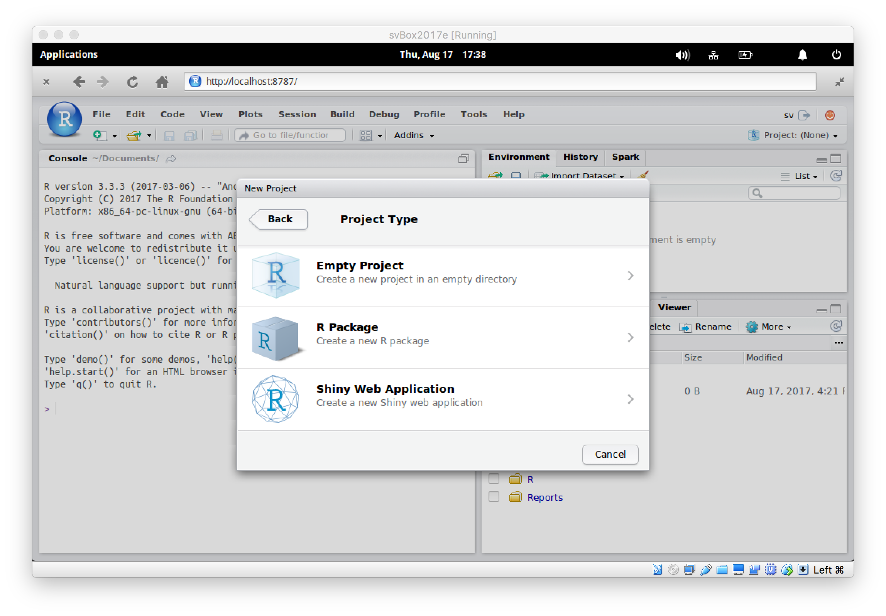
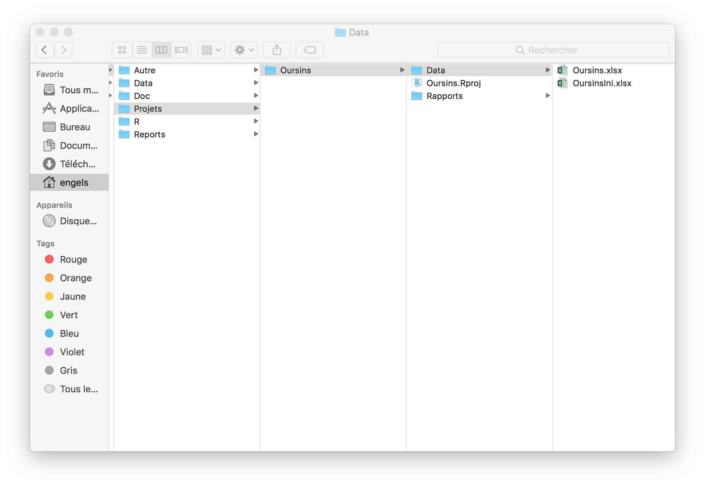

## Objectif

> Se familiariser avec les projets dans RStudio. Les projets sont des outils pratiques d'organisation des fichiers. Ils permettent de plus, une grande flexibilité et un partage facile entre utilisateurs.

## Prérequis

- Tutoriel de prise en main de la machine virtuelle et de RStudio

## Procédure

**Étape 1.** Démarrez la SciViews Box, et puis RStudio. Sélectionnez le bouton **Project** tout à droite dans la barre d'outils générale de RStudio. Un menu contextuel apparaît. Sélectionnez **New Project**.

----

**Étape 2.** Une boite de dialogue s'ouvre. Sélectionnez **New Directory**. Il est également possible d'employer un dossier existant.

----

**Étape 3.** Sélectionnez **Empty Project**.

----

**Étape 4.** Ensuite, RStudio vous demander quelques informations pour configurer votre projet.

Nommez le projet et indiquez où vous voulez le placer. Pour ce tutoriel, nous l’appellerons `Oursins` (**Directory Name**).

Cliquez ensuite sur **Browse** pour sélectionner le répertoire dans lequel vous placerez ce nouveau projet :

Naviguez vers le répertoire `Shared`...

... puis le sous-répertoire `Projects` :

Cliquez sur **Choose**. Vous pouvez éventuellement cocher aussi l'option **Create a git repository** (nous vous le conseillons), mais **ne cochez surtout pas Use packrat with this project !** Packrat permet de garder une copie des packages R utilisés dans un projet, mais d'une part, ce système est **incompatible** avec le format de fichiers du dossier `Shared` de la machine virtuelle, et d'autre part, cela alourdi de plusieurs dizaines de mégaoctets votre projet, alors que la machine virtuelle SciViews Box est _déjà_ configurée pour gérer correctement la plupart des packages R dont vous aurez besoin.

> Donc, on répète : ne jamais cocher l'option **Use packrat with this project** à partir du répertoire partagé `Shared` de la SciViews Box !

Terminez la configuration de votre projet en cliquant **Create Project**.

----

**Étape 5.** Le projet est crée. RStudio se configure tout seul pour fonctionner de manière relative à votre projet `Oursins`. Le nom du projet apparaît à la droite du bouton de gestion des projets (voir encadré bleu ci-dessous).

Notez, par exemple, que le répertoire de base de votre projet est devenu le répertoire actif dans l'onglet **Console** (`~/Shared/Projects/Oursins/`), et que l'onglet **Files** affiche maintenant son contenu. Un fichier `Oursins.Rproj` y a été ajouté automatiquement par RStudio. Ce fichier contient les paramètres de configuration propres à ce projet^[N'éditer **jamais** à la main un fichier `.Rproj`. Laisser RStudio s'en occuper tout seul.]. C'est aussi une excellente façon de repérer qu'un répertoire est la base d'un projet RStudio, en repérant ce fameux fichier `.Rproj`.

----

**Étape 6.** Créez à présent différents sous-dossiers pour structurer le projet, en cliquant sur le bouton **New Folder** de la barre d'outils de l'onglet **Files**.

Ajoutez deux dossiers : `data` et `reports`. Ces dossiers contiendront, bien entendu respectivement, les données à analyser et les rapports d'analyses liés à votre projet.

----

**Étape 7.** Ouvrez le sous-dossiers `data` du projet dans l'explorateur de fichiers sur votre ordinateur.

Placez-y les jeux de données intéressantes relatives au projet. Dans notre cas, nous allons copier les fichiers `Oursins.xlsx` et `OursinsIni.xlsx` depuis ... (**indiquer où on peut trouver ces fichiers**).

_Vous êtes maintenant prêt pour travailler dans RStudio dans une structure claire et gérable, quelle que soit la complexité de vos analyses._

----

**Étape 8.** Pour fermer le projet `Oursins`, sélectionnez le bouton de projet dans la barre d'outils générale, et sélectionnez ensuite **Close Project**.

Vous constaterez que RStudio se reconfigure tel qu'il était avant que vous n'entriez dans le projet `Oursins`. Revenez vers le bouton projet et resélectionnez le projet `Oursins` dans le menu contextuel... RStudio de reconfigure à nouveau tel qu'il était lorsque vous avez quitté dernièrement le projet. Il en sera de même pour tous les autres projets RStudio que vous créerez ensuite. Cela permet de compartimenter au mieux vos analyses, projet par projet !

----

## Pour en savoir plus 

- [Organiser ses fichiers](http://larmarange.github.io/analyse-R/organiser-ses-fichiers.html)

- Tutoriel "la gestion des fichiers dans un projet et les chemins relatifs".

_Copyright © 2017-2018, Guyliann Engels & Philippe Grosjean, [Attribution-NonCommercial-ShareAlike 4.0 (CC BY-NC-SA 4.0)](https://creativecommons.org/licenses/by-nc-sa/4.0/deed.fr)._
