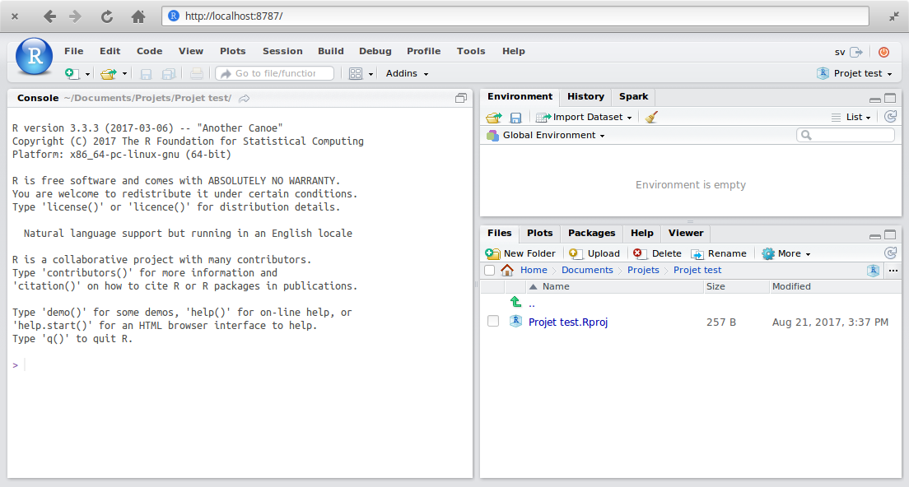
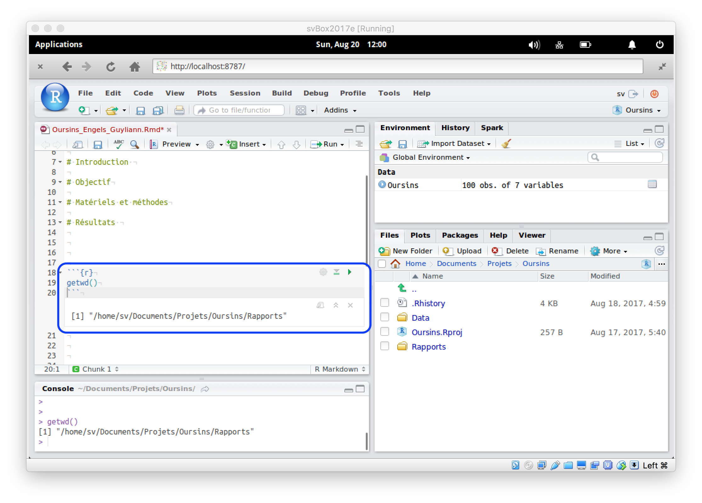

## Objectifs

> Organiser ses fichiers au sein d'un projet RStudio et maîtriser l'accès à ces mêmes fichiers en utilisant, de préférence, des chemins d'accès relatifs afin que le projet soit **portable**. 


## Prérequis

- Être familiarisé avec les projets sous RStudio (voir tutoriel projets dans RStudio).


## Organiser ses fichiers au sein d'un projet RStudio

L'organisation de base des dossiers qui est proposée dans la SciViews Box est un bon point de départ. Elle propose de placer ses projets dans un sous-dossier `Projects` dans `Shared` qui est lui-même le répertoire partagé entre la machine virtuelle et le système d'exploitation hôte^[Tout ce qui se trouve dans le dossier `Shared` est disponible à la fois dans la SciViews Box et dans le système hôte natif de l'ordinateur] :

```
/home
  /sv               # Répertoire de base de l'utilisateur 'sv'
    /Shared         # Dossier partagé entre la svBox et le système hôte
      /Data         # Dossier contenant quelques jeux de données exemples
      /Doc          # Des fichiers d'aide et autre documentation
      /Projects     # Le répertoire proposé pour y placer vos projets
    /Downloads
    /R
...
```

Créer un projet dans RStudio^[Si vous éprouvez des difficultés à créer votre projet, (re)voyez le tutoriel "Projets RStudio".] (avec les options **New Directory** & **Empty Project**). Nous le nommerons `Projet test` (**Directory Name**) dans le dossier `~/Shared/Projects` (**Create project as subdirectory of**)^[Le tilde `~` est un raccourcis pour indiquer le répertoire de l'utilisateur. Il est donc équivalent à `/home/sv` dans la SciViews Box.]. (**Pourquoi ne pas repratir simplement du projet Oursins créé dans le tutorial précédent???**)



```{r, fig.align='center', echo=FALSE, include=FALSE}
# Ceci correspond à une autre façon d'inclure des images dans le R Notebook
# mais cela ralentit considérablement la compilation du document, et je ne
# suis pas certain que ce soit compatible avec tous les formats de sortie,
# donc, remplacé par des balises Markdown classiques pour l'instant!
knitr::include_graphics("screenshots/Projet test initial.png")
```

Le répertoire `Projets` doit maintenant contenir ceci :

```
/home
  /sv
    /Shared
      /Projects
        /Projet test         # Le répertoire de base du projet
          Projet test.Rproj  # Fichier de configuration du projet créé par RStudio
```

**Nous allons maintenant ajouter différents répertoires dans `Projet test` de manière à organiser au mieux notre travail. Ceci concerne à la fois les données et le rapport d'analyse que l'on réalisera dans ce projet.**

- Cliquer sur le bouton **New Folder** dans la barre d'outils de l'onglet **Files** et appelez ce nouveau dossier `data`. Puis créez également `reports` de la même manière, si ce n'est déjà fait (**Si on repart du tutoriel projet avec Oursins, c'est déjà fait!**). Vous pouvez faire cela depuis RStudio, mais aussi depuis le système hôte si c'est plus confortable pour vous. Vous allez maintenant copier le jeu de données `Oursins.csv` depuis `Shared/Data` dans le dossier `Shared/Projects/Projet test/data` (cela se fait plus facilement depuis le système hôte). _Pour avoir un projet dit "portable", il faut que tous les fichiers nécessaires à l'analyse se trouve dans le répertoire du projet ou dans un de ses sous-dossiers. Donc, nous devons y copier les données de départ !_

Créer maintenant un nouveau fichier R Notebook comme premier rapport. Le sauver dans `Shared/Projects/Projet test/reports`, par exemple sous le nom `Rapport de test`.

L'organisation des fichiers du projet doit se présenter comme ceci maintenant:

```
/home
  /sv
    /Shared
      /Projects
        /Projet test                 # Le répertoire de base du projet
          Projet test.Rproj          # Fichier de configuration du projet créé par RStudio
          /data                      # Le dossier avec les données de départ
            Oursins.csv              # Un jeu de données au format CSV
          /reports                   # Un dossier pour les rapports d'analyse
            Rapport de test.nb.html  # Vue HTML du rapport générée automatiquement
            Rapport de test.Rmd      # Un premier rapport au format R Notebook
```

**Bravo! Vous venez de créer un projet "portable" qui contient différents items tous soigneusement organisés dans des sous-dossiers du répertoire principal du projet : les données d'un côté et un rapport de l'autre**

Pour que le projet demeure réellement portable lors de la rédaction de rapports et scripts R, il faut référencer les différents fichiers du projet à l'aide de **chemins relatifs**. C'est ce que nous apprendrons à faire dans la partie suivante de ce tutoriel.


## Utiliser les chemins relatifs dans un projet portable

Un projet RStudio pourra être qualifié de "portable" s'il est possible de déplacer le répertoire de base du projet et tout ce qu'il contient (ou le renommer) sans que les analyses effectuées dans R n'en soient affectées. Ceci est utile pour copier, par exemple, le projet d'un PC à un autre, ou si vous décidez de restructurer vos fichiers sur le disque dur.

- La première règle est de placer tous les fichiers nécessaires dans le répertoire du projet ou dans un sous-dossier. C'est ce que nous venons de faire plus haut.

- La seconde règle est de référencer les différents fichiers au sein du projet avec des **chemins relatifs**. Nous allons maintenant apprendre à faire cela.

Les différents systèmes d'exploitations (Windows, MacOS, Linux) utilisent des conventions différentes pour les chemins d'accès aux fichiers. Dans notre cas, la machine virtuelle utilise un système d'exploitation **Linux**. La barre oblique (`/` dite "slash" en anglais) sépare les différents dossiers imbriqués sous Linux et sous MacOS. Le système d'exploitation Windows utilise pour sa part, la barre oblique inversée (`\`, dite  "backslash" en anglais, mais dans R et RStudio, vous pourrez également utiliser le slash `/`, ce que nous vous conseillons de faire toujours pour un maximum de compatibilité entre systèmes). Par exemple, votre fichier `Oursins.csv` se référence comme suit dans la SciViews Box, donc sous Linux :

```
/home/sv/Shared/Projects/Projet test/data/Oursins.csv 
```

Ce chemin d'accès est le plus détaillé. Il est dit **chemin d'accès absolu** au fichier. Vous noterez qu'il est totalement dépendant de la structure actuelle des dossiers sur le disque. Si vous renommez `Projet test` ou si vous le déplacez ailleurs, la référence au fichier sera cassée ! Ainsi, si vous partagez votre projet avec un collaborateur qui le place ailleurs sur son disque dur, le chemin d'accès devra être adapté sans quoi l'analyse ne pourra plus s'exécuter correctement.

Décodons ce chemin d'accès :

- `/`, racine du système
- `/home/sv/`, notre dossier personnel comme utilisateur `sv`
- `/home/sv/Shared/`, le dossier partagé entre la SciViews Box et notre PC hôte
- `/home/sv/Shared/Projects/Projet test/`, le dossier de base de notre projet
- `/home/sv/Shared/Projects/Projet test/data/`, le répertoire qui contient le fichier `Oursins.csv`.

Le répertoire utilisateur `/home/<user>` est différent sous MacOS (il s'appelle `/Users/<user>`) et sous Windows (il se nomme généralement `C:\Users\<user>`). Comme c'est un répertoire clé, et qu'il est impossible d'écrire un chemin absolu qui soit le même partout, il existe un raccourcis: le "tilde" (`~`) qui signifie "mon répertoire utilisateur". Ainsi, vous pouvez aussi accéder à votre jeu de données "Oursins" comme ceci :

```
~/Shared/Projects/Projet test/data/Oursins.csv
```

Ce chemin d'accès est déjà plus "portable" d'un système à l'autre et d'un utilisateur à l'autre. Il est donc à préférer. Notez que sous R, vous devez doubler les backslashs sous Windows (`~\\Documents\\...`). Ce n'est ni très esthétique, ni compatible avec les deux autres systèmes. Heureusement, R comprend aussi le slash comme séparateur sous Windows, de sorte que la même syntaxe peut être utilisée partout ! _Nous vous conseillons donc d'utiliser aussi systématiquement les slashs sous Windows dans R ou RStudio._ Si cette façon d'écrire le chemin d'accès est compatible entre les trois systèmes d'exploitation, elle ne permet toujours pas de déplacer ou de renommer notre projet.

L'utilisation d'un **chemin relatif** permet de définir la position d'un fichier par rapport à un autre dossier qui est dit le **répertoire actif**. A titre d'exemple, nous voulons faire référence au jeu de données `Oursins.csv` depuis notre rapport `Rapport de test.Rmd`.


Demandons-nous d'abord quel est le **répertoire actif**. Pour un fichier R Markdown ou R Notebook, c'est facile, c'est le dossier qui contient ce fichier. Dans la console R, cela peut varier selon le contexte. Si vous avez ouvert un projet, c'est le répertoire de base du projet par défaut, mais cela peut être modifié. **Le répertoire actif pour R est toujours indiqué en gris à côté de l'onglet Console dans RStudio.** Vous pouvez aussi interroger R à l'aide de l'instruction `getwd()`:

```{r}
getwd()
```

Vous pouvez réaliser cela dans un chunk R dans votre document R Notebook par exemple : 



Une fois que vous connaissez le répertoire actif, vous naviguez _à partir de_ celui-ci. Il existe une convention pour reculer d'un dossier dans la hiérarchie: pour cela vous indiquez `..` à la place d'un nom de dossier. Voici ce que cela donne :

```
../data/Oursins.csv
```

Comment lit-on ceci? Tout d'abord, notez (c'est très important) que le chemin d'accès ne commence pas par `/` (Linux ou MacOS), ou `C:/` (ou toute autre lettre, sous Windows). C'est le signe que l'on ne part pas de la racine du système de fichier, mais du **répertoire actif**. Ensuite, les différents éléments se décryptent comme suit :

- `~/Shared/Projects/Projet test/reports`, répertoire actif au départ pour le document R Notebook
- `..`, retour en arrière d'un niveau. On est donc dans `~/Shared/Projects/Projet test`
- `/data`, naviguer dans le sous-dossier `data`. On est donc maintenant dans `~/Shared/Projects/Projet test/data`. C'est le répertoire qui contient le fichier qui nous intéresse
- `/Oursins.csv`, le nom du fichier référencé.

_A noter que si le fichier se trouve déjà dans le répertoire actif, le chemin relatif se résume au nom du fichier directement !_

Nulle part dans ce chemin relatif n’apparaît le nom du répertoire de projet, ni d'aucun autre répertoire parent. Ainsi, il est possible de renommer ou déplacer le projet sans casser la référence relative à n'importe quel fichier à l'intérieur de ce projet. Donc, en utilisant uniquement des références relatives, **le projet reste parfaitement portable**.


## Exercices

Gardons notre dossier `~/Shared/Projets/Projet test/reports` comme répertoire actif, comment référenceriez-vous :

- le fichier `Rapport de test.nb.html` qui se trouve dans le même dossier^[**Réponse :** `Rapport de test.nb.html`, puisqu'il se trouve dans le répertoire actif.] ?

- le fichier `Projet test.Rproj` dans le dossier projet^[**Réponse:** `../Projet test.Rproj` puisqu'on doit remonter d'un niveau dans l'arborescence pour trouver le fichier.] ?


## Pour en savoir plus...

- http://desktop.arcgis.com/fr/arcmap/10.3/tools/supplement/pathnames-explained-absolute-relative-unc-and-url.htm

- https://doc.ubuntu-fr.org/arborescence 

- http://larmarange.github.io/analyse-R/organiser-ses-fichiers.html 


_Copyright © 2017-2018, Guyliann Engels & Philippe Grosjean, [Attribution-NonCommercial-ShareAlike 4.0 (CC BY-NC-SA 4.0)](https://creativecommons.org/licenses/by-nc-sa/4.0/deed.fr)._
