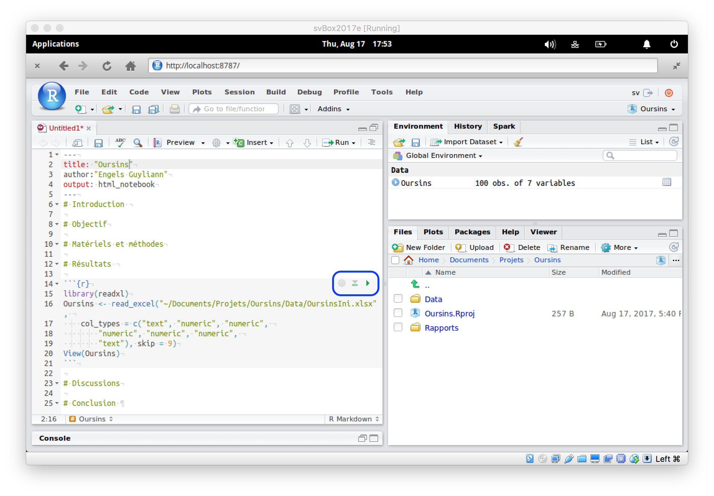

## Objectif

> Vous familiariser avec l'importation de données Excel ou CSV dans un document RStudio de manière reproductible.

## Prérequis

* Être à l'aise avec RStudio : voir tutoriel "prise en main de la machine virtuelle et de RStudio"
* Être capable de créer un projet dans RStudio : voir tutoriel "utilisation des projets dans RStudio"

## Procédure

**Étape 1.** Partez d’un document R, R Markdown ou encore R Notebook ouvert dans RStudio. Dans notre cas, un R Notebook est ouvert à partir du projet `Oursins` créé dans le tutoriel sur les projets RStudio. Insérer un **chunk R**. (**Si l'on part réellement du tutoriel project RStudio, le rapport est déjà sauvegardé... cela ne correspond pas à la copie d'écran actuelle!**)

----

**Étape 2.** Sélectionnez le bouton **Import Dataset** dans la barre d'outils de l'onglet **Environment**. Sélectionnez le type de fichier souhaité. Dans le cas présent, un fichier Excel (**From Excel**). 

----

**Étape 3.** Une boite de dialogue s’ouvre. cliquez sur le bouton **Browse...**.

----

**Étape 4.** Sélectionnez le jeu de donnée `OursinsIni.xlsx` qui se trouve dans le dossier `data`.

----

**Étape 5.** Le jeu de donnée s’affiche dans la boite de dialogue **Import Excel Data**. Cette boite de dialogue est subdivisée en trois zones :

- **Data Preview** : prévisualisation des données,
- **Import Options** : options d'importation (cadre bleu) et
- **Code Preview** : prévisualisation des instructions pour l'importation (cadre orange).

----

**Étape 6.** Différents paramètres peuvent être employés afin d'importer le jeu de donnée correctement dans la partie **Import Options**. Il est crucial de bien les choisir :

- **Name** : le nom de la variable
- **First Row as Names** : option à cocher si la première ligne est composée des noms des colonnes
- **Sheet** : sélectionner la feuille du classeur Excel que l'on souhaite employer
- **NA** : indiquer la manière dont les valeurs manquantes sont représentées dans la feuille Excel
- **Skip** : le nombre de premières lignes à ignorer (par exemple, si elles contiennent des métadonnées, ou si le tableau commence plus bas dans la feuille Excel)
- **Open Data Viewer** : permet de sélectionner ou désélectionner l'affichage des données

La représentation des valeurs manquantes peut varier d'un fichier à l'autre. Il est important de spécifier le code employé dans la feuille Excel pour représenter ces valeurs manquantes.

Il est également intéressant de sélectionner le type de variable que le jeu de donnée comporte. Pour ce faire dans le compartiment **Data Preview**, sélectionnez le type de la variable (exemple : caractère, numérique, ...) 

**Remarque :** les fichiers CSV offrent un plus large panel de types de variables, mais il est toujours possible de retravailler les variables dans R après importation. 

----

**Étape 7.** Copiez le code s’affichant dans la case **Code Preview** (la petite icône à droite en forme de presse-papier le réalise facilement, voir encadré bleu ci-dessous) et refermez la boite de dialogue d’importation en cliquant sur le bouton **Cancel**.

> Attention : ne **pas** cliquer sur le bouton **Import**. Les données seront effectivement importées, mais les instructions qui effectuent cette importation seront perdues, et l'action ne sera donc pas reprise dans le document. Passer toujours par cette étape de copier-coller des instructions dans le document R Notebook, R Markdown, ou script R qui utilise ces données !

----

**Étape 8.** Collez les instructions dans le document cible. S'il s'agit d'un document R Markdown ou R Notebook, vous _devez_ coller ces instructions à l'intérieur d'un chunk R (avec fond gris clair), et non pas dans une zone Markdown ou dans le préambule (avec fond blanc).

Dans le cadre de l'utilisation d'un projet (dans notre cas `Oursins`) que l'on souhaite portable, il est intéressant d'employer des chemin d'accès relatifs aux divers fichiers au lieu de chemins d'accès absolus. Le chemin d'accès relatif comporte plusieurs avantages : 

- Un chemin d'accès plus court à écrire
- Une plus grande portabilité. L'échange de document entre collaborateurs se fera alors sans problèmes car les chemins relatifs pointent vers des fichiers à l'intérieur du projet **quel que soit l'endroit où le projet se situe sur le disque**, à l'inverse des chemins absolus qui nécessitent de toujours placer le projet exactement au même endroit. Malheureusement, la boite de dialogue d'importation crée des instructions qui utilisent un chemin absolu vers le fichier à importer. Il faut donc, le transformer à la main. La copie d'écran ci-dessous montre (encadré bleu) trois instructions successives qui importent le même fichier de données. La première est un chemin absolu, la seconde utilise un chemin depuis le répertoire de l'utilisateur (note `~`), et la troisième utilise un chemin relatif. **C'est cette troisième forme que vous devez utiliser systématiquement dans des projets portables, c'est-à-dire, tous vos projets !**

Notre rapport se trouve dans le sous-dossier `Rapports` du dossier `Oursins` (qui est le dossier principal de notre projet), il faut donc indiquer qu'on sort du sous-dossier `Rapports` (naviguer vers le dossier parent en indiquant `..`) pour entrer dans le sous-dossier `Data`. Cela s'écrit donc : `../Data/OursinsIni.xlsx`.

> Voir Tutoriel "gestion des fichiers dans un projet et les chemins relatifs".

----

**Étape 9.** Exécutez les instructions. Dans un script R, vous cliquez sur le bouton **Run** de la barre d'outils de l'éditeur. Dans un document R Markdown ou R Notebook, comme ici, vous cliquez sur la flèche verte an haut à droite du chunk (encadré bleu).

Le jeu de données `Oursins` est importé dans **R** et il s'affiche dans l'onglet **Environment**. On peut voir immédiatement qu'il comporte 100 observations (lignes dans le tableau) pour 7 variables (colonnes).

_Félicitations ! Vous venez d'importer votre premier jeu de données, et vous avez réalisé cette importation de manière **reproductible** et **portable** au sein de votre projet `Oursins`. La même technique peut être utilisée pour importer des données dans d'autres formats, tels que des données provenant des logiciels statistiques SAS, SPSS ou Stata, ainsi que des données au format CSV (nous vous conseillons dans ce cas de chosir la seconde option **From Text (readr)** plus performante)._

----

## Pour aller plus loin...

**TODO**

_Copyright © 2017-2018, Guyliann Engels & Philippe Grosjean, [Attribution-NonCommercial-ShareAlike 4.0 (CC BY-NC-SA 4.0)](https://creativecommons.org/licenses/by-nc-sa/4.0/deed.fr)._
