```{r setup, include=FALSE}
knitr::opts_chunk$set(echo = TRUE)
knitr::opts_chunk$set(fig.pos = "!H", out.extra = "")
```

L'accès PC avec Remote Desktop est destiné aux étudiants n'ayant pas un PC suffisamment puissant pour utiliser la SciViews Box, mais néanmoins utilisable pour accéder à Internet via une connexion correcte. Il est également destiné à ceux qui disposent d'un Mac équipé de la nouvelle puce M1 ne permettant pas de faire tourner la SciViews Box dans VirtualBox. Nous avons installé trois PCs équipés des logiciels du cours de Science des Données Biologiques en accès à distance. Voici comment les utiliser.

## Sous Windows

Pour vous connecter, vous utiliserez **Connexion Bureau à distance** préinstallé sous Windows. Dans la zone de recherche de la barre de tâches (avec une loupe et indiqué "Taper ici pour rechercher"), entrez "connexion". Vous devez voir l'item "Connexion Bureau à distance" apparaître.

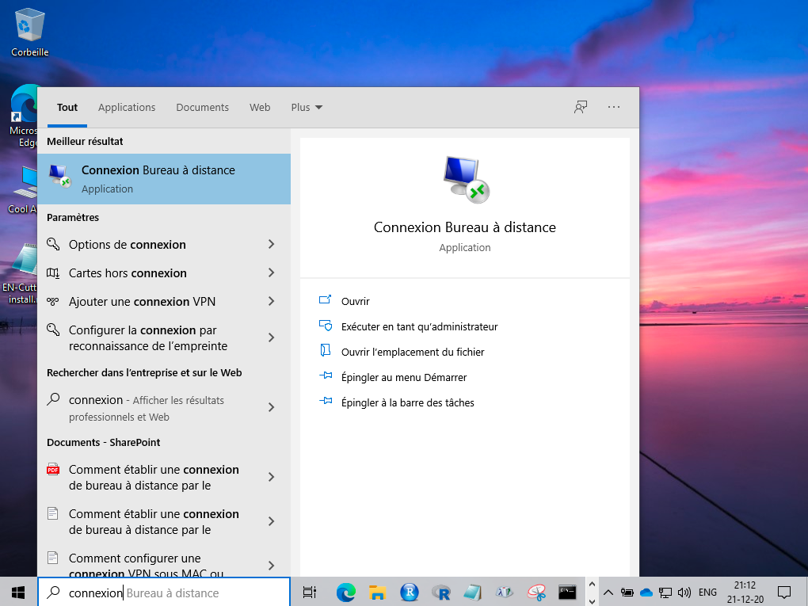
\ 

Lancez cette application. Vous voyez une boite de dialogue de configuration. Entrez le nom d'un des trois PCs mis à votre disposition\ : `ECONUM-ETU1`, `ECONUM-ETU2` ou `ECONUM-ETU3`. Ensuite, cliquez sur "Afficher les options".

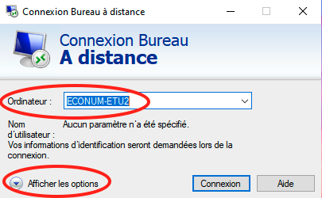
\ 

Dans la boite de dialogue qui s'ouvre, cliquez sur l'onglet **Avancé** et allez dans **Paramètres...**

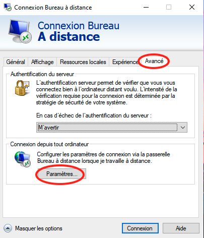
\ 

Sélectionnez "Utiliser ces paramètres de serveur passerelle Bureau à distance" et entrez `rdsgw.umons.ac.be`. Ensuite **OK**.

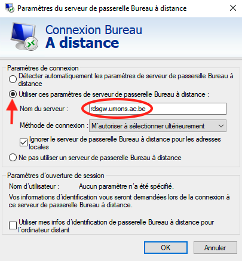
\ 

Cliquez finalement sur le bouton **Connexion**. Vous devez entrer votre nom et mot de passe du compte UMONS. Attention, pour le nom d'utilisateur, il faut absolument indiquer `UMONS\xxxxxx` où `xxxxxxx` est votre numéro de matricule.

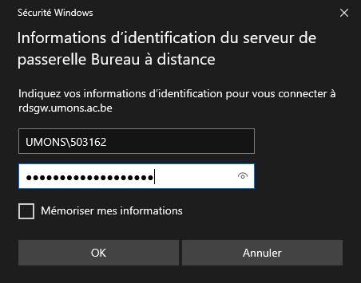
\ 

Vous êtes identifié. Sinon votre mot de passe peut être demandé une seconde fois par le serveur d'accès à distance et vous avez la possibilité de modifier le compte Microsoft utilisé. Choisissez bien le compte UMONS si vous en possédez plusieurs.

Après quelques dizaines de secondes le bureau Windows de l'ordinateur distant apparaît. Vous êtes connecté et pouvez travailler sur le PC distant comme si vous étiez physiquement devant lui.

Avant toute chose, vérifiez le clavier détecté automatiquement dans la barre de tâches, et corrigez-le éventuellement. Il est très probable que vous utilisiez un "clavier français (Belgique)", sinon indiquez le clavier qui vous correspond.

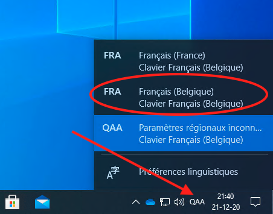
\ 

Vous devez maintenant lancer et configurer la SciViews Box comme d'habitude avant de pouvoir travailler.

**Remarque importante\ :** lorsque vous voulez quitter la session, cliquez *toujours* sur votre compte dans le menu Windows et puis "Se déconnecter". N'utilisez *jamais* le menu "Marche/Arrêt". Si vous éteignez physiquement l'ordinateur, il ne sera plus disponible pour une autre connexion à distance et quelqu'un devra se déplacer physiquement dans le local pour le rallumer\ ! 

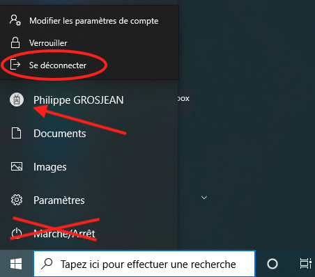
\ 

\newpage

## Sous MacOS

Le logiciel **Microsoft Remote Desktop** doit d'abord être installé. Allez dans **App Store** depuis le menu pomme en haut à droite. Dans la zone de recherche, entrez "Microsoft Remote Desktop". Ensuite cliquez sur le bouton à droite du titre pour installer l'application.

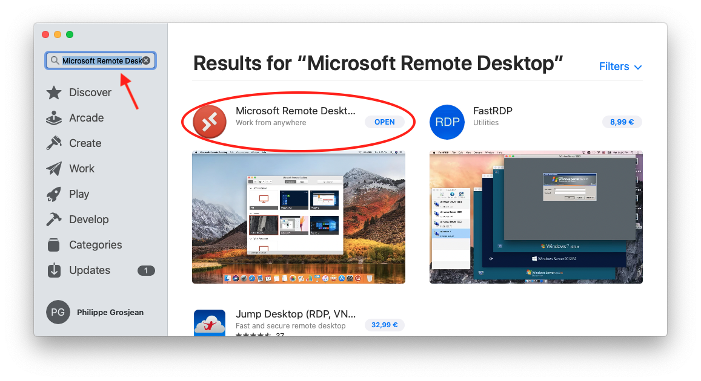
\ 

Une fois l'application installée, lancez-là. Commencez par paramétrer la passerelle (Gateway). Allez dans le menu **Microsoft Remote Desktop** en haut à gauche de l'écran et sélectionnez l'entrée "Préférences...". Dans la boite de dialogue, allez à l'onglet **Gateways** (ou l'équivalent en français).

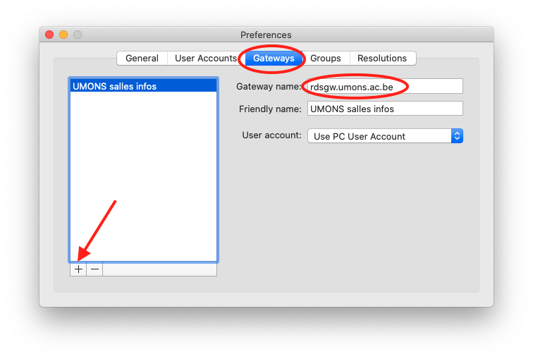
\ 

Cliquez sur le bouton "+". Ensuite, entrez `rdsgw.umons.ac.be` comme nom de passerelle. Vous pouvez aussi indiquer un nom familier comme ici dans la copie d'écran, `UMONS salles infos` (vous pouvez choisir le nom que vous voulez).

Vous allez maintenant ajouter un ordinateur dans la fenêtre principale. Cliquez sur le bouton '+', et puis sur "Add PC".

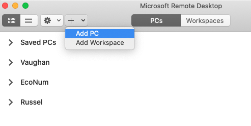
\ 

Entrez le nom de l'un des trois PCs suivants\ : `ECONUM-ETU1`, `ECONUM-ETU2` ou `ECONUM-ETU3`. Vous devez également indiquer la passerelle que vous venez de configurer. Le reste est optionnel (comme indiquer un nom familier pour cette machine).

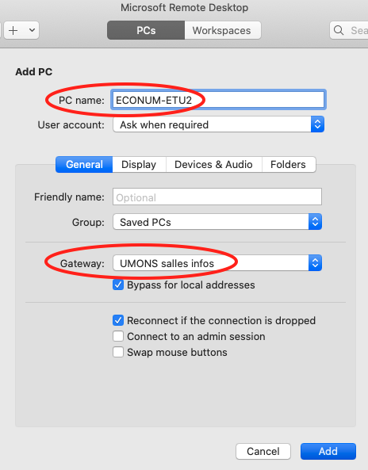
\ 

Cliquez sur le bouton "Add" quand c'est fini. Le PC apparait dans la catégorie "Saved PCs". Double-cliquez dessus pour le lancer. Votre identifiant et mot de passe UMONS sont demandés. Indiquez bien `UMONS\xxxxxx` où `xxxxxx` est votre numéro de matricule.

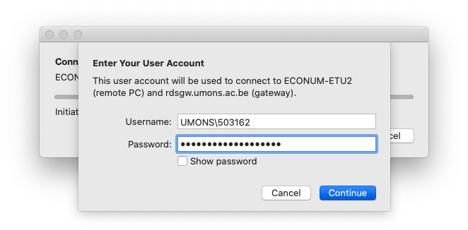
\ 

Vous recevrez vraisemblablement un message d'avertissement à propos du certificat UMONS qui ne peut être vérifié. Ne vous en préoccupez pas et cliquez sur le bouton **Continue**.

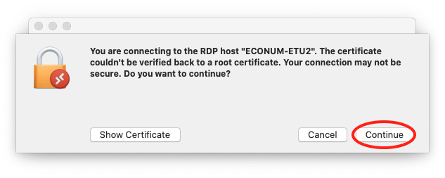
\ 

Après quelques dizaines de secondes, vous devez voir apparaître le bureau Windows du PC distant. A partir de ce moment, vous pouvez travailler sur le PC distant comme si vous étiez physiquement devant lui.

Avant toute chose, vérifiez le clavier détecté automatiquement dans la barre de tâches, et corrigez-le éventuellement. Il est très probable que vous utilisiez un "clavier français (Belgique)", sinon indiquez le clavier qui vous correspond.


\ 

Vous devez maintenant lancer et configurer la SciViews Box comme d'habitude avant de pouvoir travailler.

**Remarque importante\ :** lorsque vous voulez quitter la session, cliquez *toujours* sur votre compte dans le menu Windows et puis "Se déconnecter". N'utilisez *jamais* le menu "Marche/Arrêt". Si vous éteignez physiquement l'ordinateur, il ne sera plus disponible pour une autre connexion à distance et quelqu'un devra se déplacer physiquement dans le local pour le rallumer\ ! 


\ 

## En cas de problème...

Si vous n'arrivez pas à vous connecter sur un PC distant, essayer les deux autres. Il se peut que ce PC soit temporairement indisponible, soit éteint, ou soit utilisé en local en ce moment.

Si les procédures expliquées ici ne fonctionnent pas ou si les PCs distants ne sont pas disponibles, veuillez nous contacter via email à l'adresse `sdd@sciviews.org` pour le dépannage. 
